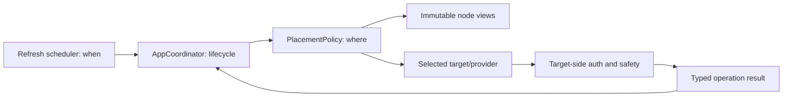

# Master/Worker Placement Boundaries

This document describes the placement behavior currently implemented in System
Analyzer. “Coordinator” is a request-scoped role used to select a node for one
typed operation. It is not a permanent master server, a superuser, or a shared
resource manager.

## CURRENT: Independent Nodes

Each registered node owns its descriptor, provider, runtime context, scheduler,
data, and safety boundary. Nodes do not share RAM or CPU, and the application
does not automatically migrate an operation from one node to another. Node
qualified operation keys keep work and cached results for different nodes
independent.

The initiating application instance coordinates one placement request. The
coordinator may ask `PlacementPolicy` for a decision, but the decision grants
no access and does not start work. `ComponentRefreshScheduler` decides when a
component refresh is due. `PlacementPolicy` decides where an eligible typed
request may run. `AppCoordinator` owns the operation lifecycle. The selected
target/provider remains responsible for authorization and execution safety.

## CURRENT: Job Classes

All requests have one of three classes:

- **LOCAL_BOUND:** Tk/UI work, local settings and persistence, local file-to-
  Trash cleanup, and local-only window actions. The policy accepts only the
  local node for this class.
- **TARGET_BOUND:** CPU, memory, storage, GPU, network, battery, thermal,
  process enumeration, process termination, filesystem review, cleanup, and
  future hardware acquisition. These operations have meaning on a particular
  target and cannot be redirected to another node. The policy considers only
  the explicit target node.
- **MOVABLE:** A typed operation whose result is independent of node-local
  hardware, files, processes, permissions, and UI. The audit found **zero
  current movable jobs**. Hashing supplied bytes, parsing supplied text,
  aggregation, compression, and report generation are not current operations
  or remote contracts. No remote compute endpoint was invented.

## CURRENT: Placement Rules

`PlacementPolicy` is synchronous, side-effect free, and consumes immutable
`PlacementView` values. It performs eligibility filtering before ranking.

Hard rejection rules, in order, are:

1. A local-bound request rejects non-local nodes.
2. A target-bound request rejects every node whose identity differs from the
   requested target.
3. The node must be trusted.
4. The node must be authenticated.
5. The node must be online.
6. The protocol must be compatible.
7. The node identity must be valid.
8. The node must not be shutting down.
9. The required capability must be present.
10. The required permission, when specified, must be present.

Unknown capability, discovery-only trust, failed authentication, protocol
incompatibility, identity mismatch, offline state, and shutdown are hard
failures. They are not ranking penalties. If no node survives, the decision
has no selected node and reports `no eligible nodes`.

For local-bound and target-bound requests, the surviving constrained node is
selected; there is no fallback to another node. For movable requests, the
current deterministic soft rules are:

1. Select the eligible local node when `input_size_bytes + output_size_bytes`
   is at or below `remote_transfer_threshold_bytes`.
2. Otherwise rank by fewer `active_jobs`.
3. Use lower latency only when the latency metric is fresh.
4. Prefer local over remote for an otherwise equal result.
5. Break all remaining ties by stable `NodeId.value`.

Optional placement metrics use one freshness window: **30 seconds**, measured
with the policy's injected monotonic clock. Missing or stale latency is ignored
for latency ranking; it does not make a node unauthorized or offline. Active
job counts remain input values and are not a global load estimate. A movable
request with non-zero transfer size and no remote candidate with fresh latency
stays local when a local candidate exists. The policy performs no byte-to-time
conversion and invents no bandwidth estimate. Negative or non-integer byte
sizes and thresholds are rejected.

The result explains the selected rule, eligible node count, and rejection
reasons. It does not claim global optimization.

## CURRENT: Lifecycle and Safety

`AppCoordinator.choose_placement` delegates exactly one decision to the
injected policy. Choosing a placement does not create a run, executor,
generation, or scheduler. Actual work continues through the existing
`AppCoordinator` lifecycle:

- Repeated triggers for one key coalesce into one in-flight run and at most one
  pending rerun.
- Each run has a generation, cooperative cancellation event, cached last good
  result, and one injected delivery path to the Tk thread.
- A cancelled run is not restarted by its pending rerun. The worker may finish,
  but its late result is discarded by generation/cancellation checks.
- A result from an old generation, including a result arriving after a node
  switch, is not applied to the current logical request. Node switching also
  cancels active node operations and invalidates render targets.
- A worker failure is delivered as an operation error and is not treated as a
  reason to reroute a target-bound or destructive operation. There is no
  destructive retry or automatic fallback.

Remote execution has a second, target-owned boundary. The authenticated
provider signs requests and verifies response identity, freshness, and request
correlation. The target verifies the caller credential, caller identity,
target identity, request signature, protocol shape, capability, and permission.
Destructive process requests also require a non-replayed request ID. Target
providers validate process identity and filesystem/action safety; placement
cannot enlarge grants or bypass those checks.

Discovery never grants execution authority. Trust and authorization remain
distinct. If a trusted/authorised node is revoked, it is removed from the
registry, selection returns to local when necessary, and its provider can be
invalidated. Authentication or identity failures do not become placement
eligibility; the peer retry policy does not automatically retry those trust
failures. Ordinary peer disappearance/failure is reported through the existing
connection/provider path, not converted into a different target.

## CURRENT: Diagnostics

Diagnostics expose at most the latest placement decision: job type, selected
worker, eligible count, and reason. Each displayed detail is capped at 160
characters. No credentials, request payloads, permission internals, placement
history, or telemetry database is recorded. The UI shows `No placement
decision yet` when there is no latest decision.

## FUTURE: Deliberate Exclusions

The current implementation deliberately does not include:

- `ResourceGovernor`, pressure sampling, reservations, or global load control.
- A second scheduler, executor hierarchy, worker manager, or leader election.
- Arbitrary RPC, arbitrary command/function dispatch, or automatic workload
  migration.
- Manual worker-selection or placement settings.
- A telemetry database or continuous network probing.

The only plausible future movable work is explicitly typed pure hashing,
parsing, aggregation, compression, or report generation after a bounded,
authenticated remote contract exists. Such work would still require explicit
idempotency, authorization, transfer limits, and failure semantics; none of it
is a current job or implied by this document.
