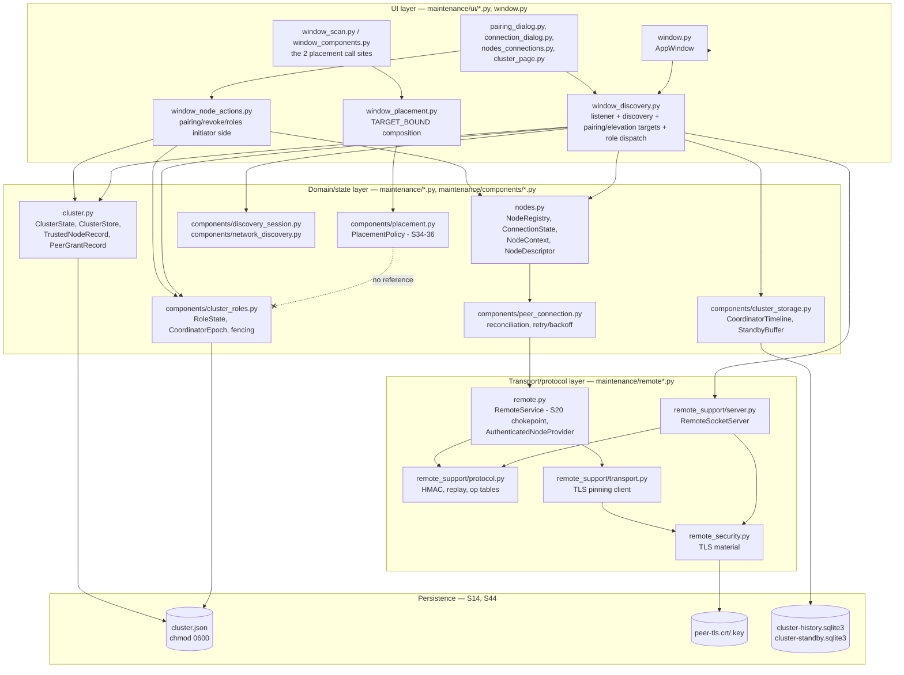
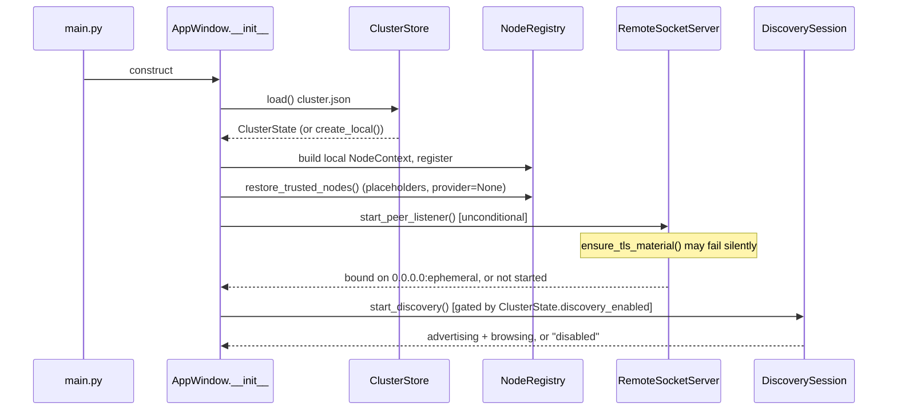
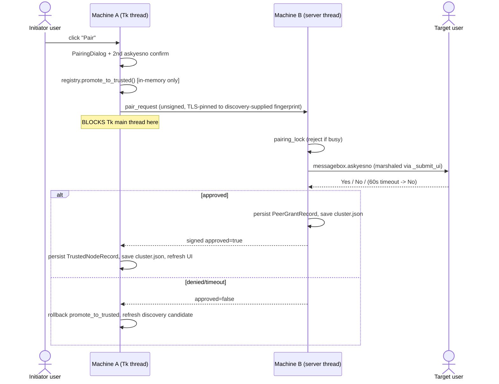
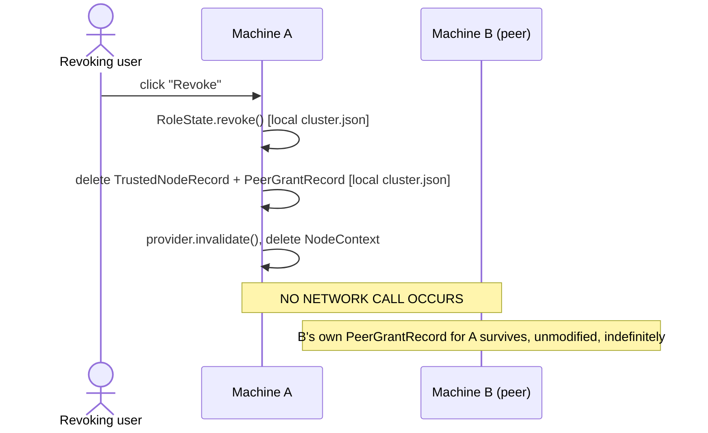
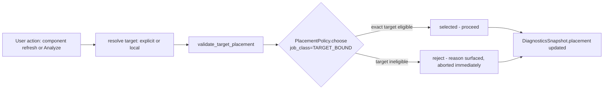
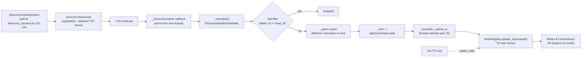
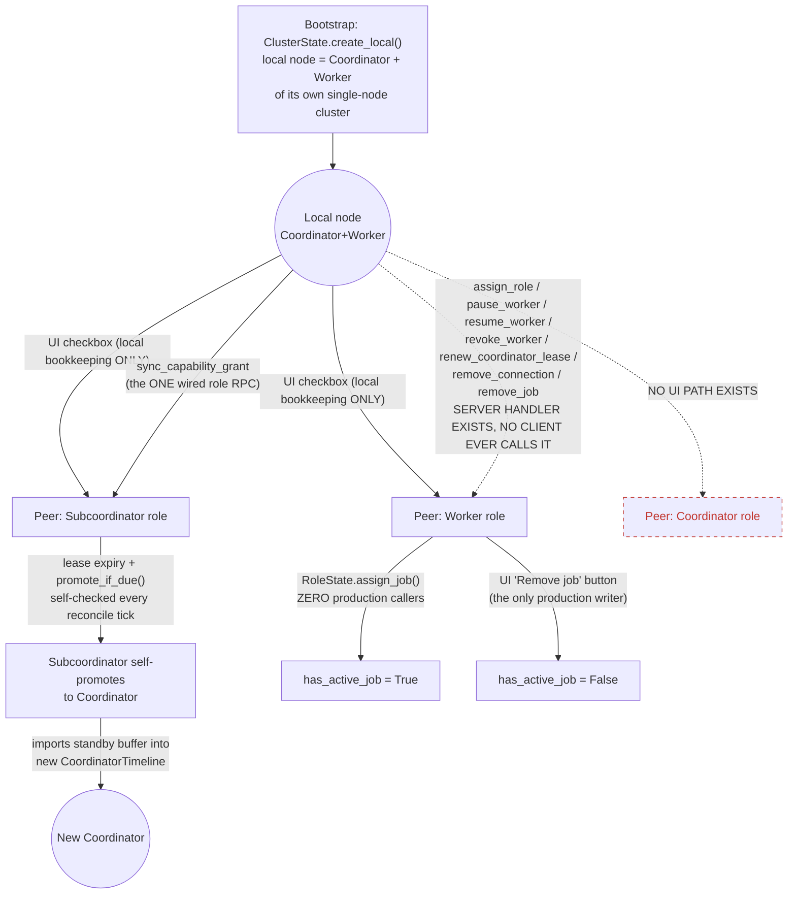
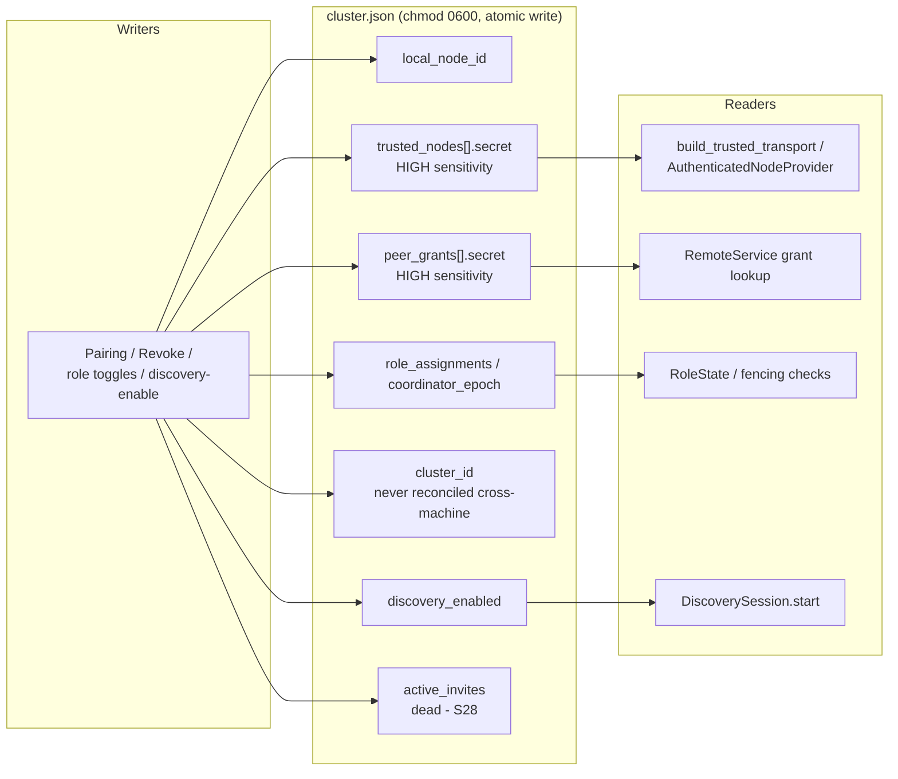
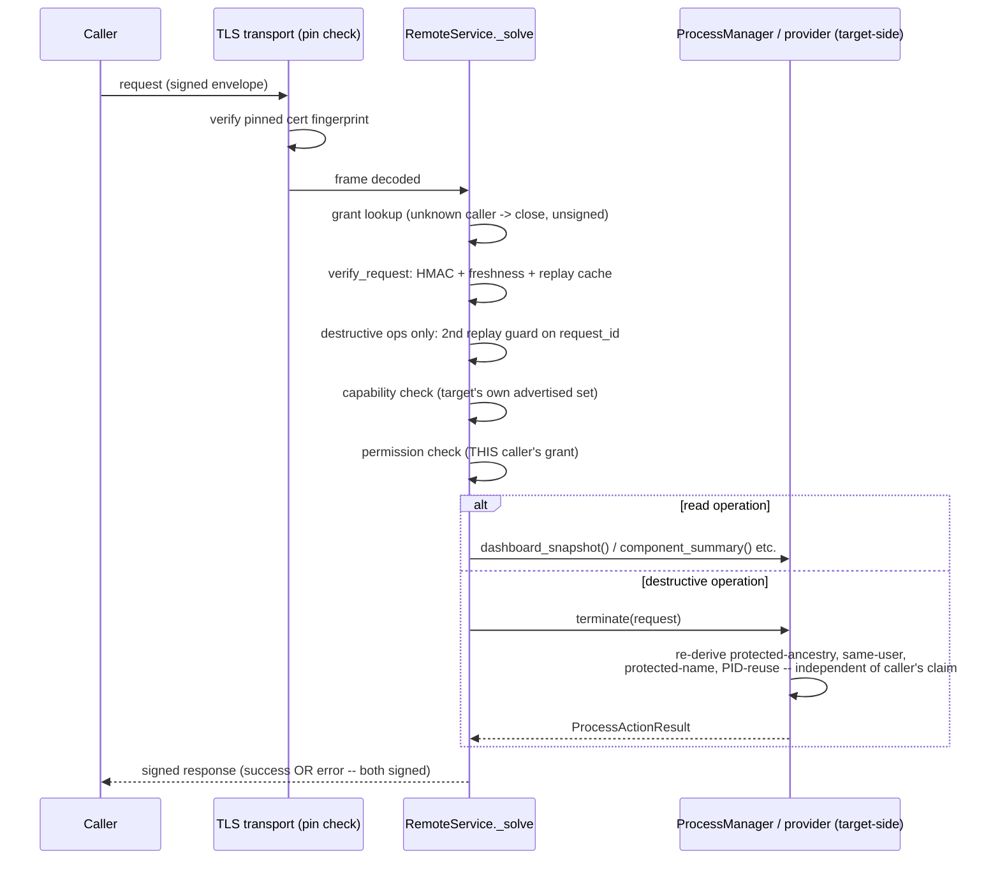
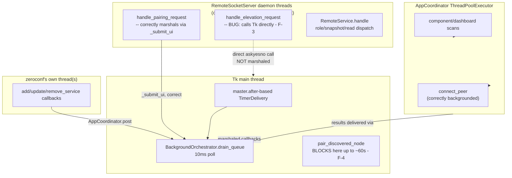

# Remote / Pairing / Trust / Cluster / Coordinator — Canonical True-Flow Reconstruction

## 1. Audit metadata

- **Repository:** `/home/btn17/Downloads/exp` (System Analyzer)
- **Commit audited:** `7620abb` ("build: publish wheel 1.6.0.0"), working tree otherwise clean except one untracked, unrelated directory (`docs/performance/observability/`, belongs to a concurrent, separate agent's work — not touched by this audit).
- **Method:** six independent LLM agent passes — five parallel, blind-to-each-other research passes (Agent A: runtime trace; Agent B: trust/security; Agent C: cluster/role/placement; Agent D: UI/user-flow; Agent E: test/docs/history archaeology) followed by one adversarial verification pass (Agent F) that re-checked the ten highest-stakes and lowest-confidence claims directly against source. This document is the human-facing (Agent G) synthesis of all six reports, itself further condensed and cross-checked during synthesis.
- **Evidence discipline:** every architectural claim below is backed by a file:line citation to code actually read during this audit, or explicitly marked `NOT VERIFIED`. Docs and history are used only for intent/drift context, never as a substitute for a code citation of "what happens now."
- **Scope:** discovery, pairing, identity, TLS, trust, authentication, authorization, capabilities, permissions, connection state, node selection, remote reads, remote process actions, cluster membership, invitations, Coordinator/Subcoordinator/Worker roles, coordinator epochs/leases/fencing, worker state, placement, Remove Connection, Revoke, rediscovery/re-pair, persistence, diagnostics, error paths, cancellation, shutdown.
- **Explicitly out of scope for this pass:** fixing anything found. This document is read-only evidence; a prioritized backlog is proposed in §52 but nothing in the repository was modified to produce this audit.

### Post-audit implementation update (2026-09-16)

The pairing flow has since been extended with an additive two-phase handshake:
the target stores an expiring `PendingPairing`, the initiator saves local trust
before sending `pair_confirm`, and the target promotes the pending record only
after exact transaction binding validation. `pair_abort`, expiry pruning,
serialized target transitions, durable confirm replay, mixed-version rejection,
local rollback, and cancellation tests are now implemented in
`maintenance/cluster.py`, `maintenance/remote.py`,
`maintenance/remote_support/`, `maintenance/ui/window_discovery.py`, and
`maintenance/ui/window_node_actions.py`.

The remaining distributed-systems limitation is explicit: a target may commit
`pair_confirm` and lose the response before the initiator receives it. The
initiator can then observe an ambiguous result; `pair_abort` intentionally does
not remove an already-active grant. A full crash-safe outcome would require a
durable initiator recovery record plus authenticated target reconciliation/status
and a shared serialization boundary for all cluster-state writers. Until that
follow-up exists, pairing is **VERIFIED CURRENT**, not crash-safe
**VERIFIED COMPLETE**, for lost-response and power-loss scenarios.

This update also supersedes the older pairing statements below that describe
the pre-transaction synchronous flow or immediate target grant persistence.

---

## 2. Executive truth summary

System Analyzer is, by default, a fully-functional **single-machine** system monitor. Every remote/cluster capability layers on top of that without being required. The actual, currently-true architecture differs from what the naming ("cluster", "invite", "Coordinator") suggests in several important ways:

1. **There is no multi-owner cluster.** Every installation bootstraps itself as its own independent single-node "cluster" (`cluster_id = secrets.token_urlsafe(18)`, itself both Coordinator and Worker of that cluster). Pairing with another machine establishes bilateral **trust**, not cluster membership — the two machines' `cluster_id` values are never reconciled, adopted, or merged by any code path found (§27).
2. **Pairing is real and safely bootstrapped by a human, not by cryptography.** The target machine's user gets a genuine native OS confirmation dialog, on a real network thread, correctly marshaled onto the Tk UI thread — this is proven, not assumed (§11). But the *only* thing that makes first-contact pairing safe against an active network attacker is a human comparing two fingerprints "through a trusted channel" (the app's own UI copy says this). TLS in this app validates no certificate chain at all (`ssl.CERT_NONE`) and trusts only a pinned fingerprint; the "identity fingerprint" is a public, non-secret, deterministic hash of the node id that anyone on the LAN can compute. There is no cryptographic anchor until the human approves (§12).
3. **Role assignment, pause, resume, revoke, and coordinator-lease-renewal RPCs are fully implemented on the wire protocol and the server side — and are never called by any production client code.** Three independent audit passes (runtime trace, security, and cluster/role agents) and one adversarial re-verification pass all confirm this from different angles: `maintenance/remote.py`'s `assign_role`, `pause_worker`, `resume_worker`, `revoke_worker`, `renew_coordinator_lease`, `remove_connection`, `remove_job` client methods have zero production call sites. Every "role change" a user makes in the UI mutates that user's **own local** `cluster.json` only. **Revoke never notifies the peer being revoked.** The peer's own grant for the revoker survives indefinitely, until the peer independently revokes it too (§25, §29-32).
4. **Placement (`PlacementPolicy`) is genuinely composed into two real production call sites** — component refresh and manual "Analyze" — as a `TARGET_BOUND`-only eligibility gate. This claim from a prior session's own audit-followup doc is independently re-verified true by two separate agents plus the adversarial pass. No `MOVABLE` job exists in production; the ranking algorithm for it is fully built and unit-tested but dormant, and critically, it currently has **zero connection to cluster role/worker eligibility** — `PlacementView` never references `RoleAssignment`/`ClusterRole` at all (§34-36).
5. **Cluster invitations (`create_invite`/`consume_invite`) are dead on the creation side.** `create_invite()` has no production caller anywhere; the entire invite subsystem cannot be exercised by a real user today. The UI's own Revoke confirmation dialog is misleadingly worded — it says "a new invite is required to reconnect," but the actual reconnection mechanism this app uses is re-discovery + re-pairing, not invites (§28, §37).
6. **The Coordinator role can never be assigned or transferred through the UI.** The "Coordinator" role checkbox is hard-`DISABLED` in code with no path to enable it; Coordinator status exists only via the automatic single-node bootstrap default and the (also never-UI-exposed) Subcoordinator-promotion-on-lease-expiry backend path (§30, §40).
7. **The rich `ConnectionState`/`NodeConnectionStatus` model (`CONNECTING`/`AUTHENTICATION_FAILED`/`IDENTITY_CHANGED`/`OFFLINE`) never reaches the UI.** The UI only ever shows a binary Online/Offline, styled with "Offline" as a mild amber warning rather than a clear failure — collapsing several materially different backend failure states into one word (§16, §41, §57).
8. **A real, confirmed thread-safety bug exists**: `handle_elevation_request` calls Tkinter's `messagebox.askyesno` directly from a non-Tk server thread, unlike its sibling `handle_pairing_request`, which correctly marshals the same kind of call onto the Tk main thread. Tkinter is not thread-safe (§43, §51).
9. **The "Pair" button blocks the Tk UI thread synchronously for up to ~60 seconds** — the entire pairing RPC round trip (including the target user's up-to-60-second approval wait) runs inline on the initiator's UI thread with no background dispatch (§10, §43).
10. **Manually-added hosts (as opposed to discovered peers) cannot actually be pair-authenticated by any mechanism this codebase provides** — `add_manual_host` invents a local secret that is never transmitted to the target by any code path; there is no secret-entry field in the connection dialog either (§37, §51).

None of the above are hypothetical or docs-only claims — every one is backed by a direct code citation in the sections that follow, most cross-confirmed by two or more independent audit passes.

---

## 3. Status vocabulary

Every subsystem/flow claim in this document uses exactly one of:

| Status | Meaning |
|---|---|
| **VERIFIED COMPLETE** | End-to-end production path exists, directly evidenced. |
| **VERIFIED CURRENT** | Real/current behavior, but "complete" overstates it. |
| **WIRED BUT PARTIAL** | Production path exists; meaningful branches/features missing. |
| **BROKEN** | Intended/reachable flow exists but fails in some case. |
| **DRIFTED** | Current behavior conflicts with another current owner, or with clearly established intended semantics. |
| **MISSING WIRING** | Implementation exists; no production composition/caller exists. |
| **TEST-ONLY** | Exists only through tests/fakes. |
| **DEAD / UNREFERENCED** | Production implementation, zero callers. |
| **DOC-ONLY** | Documentation describes behavior with no implementation. |
| **STALE DOCUMENTATION** | Docs describe an older state contradicted by current source. |
| **FUTURE SEAM** | Explicit extension point exists; product feature does not. |
| **NOT VERIFIED** | Evidence insufficient to classify. |

"COMPLETE" is never used merely because unit tests pass — see §46 for the concrete instances this rule prevented from being mis-stated (PlacementPolicy, invitations).

---

## 4. Feature completeness matrix

| Subsystem | Status | Production entry point | Canonical owner | Persistence owner | Test evidence | Known gap | Confidence |
|---|---|---|---|---|---|---|---|
| App startup remote listener | VERIFIED CURRENT | `window.py:282 start_peer_listener` | `maintenance/ui/window_discovery.py` | n/a (runtime) | Unit (real socket in `test_remote_security.py`) | Binds `0.0.0.0` unconditionally, independent of discovery preference (§8) | HIGH |
| Discovery advertisement | VERIFIED CURRENT | `discovery_session.py:115-129` | `maintenance/components/discovery_session.py` | none (broadcast) | Integration (fake backend) | Fully unauthenticated (§12) | HIGH |
| Discovery browsing/candidate lifecycle | VERIFIED CURRENT | `network_discovery.py` `_ZeroconfListener` | `maintenance/components/network_discovery.py` | none | Integration | soft no-op if `zeroconf` unavailable | HIGH |
| Self filtering | VERIFIED COMPLETE | `network_discovery.py:449-451`, `nodes.py:809-812` | same | n/a | Integration | none found | HIGH |
| Discovery expiry | VERIFIED COMPLETE | `network_discovery.py:405-421`, 10s tick | same | n/a | Integration | none found | HIGH |
| Manual host entry | WIRED BUT PARTIAL | `window_node_actions.py:691-764` `add_manual_host` | same | `cluster.json` | Unit | **Cannot actually authenticate — secret never transmitted to target (§37, §51 F-6)** | HIGH |
| Outgoing Pair | VERIFIED CURRENT | `nodes_connections.py:424` → `window_node_actions.py:309` | `maintenance/ui/window_node_actions.py` | `cluster.json` | Real-socket + real-TLS (`test_remote_security.py`) | Blocks Tk main thread up to ~60s (§10, §43) | HIGH |
| Incoming Pair request | VERIFIED COMPLETE | `server.py:96-100` → `window_discovery.py:369` | `maintenance/ui/window_discovery.py` | `cluster.json` | Real-socket + real-TLS | none found | HIGH |
| Target approval prompt | VERIFIED COMPLETE | `window_discovery.py:380-410` | same | n/a | Real-socket | Correctly marshaled to Tk thread | HIGH |
| Target reject | VERIFIED COMPLETE | `handle_pairing_request` returns `False` path | same | n/a | Real-socket | Fail-closed on timeout too | HIGH |
| Initiator rollback on rejection | VERIFIED COMPLETE | `window_node_actions.py:399-414` | same | `cluster.json` | Unit | none found | HIGH |
| Initiator persistence | VERIFIED COMPLETE | `window_node_actions.py:415-432` | same | `cluster.json`, chmod 0600 | Unit | none found | HIGH |
| Target grant persistence | VERIFIED COMPLETE | `window_discovery.py:390-406` | same | `cluster.json` | Real-socket | none found | HIGH |
| Identity fingerprint | VERIFIED CURRENT (weak guarantee) | `nodes.py:413-422` | `maintenance/nodes.py` | n/a | Unit | Public, non-secret, forgeable (§12) | HIGH |
| TLS fingerprint / pinning | VERIFIED CURRENT | `remote_security.py`, `transport.py:130-145` | `maintenance/remote_security.py` | `cluster.json` (pin), disk (cert) | Real-TLS | No CA validation; pin is only as good as first-seen value (§12) | HIGH |
| TLS certificate creation | VERIFIED COMPLETE | `remote_security.py:28-67` (openssl subprocess) | same | disk, `peer-tls.{crt,key}` | Real-TLS | Fails silently → no listener (§8) | HIGH |
| Shared secret / HMAC signing/verification | VERIFIED COMPLETE | `remote_support/protocol.py` | same | `cluster.json` (0600) | Unit (real objects) | none found | HIGH |
| Timestamp freshness / replay cache | VERIFIED COMPLETE | `protocol.py:310-382, 442-445` | same | in-memory only | Unit | none found | HIGH |
| Protocol version check | VERIFIED COMPLETE | `protocol.py:29`, checked both directions | same | n/a | Unit | none found | HIGH |
| Capability / permission tables | VERIFIED COMPLETE | `protocol.py:45-73` | same | n/a (static) | Unit (drift test added in prior session) | none found | HIGH |
| Target authorization | VERIFIED COMPLETE | `remote.py:354-456 _solve` | `maintenance/remote.py` | n/a | Unit | Single chokepoint, no duplicate authority found | HIGH |
| Hello / activation | VERIFIED COMPLETE | `remote.py:371-381`, `window_discovery.py:559-606`, `window_node_actions.py:872-988` | shared | runtime | Real-socket + unit | No persistent session — every call reopens a socket (§15) | HIGH |
| Connection reconciliation | VERIFIED CURRENT | `peer_connection.py` | `maintenance/components/peer_connection.py` | n/a (runtime) | Unit | Rich state never surfaces to UI (§16, §41) | HIGH |
| Test Connection | VERIFIED COMPLETE | `window_node_actions.py:780-852` | same | n/a | Unit | Diagnostic only, doesn't change status/retry state | HIGH |
| Node selection | VERIFIED COMPLETE | `nodes.py:745-785`, `node_selection.py` | `maintenance/nodes.py` | n/a | Unit | none found | HIGH |
| Dashboard remote read | VERIFIED COMPLETE | `remote.py:382-394` | same | n/a | Unit + integration | Gated additionally by dashboard-share when required | HIGH |
| Component remote read | VERIFIED COMPLETE | `remote.py:407-412` | same | n/a | Unit | now placement-gated too (§34) | HIGH |
| Process review remote read | VERIFIED COMPLETE | `remote.py:413-415` | same | n/a | Unit | none found | HIGH |
| Storage review remote read | VERIFIED COMPLETE | `remote.py:453-455` | same | n/a | Unit | Read-only by design (§23) | HIGH |
| Graceful remote process quit | VERIFIED COMPLETE | `remote.py:416-452`, target `actions.py` | shared (network+target) | n/a | Unit | Two independent safety layers confirmed (§22) | HIGH |
| Force remote process quit | VERIFIED COMPLETE | same + `action_kind=FORCE_QUIT` | same | n/a | Unit | Escalation requires prior normal-quit attempt in UI | HIGH |
| Remote Move to Trash | DEAD / DOES NOT EXIST | none | n/a | n/a | none | No wire op; `NodeContext.file_manager` always `None` remotely (§23) | HIGH |
| Remove Connection | VERIFIED COMPLETE (locally) | `window_node_actions.py:211-252` | same | `cluster.json` unchanged | Unit | none found | HIGH |
| Reconnect (post Remove Connection) | VERIFIED COMPLETE | `peer_connection.py` `reconnect()` | same | n/a | Unit | none found | HIGH |
| Revoke | WIRED BUT PARTIAL | `window_node_actions.py:632-688` | same | `cluster.json` | Unit | **Never notifies the peer — one-sided (§25, §51 F-1/F-2)** | HIGH |
| Rediscovery after Revoke | VERIFIED COMPLETE | `nodes.py:799-879` | `maintenance/nodes.py` | n/a | Unit | none found | HIGH |
| Re-pair after Revoke | VERIFIED COMPLETE | full pairing flow again | same | `cluster.json` | Unit | none found | HIGH |
| Cluster creation semantics | DRIFTED / AMBIGUOUS | `cluster.py:94-111 _initial_roles` (automatic, not user-invoked) | `maintenance/cluster.py` | `cluster.json` | Unit | No explicit "create/join cluster" concept; every install is its own cluster (§27) | HIGH |
| Invite creation | DEAD / UNREFERENCED | `cluster.py:574-591`, zero production callers | n/a | n/a | Unit only | No UI anywhere (§28) | HIGH |
| Invite consumption | MISSING WIRING (functionally dead) | `window_discovery.py:178-201` (reachable wire handler) | same | `cluster.json` | Unit (model only) | Can never succeed since nothing ever creates an invite | HIGH |
| Worker role | VERIFIED CURRENT (local-only) | checkbox in `nodes_connections.py:725-789` | `maintenance/components/cluster_roles.py` | `cluster.json` | Unit | Never pushed to the peer (§30) | HIGH |
| Coordinator role | MISSING WIRING (assignment) | none (checkbox hard-disabled) | same | `cluster.json` | Unit (backend only) | No UI path to assign/transfer (§30, §51) | HIGH |
| Subcoordinator role | WIRED BUT PARTIAL | checkbox + promotion backend | same | `cluster.json` | Unit | Role-based `allows()` authorization function unused in production (§31) | HIGH |
| Role assignment (general) | VERIFIED CURRENT (local-only) | `window_node_actions.py:171-183` | same | `cluster.json` | Unit | Never propagated via RPC (§29, §51 F-1) | HIGH |
| Role revocation | VERIFIED CURRENT (local-only) | `window_node_actions.py:277-306` | same | `cluster.json` | Unit | Same propagation gap | HIGH |
| Coordinator lease | VERIFIED CURRENT (self-only) | `window_discovery.py:639-666` | `maintenance/components/cluster_roles.py` | `cluster.json` | Unit | Remote lease-renewal RPC never called (§30, §51 F-1) | HIGH |
| Coordinator epoch / fencing | VERIFIED COMPLETE (server-side enforcement) | `remote.py:458-473 _verify_role_fence` | same | `cluster.json` | Unit (adversarial tests) | none found | HIGH |
| Worker snapshot | VERIFIED CURRENT | `window_discovery.py:681-778` | `maintenance/components/cluster_storage.py` | SQLite (`cluster-history.sqlite3`) | **NOT TESTED at dispatch layer** (§46, §51 F-4) | Untested authorization branch | MEDIUM |
| Standby batch | VERIFIED CURRENT | same function | same | SQLite (`cluster-standby.sqlite3`) | NOT TESTED at dispatch layer | Same gap | MEDIUM |
| Active job state (`has_active_job`) | BROKEN / ONE-WAY | `cluster_roles.py:358-365 remove_job` (only writer used in production) | same | `cluster.json` | Unit (model), zero production "set" path | `assign_job()` never called in production (§32, §51) | HIGH |
| Placement TARGET_BOUND | VERIFIED COMPLETE | `window_components.py`, `window_scan.py` via `window_placement.py` | `maintenance/components/placement.py` | n/a | Unit + integration | none found | HIGH |
| Placement MOVABLE | TEST-ONLY | none in production | same | n/a | Unit only | Zero cluster-role awareness even if wired (§34-36) | HIGH |
| Cluster diagnostics | VERIFIED CURRENT | `window.py:448-479, 517-525` | `maintenance/diagnostics.py` | n/a | Unit | Individual snapshot values not browsable (§33, §42) | MEDIUM |
| Shutdown | VERIFIED CURRENT | `window_lifecycle.py:283-337` | same | n/a | Unit | In-flight pairing dialogs are abandoned, not gracefully failed (§44) | HIGH |
| Restart recovery | VERIFIED CURRENT | `ClusterStore.load`, `restore_trusted_nodes` | same | `cluster.json` | Unit | Trusted nodes restored as inert placeholders, must re-`hello()` (§45) | HIGH |

---

## 5. Domain glossary (from current code, not intuition)

| Term | Canonical type/field | Owner | Becomes true | Becomes false | Persisted? | UI-visible? | Mirrored elsewhere? |
|---|---|---|---|---|---|---|---|
| **DISCOVERED** | `NodeTrustState.UNTRUSTED` entry in `NodeRegistry._discovered` | `maintenance/nodes.py` | `update_discovered()` on a new mDNS candidate | `remove_discovered`/promotion/rejection | No | Yes ("Discovered peers" list) | `DiscoveredNodeCandidate` cache in `network_discovery.py` |
| **PAIRED** | Existence of a `TrustedNodeRecord` (initiator) / `PeerGrantRecord` (target) | `maintenance/cluster.py` | Both sides persist after mutual human approval | Revoke (either side, independently) | Yes (`cluster.json`) | Indirectly ("Trusted nodes" list) | `NodeDescriptor.trust` |
| **TRUSTED** | `NodeTrustState.TRUSTED`/`AUTHORISED` on `NodeDescriptor.trust` | `maintenance/nodes.py` | `promote_to_trusted` (in-memory) confirmed by persisted record | `revoke_trusted` | Reflects persisted `trusted_nodes` | Yes ("Trusted"/"Local" label) | `PlacementView.trusted` derives from this |
| **IDENTITY VALID** | `NodeIdentityStatus` (`VERIFIED`/`MISMATCH`) | `maintenance/nodes.py` | `confirm_identity` on matching fingerprint | `update_discovered` detecting a changed fingerprint | Runtime only | Yes ("Identity mismatch" text, forces danger color) | `PlacementView.identity_valid` |
| **AUTHENTICATED** | `NodeConnectionStatus.ONLINE` on `ConnectionState`, OR `is_local` | `maintenance/nodes.py` | Successful `hello()` HMAC round trip | Any failed/expired connection | Runtime only | **No** — never surfaces distinctly from AUTHENTICATED vs plain ONLINE in UI | `PlacementView.authenticated` |
| **AUTHORIZED** | Per-request: `OP_REQUIRED_CAPABILITY`+`OP_REQUIRED_PERMISSION` check in `RemoteService._solve` | `maintenance/remote.py` | Evaluated fresh on every single request | n/a (not cached) | No | Only indirectly (disabled buttons) | none — single chokepoint |
| **ONLINE** | `NodeStatus.ONLINE` on `NodeDescriptor.status` | `maintenance/nodes.py` | `attach_peer`/`activate_remote_node` success | `detach_peer`, `mark_disconnected` | No | Yes ("Online"/"Offline") | `PlacementView.online` (also requires `NodeConnectionStatus.ONLINE`) |
| **CONNECTED** | Not a distinct field — conflated with `ONLINE` in UI; backend distinguishes via `NodeConnectionStatus` | `maintenance/nodes.py:64-72` | see ONLINE | see ONLINE | No | **Collapsed into "Online"/"Offline" only** — CONNECTING/AUTHENTICATION_FAILED/IDENTITY_CHANGED never shown | n/a |
| **SELECTABLE** | Computed by `NodeRegistry.selectable_descriptors()` | `maintenance/nodes.py:745-764` | trust ∈ {LOCAL,TRUSTED,AUTHORISED} AND identity≠MISMATCH AND (is_local OR operational) | any of the above flips | No | Yes (node selector dropdown) | n/a |
| **CLUSTER MEMBER** | **No dedicated field exists.** Closest proxy: presence of a `RoleAssignment` in `ClusterState.role_assignments`, but this is purely local bookkeeping, not a bilateral membership record (§27) | `maintenance/components/cluster_roles.py` | `RoleState.assign()` (local only) | `RoleState.revoke()` (local only) | Yes, locally | Role checkboxes | **No cross-machine mirror — see §27, this is the single largest ambiguity in the domain model** |
| **COORDINATOR** | `ClusterRole.COORDINATOR ∈ RoleAssignment.roles` | same | Only via automatic bootstrap default; no UI path (§30) | `RoleState.revoke()`, lease expiry + promotion elsewhere | Yes | Yes (role label) | `CoordinatorEpoch.coordinator_id` |
| **SUBCOORDINATOR** | `ClusterRole.SUBCOORDINATOR ∈ RoleAssignment.roles` | same | checkbox → `RoleState.assign()` | checkbox/pause/revoke | Yes | Yes | n/a |
| **WORKER** | `ClusterRole.WORKER ∈ RoleAssignment.roles`; default role label when no assignment exists | same | checkbox, or implicit default | checkbox/pause/revoke | Yes | Yes | `NodeDescriptor.role` (separate, purely presentational string, defaults `"worker"`) |
| **PLACEMENT ELIGIBLE** | `PlacementView` boolean composite computed fresh per-request | `maintenance/components/placement.py` | passes `_rejection_for` checks | fails any check | No | Only via diagnostics `PlacementDiagnostic` | n/a — **has no role/cluster-membership axis at all (§34)** |
| **REVOKED** | Absence — `NodeContext` is deleted outright, not flagged | `maintenance/nodes.py:1012-1031` | `revoke_trusted` | n/a (there is no "un-revoke," only fresh re-pairing) | Reflected by absence from `cluster.json` | **No persistent "Revoked" UI state at all** — row just disappears (§41) | n/a |
| **MANUALLY DISCONNECTED** | Membership in `PeerConnectionManager._manual_disconnected` set | `maintenance/components/peer_connection.py` | "Remove connection" action | `reconnect()` | Runtime only | Indirectly (Open button re-enables) | n/a |

---

## 6. State-axis model

The node model is **twelve largely-independent axes**, not one status field:

```
IDENTITY            — stable_id / node_id, derived once, persisted
DISCOVERY PRESENCE  — is this node currently visible via mDNS right now
TRUST                — TrustedNodeRecord/PeerGrantRecord existence (bilateral, but asymmetric in shape)
IDENTITY VALIDITY    — does the live fingerprint still match the pinned one
CONNECTION           — ConnectionState machine (richer than UI shows)
AUTHENTICATION       — last hello() succeeded (folded into CONNECTION in this codebase)
SELECTABILITY        — derived: trust ∧ identity-valid ∧ (local ∨ operational)
CLUSTER MEMBERSHIP   — ambiguous/unimplemented as a bilateral concept (§27)
ROLE                 — Worker/Coordinator/Subcoordinator, LOCAL BOOKKEEPING ONLY (§29-32)
COORDINATOR LEASE/FENCE — epoch/fencing token, per-machine's own belief, not consensus (§30)
ACTIVE JOB           — has_active_job, one-way in production (§32)
PLACEMENT ELIGIBILITY — computed per-request, no role/membership input today (§34)
```

Verified legal (and code-enforced, not merely conventional) combinations:

| Combination | Legal? | Enforcement |
|---|---|---|
| trusted + offline | **Legal, common** | `NodeStatus.OFFLINE` independent of `trust` field |
| trusted + manually disconnected | **Legal** | `_manual_disconnected` set independent of trust |
| discovered + untrusted | **Legal, default state** | `update_discovered` always sets `UNTRUSTED` for new candidates |
| trusted + not cluster worker | **Legal, explicitly handled** | `RoleState.allows()` treats missing `RoleAssignment` as denied but still a valid state (`cluster_roles.py:240-249`); UI defaults display role to "worker" for presentation only |
| worker role + trust revoked | **Legal transiently** | `revoke_node` revokes role *then* revokes trust; between the two, briefly true — but both end in the same call, effectively atomic from a UI perspective |
| cluster worker + offline | **Legal** | independent axes, no code coupling |
| revoked + rediscovered | **Legal, is the designed recovery path** | `update_discovered`'s "unknown context" branch (§25) |
| paired + role none | **Legal, is actually the default** for a freshly-paired node until roles are explicitly toggled | `RoleAssignment` only created on first role write or bootstrap |
| paired + coordinator | **Structurally impossible for a *peer*** — Coordinator is never assignable via UI, and the automatic bootstrap Coordinator role only ever applies to the **local** node on first run, never to a newly-paired peer | `_initial_roles` runs once, at `ClusterState.create_local()`, before any peer exists |
| paired + worker | **Legal, and the default assumption for a freshly-paired peer via UI display fallback** | §5 WORKER row |

**Structural (code-enforced) impossibilities found:** two active Coordinators in one `RoleState` (`cluster_roles.py:284-285` raises `RoleAuthorizationError`); two active Subcoordinators (`cluster_roles.py:286-297`); a `TARGET_BOUND` placement request selecting a node other than its explicit target (`_rejection_for` filters to exact match, `placement.py:145-149`). **Convention-only (not structurally enforced) impossibilities:** a revoked node reappearing with stale trust (works only because `revoke_trusted` deletes state outright — there's no separate "blacklist" preventing a *different* enforcement bug from re-trusting it faster than intended); a peer's grant surviving a revoke on the other side (this is not prevented at all — it's the confirmed gap in §25).

---

## 7. Canonical ownership map

| Responsibility | Canonical owner | Conflict? |
|---|---|---|
| Discovery | `maintenance/components/network_discovery.py` / `discovery_session.py` | None |
| Identity (stable id, fingerprint) | `maintenance/nodes.py` (`stable_node_id`, `node_identity_fingerprint`) | None |
| Pairing | `maintenance/ui/window_node_actions.py` (initiator), `maintenance/ui/window_discovery.py` (target) | None — cleanly split by direction |
| Trust persistence | `maintenance/cluster.py` (`ClusterState`/`ClusterStore`) | None |
| TLS material | `maintenance/remote_security.py` | None |
| TLS pin check | `maintenance/remote_support/transport.py` (`SocketRemoteTransport.request`) | None |
| HMAC auth | `maintenance/remote_support/protocol.py` | None |
| Authorization (capability+permission) | `maintenance/remote.py` (`RemoteService._solve`) — **single chokepoint** | **No conflict found** — client-side gating in `window_presentation.py`/`target_state.py` is presentation-only, does not enforce, confirmed non-duplicative |
| Capabilities / permissions model | `maintenance/nodes.py` (enums), `maintenance/remote_support/protocol.py` (op↔requirement tables) | None |
| Connection reconciliation | `maintenance/components/peer_connection.py` | None |
| Node selection | `maintenance/nodes.py` (`NodeRegistry`), `maintenance/components/node_selection.py` | None |
| Cluster state (roles, epoch, invites) | `maintenance/cluster.py` (`ClusterState`) | None as a data model — **but see below, no code owns cross-machine reconciliation of this state at all** |
| Role state / fencing rules | `maintenance/components/cluster_roles.py` (`RoleState`) | None |
| Coordinator lease | `maintenance/components/cluster_roles.py` (rules), `maintenance/ui/window_discovery.py` (self-renewal driver) | **Split, not conflicting**: pure rule vs. its one production driver |
| Worker active-job state | `maintenance/components/cluster_roles.py` (`RoleAssignment.has_active_job`) | **DRIFTED** — the "canonical" writer (`assign_job`) is unused; the field only ever gets written by the UI "Remove job" action and role-edit side effects (§32) |
| Placement decision | `maintenance/components/placement.py` (`PlacementPolicy`) | None — but it is **isolated from** the role/cluster-membership owner above (§34), which is a boundary gap, not an ownership conflict |
| Remote process safety | Dual, deliberately: `maintenance/remote.py` (network-layer gate) + `maintenance/actions.py`/`process_safety.py` (target-side revalidation) | **Intentional two-layer design, not a conflict** — confirmed independently enforced (§22) |
| Remote storage safety | `maintenance/nodes.py` (`FileActionBackend`, local only) | n/a — no remote implementation exists to conflict |
| Diagnostics | `maintenance/diagnostics.py` (`DiagnosticsSnapshot`), fed by `window.py` | None |
| Shutdown sequencing | `maintenance/ui/window_lifecycle.py` (`finalize_shutdown`) — single ordered function | None |
| Cluster membership (bilateral) | **No owner exists.** `cluster_id` is generated independently per install and never reconciled (§27) | **This is the one true "nobody owns this" gap in the whole domain model** — not a multi-writer conflict, an absent-writer gap |

No **MULTI-WRITER RISK** (two different owners racing to write the same field) was found anywhere in this audit. The risks found are of a different shape: (a) an owner that exists but has no live caller (role RPCs, `assign_job`, invites), and (b) a concept (cluster membership) with no owner at all.

---

## 8. Startup

Entry: `main.py:73-76` → `AppWindow()` → `AppWindow.run()`. `__init__` (`window.py:193-284`) executes, in order:

1. `Analyzer`/`ProcessManager`/`FileManager` — local only.
2. **Preferences load** (`window.py:204-207`): `PreferencesStore.load()` never raises; malformed/missing → defaults.
3. **`cluster.json` load** (`window.py:208-209`): `ClusterStore.load()` never raises; first run → `ClusterState.create_local()` generates `local_node_id`, `cluster_id`, an initial `RoleAssignment{COORDINATOR,WORKER}` for itself, and an initial `CoordinatorEpoch`. Persist attempt is best-effort.
4. `CoordinatorTimeline`/`StandbyBuffer` constructed **conditionally on local role** at this exact moment (`window.py:210-222`) — Coordinator-role machines get a `cluster-history.sqlite3`; Subcoordinator-role machines get a `cluster-standby.sqlite3`.
5. `AppCoordinator`, `ComponentRefreshScheduler`, `ButtonCoordinator`, `UICoordinator`, `BackgroundOrchestrator` — local, unconditional.
6. `NodeRegistry()` constructed empty (`window.py:254`).
7. **Stable local identity + local `NodeContext`** (`window.py:258` → `node_context.py:27-77`): identity is *derived from the persisted `local_node_id`*, not regenerated per run — `identity_fingerprint = node_identity_fingerprint(cluster_state.local_node_id)`.
8. **Restore trusted nodes** (`window.py:259` → `node_context.py:80-144`): every persisted `TrustedNodeRecord` becomes a **non-operational placeholder** `NodeContext` (`provider=None`) — metadata only, zero network I/O at this point.
9. Tk root created; page router built; first page rendered.
10. **`_start_peer_listener()`** (`window.py:282`) — see below.
11. **`_start_discovery()`** (`window.py:283`) — see below.
12. First local dashboard scan scheduled 350ms later (`window.py:284`).

**TLS peer listener** (`window_discovery.py:102-169`) starts **unconditionally**, before any grant exists (code comment confirms this is deliberate). Steps: build `RemoteService` bound to the local `NodeContext`; `ensure_tls_material()` generates a self-signed cert via an `openssl` subprocess on first run (key `chmod 0600`, cert `chmod 0644`) — **can fail silently**, in which case the app simply has no remote listener, logged but not fatal; `RemoteSocketServer(host="0.0.0.0", ...)` — **explicitly `0.0.0.0`, LAN-reachable from process start, overriding the class's own `127.0.0.1` default** (`window_discovery.py:155-161` vs. `remote_support/server.py:43`); `server.start()` binds an ephemeral port on a background daemon thread — bind failure is caught, logged, listener stays unstarted, app continues normally.

**What is listening pre-pairing:** the raw TLS socket accepts any TCP client on the LAN. Unauthenticated `pair_request`/`elevation_request` ops route to their handlers before ever reaching `RemoteService.handle()`; every other op requires a valid HMAC signature under a grant that (pre-pairing) does not exist, so no data is readable — but the socket itself is open regardless of the discovery preference or whether any pairing has ever occurred.

**Discovery start** (`window_discovery.py:451-471` → `discovery_session.py:88-150`) is gated by `ClusterState.discovery_enabled` (default `True`, lives in `cluster.json`, **not** `preferences.json`) — if disabled, no zeroconf socket opens at all. If enabled but identity persistence failed, discovery also does not start.

**Connection-reconciliation timer** is not started unconditionally — it is lazily created the first time a `PeerConnectionManager` is built, typically triggered by discovery's first presence-change callback.

**Summary:** unconditional/non-disableable = TLS listener attempt, local identity, registry, trusted-node restoration; preference-gated (via `cluster.json`, not `preferences.json`) = discovery; can fail silently without stopping the app = TLS material generation, socket bind, zeroconf unavailability, cluster/preferences file corruption or write failure.

---

## 9. Discovery — true end-to-end flow

```
DiscoveryAdvertisement (stable_id, display_name, hostname, app_version,
  protocol_version="1", platform, connectable, port, identity_fingerprint,
  transport_fingerprint)
   -> zeroconf ServiceInfo registration (TXT record, plaintext, unsigned)
   -> network multicast
   -> zeroconf's own callback thread (add_service/update_service/remove_service)
   -> NetworkDiscovery._handle_transport_event (lock-protected)
   -> _normalize() builds a DiscoveredNodeCandidate
   -> self-filter (stable_id == local_node_id -> dropped, twice: network_discovery.py AND nodes.py)
   -> _peers cache (dict keyed by stable_id), diffed to avoid redundant re-emit
   -> _emit -> AppCoordinator.post -> controller._submit_ui (thread-marshal onto Tk)
   -> on_discovered_candidate (Tk thread) -> NodeRegistry.update_discovered(candidate)
   -> UI render (Nodes & Connections / All Systems "Discovered peers")
```

**Field semantics**: `node_id`/`stable_id` — authoritative identity, persisted. `display_name`/`hostname`/`app_version`/`platform` — hints only, never security-relevant. `protocol_version` — authoritative compatibility gate (`compatible = protocol_version in {"1"}`); an incompatible peer is filtered before pairing is even offered. `connectable`/`port` — only present if the advertiser's own TLS listener bound successfully; drives whether "Pair" can succeed at all. `identity_fingerprint` — a **public, non-secret, deterministic hash of node_id** (see §12) — not a credential. `transport_fingerprint` — the advertiser's real TLS cert SHA-256 fingerprint, used later for pinning — but received here over an entirely unauthenticated channel.

**Stale-peer expiry**: `expire_stale()` runs every 10s (`REAP_TICK_SECONDS`); any peer not seen within `DEFAULT_TTL_SECONDS=120.0` is dropped and emits a `lost` event, which flips a trusted node's `NodeStatus` to `OFFLINE` and (if a `PeerConnectionManager` exists) calls `mark_disconnected`. **Reappearance** is a fresh `add_service` event; for a previously-trusted node this triggers re-verification (`_sync_trusted_node_endpoint`, see below) before re-confirming identity.

**A specific behavior worth flagging** (Agent A): `_sync_trusted_node_endpoint` (`window_discovery.py:885-1011`) — for already-trusted nodes whose discovered address/port changed — performs a **synchronous, blocking `hello()` call directly on the Tk main thread**, inline inside the discovery-candidate event handler (`window_discovery.py:958`, no `cancel_event`, default `timeout=10.0`). A slow or hung peer at this exact moment stalls the whole UI for up to ~10 seconds. This is a responsiveness risk, not a thread-safety bug (the call itself stays single-threaded on Tk) — but it is a real, code-confirmed UI-freeze hazard distinct from the pairing-flow freeze in §10.

**Enable/disable**: toggled via `_apply_discovery_enabled`, which persists to `cluster.json` and calls `_start_discovery()`/`_stop_discovery()`. Disabling fully tears down the zeroconf registration/browser and cancels discovery timers — it does **not** affect the TLS listener, which keeps running regardless (§8).

---

## 10. Pairing — initiator flow

Entirely on the **Tk main thread**, no background dispatch anywhere in this chain (confirmed by the adversarial pass, item 7):

```
"Pair" button (nodes_connections.py:424, id "nodes:peer:{node_id}:pair")
   -> controller._open_pairing_dialog -> PairingDialog (shows both fingerprints)
   -> PairingDialog.confirm -> controller._pair_discovered_node (window.py:698-710)
   -> ui_node_actions.pair_discovered_node (window_node_actions.py:309-448)
        1. candidate lookup in registry.discovered_candidates() -- fails closed if gone
        2. registry.begin_pairing(node_id) -- raises if no fingerprint or protocol-incompatible
        3. SECOND confirmation: messagebox.askyesno("Confirm peer fingerprint", ...)
           explicit UI copy: "Confirm this fingerprint through a trusted channel before pairing"
           -- cancel -> registry.fail_pairing(node), no writes, clean abort
        4. trusted_node_record(...) generates secret = secrets.token_hex(32) (256-bit)
        5. registry.promote_to_trusted(node, capabilities=READ_CAPABILITIES)
           -- IN-MEMORY ONLY promotion, read-only capabilities enforced by a raise
              if destructive capabilities were ever requested here (they aren't)
        6. request_target_grant(controller, candidate, grant)
           -> TLSRemoteTransport pinned to candidate.transport_fingerprint
              (the value JUST received over unauthenticated discovery -- see S12)
           -> AuthenticatedNodeProvider.request_pairing() sends an UNSIGNED envelope
              {op: "pair_request", caller_node_id, identity_fingerprint,
               transport_fingerprint, secret: proposed_secret, permissions}
           -- BLOCKS the Tk thread on transport.request() -- target may take up to 60s
        7a. on success (provisioned=True):
              merge TrustedNodeRecord into cluster_state.trusted_nodes
              role_state.clear_revocation(node) -- clears any stale prior revocation
              controller._save_cluster_state(state) -- atomic write + chmod 0600
              UI refresh: nodes page, cluster page, node selector, peer reconciliation
        7b. on failure/rejection/exception:
              registry.revoke_trusted(node) -- undo the in-memory promotion from step 5
              restore previous context / re-add candidate to discovery if it existed
              registry.fail_pairing(node) if first-time pairing
              error shown: "Target did not provision the peer grant"
```

Every failure mode (candidate gone, missing fingerprint, incompatible protocol, user cancels either confirmation, target denies/times out, cluster-state save fails) rolls back completely — **no partial trust survives a failed attempt** on the initiator side.

**Note on the two confirmation dialogs**: `PairingDialog` (a purpose-built dialog showing both fingerprints) and a second, separate native `messagebox.askyesno` inside `pair_discovered_node` itself both exist and both fire in sequence for the same pairing attempt — a UX duplication, not a functional gap.

---

## 11. Pairing — target flow

Proven, not assumed — traced from the actual socket handler to the actual dialog call:

```
RemoteSocketServer._Handler.handle() (server.py:79-121, daemon thread per connection)
   -> raw["op"] == "pair_request" -> _handle_pairing_request(raw, pairing_handler)
      (routed BEFORE RemoteService.handle() -- pairing is deliberately outside
       the HMAC-authenticated dispatcher, since no secret exists yet)
   -> PairingRequest(...) construction, __post_init__ validates permissions subset
      of READ_PERMISSIONS ("pairing is read-only")
   -> pairing_handler(request) == handle_pairing_request(controller, request)
      (window_discovery.py:369-413)
        - pairing_lock.acquire(blocking=False) -- a concurrent second request is
          IMMEDIATELY denied without ever reaching the UI
        - def ask_on_ui(): messagebox.askyesno("Approve peer pairing",
            f"Allow {caller_node_id} to read this system?\n\n"
            f"Identity fingerprint: ...\nTLS fingerprint: ...\nRequested permissions: ...")
        - controller._submit_ui(ask_on_ui) -- CORRECTLY marshaled onto the Tk main
          thread via BackgroundOrchestrator's queue; submission starts the Tk poll timer
          even when the queue was otherwise idle
        - completed.wait(60.0) -- the SERVER HANDLER THREAD blocks up to 60s for
          the actual human's click
   -> on approval: PeerGrantRecord persisted (replaces any prior grant for that caller),
      controller._save_cluster_state()
   -> signed response with approved=True/False
```

**This is a real, human-facing native OS dialog**, confirmed by direct trace to `tkinter.messagebox.askyesno`, not merely a callback signature.

**Concurrency/edge cases, all fail-closed:**
- **Duplicate/concurrent request**: second request denied instantly by the non-blocking lock, never shown to the user.
- **Timeout**: `completed.wait(60.0)` returns after 60s with `result["approved"]` still `False` if the human never responds.
- **App shutting down**: `_is_closing=True` is set *before* the peer server is stopped (`window_lifecycle.py:330-337`); `BackgroundOrchestrator.drain_queue` refuses to invoke any queued `("ui", cb)` item once closing — so a pairing request racing shutdown deterministically denies after the 60s wait rather than crashing or hanging the process (the daemon thread dies with the process regardless).
- **Malformed request**: rejected by shape-validation before the handler or lock are even touched.

**Elevation flow** (`handle_elevation_request`, same file, lines 416-448) is structurally identical *except* it requires `hmac.compare_digest` proof of possession of the **already-paired** secret before it will even ask — elevation cannot bootstrap trust from nothing. **But it has a real, confirmed thread-safety bug**: unlike `handle_pairing_request`, it calls `messagebox.askyesno` **directly on the server handler thread**, with no `_submit_ui` marshaling at all (confirmed independently by Agent A and the adversarial pass, item 3). Tkinter is not thread-safe; this is a genuine defect, asymmetric with its sibling function one screen away in the same file.

---

## 12. Pairing bootstrap security — three layers, kept explicitly separate in code

Pairing happens before any shared HMAC secret exists. What actually secures it:

**(a) TLS transport trust** — `remote_security.py:77-82`: `ssl.create_default_context()` with `check_hostname=False`, `verify_mode=ssl.CERT_NONE`. **There is no certificate-chain validation of any kind.** All of TLS's contribution here is confidentiality + a fingerprint to pin against — application-layer pinning (`transport.py:130-145`, `hmac.compare_digest` on the live cert's SHA-256) is the entire trust mechanism, and it trusts whatever fingerprint was supplied — see (c).

**(b) Node identity fingerprint** — `node_identity_fingerprint()` = `sha256("system-analyzer-node:" + node_id)`. This is a **deterministic, non-secret, publicly-computable transform** — anyone who observes the plaintext `node_id` (broadcast openly via mDNS) can compute the identical value. The code's own docstring: *"This is a verification aid, not a credential."* It cannot distinguish a genuine peer from an attacker who simply advertises the same `node_id`.

**(c) Discovery is fully unauthenticated** — mDNS/Zeroconf TXT records carry `id`, `fingerprint`, `tls_fingerprint` in plaintext, unsigned, on the LAN multicast segment. An active MITM can run its own listener, advertise its own genuine (self-signed) TLS cert's fingerprint as `tls_fingerprint`, and the pinning check in (a) will accept it — because it's pinning against exactly the value the attacker just handed the initiator through discovery.

**(d) The actual root of trust is the human**, comparing two fingerprints "through a trusted channel" (the app's own dialog copy says this explicitly, on both the initiator and target side). This is a legitimate TOFU (trust-on-first-use) design — but its entire security value is conditional on the operator actually verifying the values out-of-band; the application has no way to confirm that happened.

**(e) Unauthenticated `PairingRequest` fields**: `caller_node_id`, `identity_fingerprint`, `transport_fingerprint`, `secret` (proposed), `permissions` — none signed. The only structural constraint is `permissions ⊆ READ_PERMISSIONS`. Anyone reaching the TLS listener can claim to be any `caller_node_id`; the human `askyesno` is the only gate.

**(f) When the secret first exists / is persisted**: initiator generates it in-memory at pairing start, persists only after target confirmation succeeds; target never generates it — receives `proposed_secret` over the unauthenticated pairing channel, persists it only after human approval. **Neither side ever writes the secret to disk before a human has approved on the relevant side.**

**TLS transport trust vs. node identity vs. shared HMAC authentication are three genuinely separate concepts in this codebase, confirmed distinct**: transport trust = "is this the same TLS endpoint I pinned"; node identity = "does this endpoint claim the node_id I expect" (weak — see (b)); HMAC authentication = "does this caller possess the secret negotiated during human-approved pairing" (strong, the *only* one of the three that is a real cryptographic credential, and it doesn't exist until after human approval).

---

## 13. Bilateral trust model — confirmed asymmetric

| | Initiator stores | Target stores |
|---|---|---|
| Record type | `TrustedNodeRecord` | `PeerGrantRecord` |
| Fields | `node_id, display_name, hostname, platform, color, host, port, capabilities, secret, trusted_at, identity_fingerprint, transport_fingerprint, permissions` | `caller_node_id, secret, permissions, expires_at` |
| Endpoint info (host/port) | Yes | **No — target never dials the caller** |
| Fingerprints pinned | Yes (identity + TLS) | **No fingerprint fields at all** |
| `secret` meaning | credential this machine *sends* as caller | credential this machine *accepts* from that caller |

The shared `secret` string is identical on both sides (it's the single value negotiated during pairing), but it authenticates **one direction only** — caller→target. **A fully bilateral relationship (either machine able to call the other) requires two independent pairing flows**, one in each direction; nothing in `pair_discovered_node` triggers the reverse automatically. This is directly evidenced by the fact that every node runs its own listener + its own `peer_grants` map (`window_discovery.py:106-146`), and confirmed structurally distinct dataclasses with non-overlapping field sets.

---

## 14. Persistence

`cluster.json` (path: `default_cluster_path()`, e.g. `~/.config/system-analyzer/cluster.json`), written via `ClusterStore.save()` → atomic temp-file-then-`os.replace`, followed by **`os.chmod(self.path, 0o600)` unconditionally on every save** (`cluster.py:738-739`, code comment explicitly ties this to the file holding plaintext secrets — not relying on `tempfile`'s implicit default mode). Directory itself receives no explicit chmod (umask-only — minor gap, filenames/presence not hidden). TLS private key `chmod 0600`, cert `chmod 0644`, re-enforced on every `ensure_tls_material()` call even on the cached-material fast path.

| Field | Writer(s) | Reader(s) | Sensitivity | On revoke |
|---|---|---|---|---|
| `local_node_id` | `create_local`/load migration | everywhere (own identity) | Low (public, broadcast) | Never removed |
| `discovery_enabled` | `_apply_discovery_enabled` | `DiscoverySession.start` | Low | n/a |
| `trusted_nodes[].secret` | pairing / `add_manual_host` / permission edits | `build_trusted_transport`, providers | **High — plaintext 256-bit HMAC key** | Removed on revoke |
| `trusted_nodes[].{identity,transport}_fingerprint` | pairing | mismatch checks | Medium (pin) | Removed with record |
| `peer_grants[].secret` | `handle_pairing_request`, `handle_elevation_request` | `RemoteService` grant lookup | **High** | Removed **only on this machine's own revoke — not on the peer's** (§25) |
| `cluster_id` | `create_local`, once | role-fence checks | Low | Never rotated by a single-node revoke; **never reconciled with a peer's value at all** (§27) |
| `role_assignments` / `coordinator_epoch` | `_save_role_state`, promotions, `handle_role_request` (server side only, no live client caller — §29) | `RoleState` everywhere | Medium (authorization-relevant, not secret) | `revoke()` marks `revoked=True`, kept not deleted; cleared by `clear_revocation` on re-pair |
| `active_invites` | `create_invite` (**zero production callers**, §28) | `consume_invite` (reachable wire handler, functionally dead without the above) | Medium (bearer token — hashed at rest, raw token never persisted) | n/a — subsystem is dead in production |
| `promotion_epochs` | `promote_if_due` | `can_promote` | Low | n/a |
| `capability_grants` | `grant_capabilities`/`revoke_capabilities` | `RoleState.allows` (also unused in production, §31) | Medium | stripped on `revoke()` for that node |

Malformed on-disk data never blocks startup — every field falls back to a default with a logged warning; secret *values* are never logged (grep-confirmed clean across all `LOGGER.*` call sites touching secret/grant/fingerprint fields).

---

## 15. Activation / authenticated connection

Pairing and activation are different phases — pairing establishes durable trust; activation is what makes a trusted-but-dormant peer usable *right now*. Two code paths converge on the same result:

**A. Automatic** — `PeerConnectionManager.reconcile()` (per tick, per eligible trusted context) → `_start` sets `ConnectionState.connecting`, bumps a generation counter, dispatches `connect_peer` (`window_discovery.py:559-582`) on an `AppCoordinator` **worker thread** (not the Tk thread — this path is correctly backgrounded, unlike pairing itself). `connect_peer` requires `record.port`/`record.transport_fingerprint` to already exist (a trusted-but-never-connectable record never auto-connects); builds `TLSRemoteTransport(host, port, expected_fingerprint=record.transport_fingerprint)` — **this is where the pin is actually enforced on every connection, not just at pairing time**; sends `hello()`; re-checks the returned `node_id` and `identity_fingerprint` against the persisted record (belt-and-suspenders on top of the protocol-level check inside `validate_hello_payload`). On success, `complete()` — gated by the generation counter still matching (guards against a stale completion racing a cancel/reconnect) — flips `ConnectionState.online`, resets retry state, and `attach_peer` installs `provider`/`process_manager`/`scheduler`(**fresh, per-activation**)/`coordinator` into the `NodeContext`.

**B. Manual** — `activate_remote_node` (`window_node_actions.py:872-988`), triggered by "Open" when `context.provider is None`. Same construction and hello/identity-check shape, plus an explicit `controller._switch_selected_node`/`_show_dashboard_page` at the end, and its own generation-counter guard (`_activation_generations` dict) against stale completions if revoked/re-triggered mid-flight.

**What "Online/Connected" concretely means**: **there is no persistent TCP session.** Every remote call — `hello`, `dashboard_snapshot`, `component_summary`, process actions, everything — opens a **fresh socket** inside `SocketRemoteTransport.request()`, does exactly one request/response exchange, and closes. `ONLINE` is a **last-known-good flag**, set by the most recent successful `hello()`/connection-completion event; it is not continuously re-validated by any background heartbeat outside the reconciliation tick's own retry logic. A peer could go offline the instant after a successful `hello()` and the UI would still show "Online" until the *next* operation happens to fail.

---

## 16. Connection state machine

`ConnectionState` (`nodes.py:114-138`): `status: NodeConnectionStatus ∈ {UNKNOWN, CONNECTING, ONLINE, OFFLINE, AUTHENTICATION_FAILED, IDENTITY_CHANGED}`, `reason`, `changed_at`. Lives on `NodeContext.connection`. Retry via `RetryState`: exponential backoff `min(300s, 1.0 * 2^min(attempt-1,8)) + jitter`, **except** `AUTHENTICATION_FAILED`/`IDENTITY_CHANGED` disable automatic retry entirely (`automatic_retry=False`) — these require deliberate user action (re-pair/revoke), not a background retry loop.

```
UNKNOWN/OFFLINE (auto-retry due, not manually disconnected, endpoint known)
   --reconcile() picks it up--> CONNECTING
        --connect() succeeds, generation still current--> ONLINE (attach_peer)
        --connect() raises, classified TIMEOUT/REFUSED/ROUTE_FAILURE/DISAPPEARED-->
              OFFLINE (automatic_retry=True, exponential backoff+jitter)
        --connect() raises, classified as auth/signature/identity failure-->
              AUTHENTICATION_FAILED (automatic_retry=False)
ONLINE --discovery loses the peer--> mark_disconnected(): OFFLINE("peer disappeared"),
              retry resumes with backoff (auto-retry re-enabled for this class)
ANY --user "Remove connection"--> disconnect_manual(): added to _manual_disconnected set,
              reconcile() SKIPS this node entirely until reconnect() removes it
ANY --identity_status becomes MISMATCH (e.g. rediscovery sees a changed fingerprint)-->
              reconcile() explicitly skips IDENTITY_CHANGED contexts; recovery requires
              explicit re-pairing (registry.confirm_identity), not automatic
```

**Confirmed latent gap** (Agent A): `classify_peer_failure()`'s string-matching branches can only ever return `AUTHENTICATION_FAILED`, `TIMEOUT`, `CONNECTION_REFUSED`, `ROUTE_FAILURE`, or the `DISAPPEARED` fallback — **no live connect-failure path ever actually produces `PeerFailure.IDENTITY_CHANGED`**, even though the enum member and its `failed()` handling both exist. `IDENTITY_CHANGED` is reachable only via the separate discovery-side mismatch branch (a `NodePairingState`, not a `ConnectionState`/`PeerFailure`). This looks like an intended-but-unwired failure classification, not a currently broken one — nothing currently depends on `classify_peer_failure` returning it.

**This entire richer state machine never reaches the UI** (§4, §41) — every UI surface collapses it to `NodeStatus.OFFLINE`→"Offline" or `ONLINE`→"Online", losing the distinction between "still retrying," "gave up after an auth failure," and "identity changed, needs manual re-pair."

---

## 17. Node selectability

Canonical rule — `NodeRegistry.selectable_descriptors()` (`nodes.py:745-764`):
```python
trust in (LOCAL, TRUSTED, AUTHORISED)
  and identity_status is not MISMATCH
  and (is_local or (provider is not None and scheduler is not None))
```
A trusted-but-not-yet-activated node is registered and visible in lists but **not selectable** until activation (§15) installs a provider+scheduler. `NodeSelection.switch()` (on an actual selection change) cancels the active scan, invalidates render targets, cancels the old context's in-flight operations, re-syncs all controller-level mirrors (`analyzer`, `process_manager`, `snapshot`, capabilities, scheduler), re-renders, and schedules a fresh scan on the new node.

**On disconnect** (`detach_peer`): clears `provider/process_manager/scheduler/coordinator`, node **stays registered** but drops out of `selectable_descriptors()`; if it was the selected node, nothing here forces reselection (stale mirrors persist until the user or `_rebuild_node_selector` react) — **except** the explicit "Remove connection" action, which does force a fallback to local selection.

**On revoke**: the `NodeContext` is deleted outright; if it was selected, `_selected_id` is force-reset to local.

**On disappear** (discovery loses it): `on_discovered_lost` → `mark_disconnected` → (via the wired `on_failed` callback) → `detach_peer` — so disappearance **does** drop selectability even though the trust record survives untouched.

**On reconnect**: handled automatically by reconciliation; the UI does **not** auto-reselect a node that was selected before it went offline and later came back — the user must reselect manually if the selector defaulted elsewhere in the meantime.

---

## 18. Remote transport (protocol)

- **Framing**: 4-byte big-endian length prefix + UTF-8 JSON, `MAX_ENVELOPE_BYTES = 8 MiB`, enforced both directions.
- **Protocol version**: `"1"`, checked on every request, response, and the hello payload.
- **Canonical signing form**: `json.dumps(fields, sort_keys=True, separators=(",", ":"))`.
- **Request id / nonce**: both `secrets.token_hex(16)`; `(node_id, request_id, nonce)` deduped by a bounded (4096 entries), TTL-pruned (300s) `ReplayCache`. **Destructive ops get a second, independent replay guard** keyed on `(node_id, request_id)` alone — rejects request-id reuse even under a fresh nonce.
- **Freshness window**: ±60s on both request and response timestamps.
- **HMAC-SHA256** over the canonical JSON of every field except `sig`; `hmac.compare_digest` throughout (constant-time).
- **Response signing**: every response — success *and* every structured error (`permission_denied`, `capability_unavailable`, `target_offline`, `execution_failed`) — is signed with the same credential the request was authenticated under, so a caller can always tell an authentic denial from a forgery. Unsigned/auth-failure connections simply close (no signed response at all in that case).
- **TLS**: `CERT_NONE`, fingerprint-pinning only (§12).
- **Timeouts**: connect timeout `min(timeout, 0.25)` when cooperatively cancellable, else `10.0`s default; server-side per-connection `10.0`s.
- **Server thread model**: `socketserver.ThreadingTCPServer`, `daemon_threads=True`, admission bounded by a non-blocking `BoundedSemaphore(8)` — a connection beyond the cap is closed immediately, never queued.
- **Authorization in practice**: capability check against the **target's own advertised capabilities**; permission check against the **caller's specific grant**. Grant-mode is always on in production (a `grants=` dict, possibly empty, is always passed), so the class's own non-grant-mode default-permission fallback is effectively dead code in production (confirmed: an unknown caller is rejected before that fallback is ever consulted).

---

## 19. Complete remote operation table

| Op | Confirmed production client call site | Target handler | Capability | Permission | R/W/Destructive | UI-reachable |
|---|---|---|---|---|---|---|
| `hello` | `connect_peer`, `activate_remote_node`, `test_connection`, `_sync_trusted_node_endpoint` | `remote.py:371-381` | DASHBOARD_READ | DASHBOARD_READ | Read | Yes |
| `dashboard_snapshot` | dashboard render path for a remote-selected node | `remote.py:382-394` | DASHBOARD_READ | DASHBOARD_READ | Read | Yes (dashboard-share-gated when required) |
| `start_dashboard_share` / `stop_dashboard_share` | `_share_dashboard` (target-local trigger) | `remote.py:395-406` | DASHBOARD_READ | DASHBOARD_READ | Write (server-local state) | Yes ("Share dashboard") |
| `component_summary` | dashboard card refresh, now placement-gated (§34) | `remote.py:407-412` | COMPONENT_READ | COMPONENT_READ | Read | Yes |
| `process_candidates` | `ProcessDialog` | `remote.py:413-415` | PROCESS_REVIEW | PROCESS_REVIEW | Read | Yes |
| `process_request_quit` | `ProcessDialog` "Quit Selected" | `remote.py:416-452` | PROCESS_TERMINATION | PROCESS_TERMINATION | **Destructive** | Yes |
| `process_force_quit` | `ProcessDialog` force-quit escalation | same handler | PROCESS_FORCE_TERMINATION | PROCESS_FORCE_TERMINATION | **Destructive** | Yes |
| `storage_candidates` | `StorageDialog` | `remote.py:453-455` | STORAGE_REVIEW | STORAGE_REVIEW | Read | Yes |
| `sync_capability_grant` | `_propagate_capability_grants` (Coordinator→Subcoordinator ACL push) | `window_discovery.py:321-355` | REMOTE_MANAGEMENT | REMOTE_MANAGEMENT | Write | Yes — **the one role-adjacent RPC with a confirmed live client call site** |
| `worker_snapshot` | `queue_cluster_uploads` (automatic, worker→coordinator) | `window_discovery.py:216-250` | REMOTE_MANAGEMENT | REMOTE_MANAGEMENT | Write | Yes, automatic; **dispatch-layer authorization branch has zero test coverage (§46)** |
| `standby_batch` | same function, coordinator→subcoordinator | same handler | REMOTE_MANAGEMENT | REMOTE_MANAGEMENT | Write | Yes, automatic; same test gap |
| `consume_invite` | **none** | `window_discovery.py:178-201` | REMOTE_MANAGEMENT | REMOTE_MANAGEMENT | Write | Server-wired, functionally unreachable — no invite is ever created (§28) |
| `assign_role`, `pause_worker`, `resume_worker`, `revoke_worker`, `renew_coordinator_lease`, `remove_connection`, `remove_job`, `grant_capabilities`, `revoke_capabilities` | **CONFIRMED: none, in any of these, anywhere in production** (adversarial pass item 1, cross-confirmed by three independent agents) | `window_discovery.py:172-366` (all fully implemented server-side) | REMOTE_MANAGEMENT | REMOTE_MANAGEMENT | Write | **Server-wired, client-dead** — see §29 |

**Confirmed absent from the protocol entirely** (not merely unwired — the capability requirement doesn't exist):
- **No remote file deletion / "Move to Trash"** — `NodeContext.file_manager` is never populated for a remote node by any activation path; `FileActionBackend.move_to_trash` has no remote counterpart.
- **`NodeCapability.CLEANUP`/`NodePermission.CLEANUP`** are fully modeled in the enum and UI gating logic but have **no corresponding wire operation at all** — the capability exists in the type system with nothing behind it remotely.
- **No generic shell/RPC/command execution** — the operation set is a fixed, exhaustively-validated allowlist; unknown ops are rejected before dispatch.
- **No file-transfer primitive** beyond the structured, size-capped (`MAX_ENVELOPE_BYTES // 2`) `worker_snapshot`/`standby_batch` JSON payloads.

---

## 20. Authentication / authorization pipeline

**Single canonical chokepoint: `RemoteService._solve()` (`remote.py:354-456`)**, reached only via `RemoteService.handle()`. Traced for both a read (`dashboard_snapshot`) and a destructive op (`process_force_quit`):

```
TLS pin check (transport.py, before any app-layer bytes are trusted)
  -> frame decode (length-prefixed JSON, size-capped)
  -> RemoteService.handle(): json.loads, extract caller
  -> grant lookup: unknown/expired caller -> RemoteAuthError, connection just closes
     (no signed response for THIS specific failure -- auth didn't succeed enough
     to sign anything with)
  -> verify_request(): HMAC signature (constant-time), timestamp freshness (±60s),
     replay-cache check (nonce), + a SECOND replay guard keyed on request_id alone
     for destructive ops specifically
  -> caller/target node-id cross-check
  -> _solve(): capability check (does the TARGET advertise this capability)
             + permission check (does THIS CALLER'S grant include this permission)
             -- both required, evaluated fresh per request, never cached
  -> domain action (dashboard_snapshot() / process_manager.terminate())
  -> TARGET-SIDE REVALIDATION (destructive ops only -- see S22)
  -> response signed with the SAME credential the request was authenticated under
     (true for success AND every structured error) -> caller can tell an authentic
     denial from a forgery
  -> caller: verify_response() re-checks signature/freshness/echo fields
```

**No accidental parallel authority found.** Client-side gates in `window_presentation.py`/`target_state.py` (`can_review`, button enable/disable) were specifically checked and confirmed to be presentation-only — they read the caller's own cached copy of the target's descriptor to decide what UI to show, but the target independently re-derives capability/permission from its own live state at step above regardless of what the caller's UI displayed. This is intentional defense-in-depth (a nicer error experience), not a second enforcement boundary that could drift out of sync with the real one.

---

## 21. Remote reads

Dashboard, component, process-list, and storage-list reads all follow the identical shape in §20 — capability+permission gated, no destructive-op replay guard needed since they're idempotent. `dashboard_snapshot` additionally requires an active dashboard-share grant when `require_dashboard_share=True` (always true in production, per `start_peer_listener`'s wiring) — a separate, target-controlled, time-limited (5-minute default expiry, §4) sharing mechanism layered on top of the base capability/permission check, not a replacement for it.

---

## 22. Remote process actions

Graceful (`process_request_quit`) and force (`process_force_quit`) termination are gated identically at the network layer (§20) and then **independently re-validated on the target side**, confirmed via direct trace of `maintenance/actions.py`/`maintenance/components/process_safety.py`:

- **Target-online check** happens *before* the process manager is touched at all — `if status is not ONLINE: raise RemoteUnavailableError`.
- **PID/create-time propagation**: every process reference must carry both, structurally validated (`ProcessTerminationRequest.__post_init__`).
- **Protected-ancestry snapshot**: `{0, 1, os.getpid(), *parent_chain}` — **fails closed**: if ancestry can't be read, zero actions are taken system-wide, not just for the specific PID in question.
- **Same-OS-user check**: scoped to the account the target app itself runs as — a remote caller's permissions never widen this to another OS user.
- **Protected-process-name check** against a fixed denylist.
- **PID-reuse protection**: the caller's claimed `create_time` (captured at scan time, on the *caller's* side) is compared against the target's live `psutil` value immediately before acting — a caller cannot terminate whatever process now happens to hold a recycled PID.
- **Force-quit children inherit the identical re-check recursively** — an unreadable child fails closed (treated as protected), never inheriting the parent's already-approved status.

**This proves the stated invariant directly, not by inference**: a caller with `PROCESS_FORCE_TERMINATION` permission still cannot kill PID 1, a protected-name process, another OS user's process, or a process whose PID was reused since the caller's last scan — remote authorization and target-side safety are two independently-enforced layers, confirmed to share zero shortcuts. Local (same-machine) process actions route through the identical `ProcessManager`/`actions.py` code, so there is no safety-logic drift between local and remote termination.

---

## 23. Remote storage

**Read** (`storage_candidates`) is a normal capability/permission-gated read, wired and reachable. **Remote cleanup/"Move to Trash" does not exist** — confirmed absent, not merely disabled: `NodeContext.file_manager` is never populated by any remote activation path (`attach_peer`/`activate_remote_node` both leave it `None`), so `StorageDialog`'s `self.manager.move_to_trash(paths)` call is structurally unreachable for a remote target — there is no code path that could even attempt it, let alone a permission check gating it. This is the single most stable finding across the entire history of this codebase's documentation (every audit doc from 2026-08 onward makes the identical claim) and is independently re-confirmed here from current source, not merely carried forward from docs. Classification: **FUTURE SEAM at most** — the type system anticipates a `CLEANUP` capability/permission (§19) but zero wire-level implementation exists.

---

## 24. Remove Connection

`window_node_actions.py:211-252`. Confirmation dialog is explicit about intent: *"The connection will close, but trusted reconnect remains available."*

| Before | After |
|---|---|
| `TrustedNodeRecord` | **Unchanged** |
| `PeerGrantRecord`(s) | **Unchanged** |
| `NodeContext` | Kept; `provider/process_manager/scheduler/coordinator` set `None` |
| Connection | `disconnect_manual()` — added to `_manual_disconnected`, reconciliation skips it |
| Role assignment | Unchanged |
| Reconnect without re-pairing? | **Yes** — `reconnect()` clears the manual-disconnect flag; existing `TrustedNodeRecord.secret` is reused as-is |

No network call happens anywhere in this function — entirely local state, confirmed by full read of the function body. This is the correct, minimal-blast-radius behavior for what the confirmation dialog promises.

---

## 25. Revoke

`window_node_actions.py:632-688` (`revoke_trusted_node`), invoked from `revoke_node` (277-306) which first revokes any cluster-role assignment.

| Before | After |
|---|---|
| `TrustedNodeRecord` | **Deleted** from `cluster_state.trusted_nodes` |
| `PeerGrantRecord` (caller==this node) | **Deleted** from `cluster_state.peer_grants` |
| Role assignment | Marked `revoked=True` (kept, not deleted); also strips any `capability_grants` referencing the node |
| In-memory provider | `.invalidate()` — instant, in-process: every subsequent call through it raises immediately, not just eventually |
| `NodeContext` | **Fully deleted** from the registry (`del self._contexts[node_id]`) |
| Reconnect without re-pairing? | **No** — record is gone; activation requires `state.record(node_id)` to exist |

**Chain verification, `Revoke → still broadcasting → rediscovered as untrusted → Pair offered again → fresh pairing possible`**: **fully confirmed, no broken link.** `revoke_trusted()` deletes the context (doesn't blacklist it); `PeerConnectionManager.reconcile()` only iterates currently-registered contexts, so a deleted node is simply absent, never retried; on rediscovery, `update_discovered()`'s "unknown context" branch re-adds it fresh as `UNTRUSTED`/`DISCOVERED`; "Pair" becomes available exactly as for any new candidate. Test-proven end-to-end, including a *changed* identity fingerprint being accepted cleanly on the fresh pairing (not rejected as a stale mismatch), via `tests/test_nodes.py::test_revoked_peer_reappears_as_untrusted_discovery_candidate` and `::test_revoke_then_repair_accepts_new_verified_identity`.

**CONFIRMED GAP, cross-verified by three independent passes (B, C's adjacent finding, and the adversarial pass item 2): Revoke is entirely local-only. It never notifies the peer.** `revoke_trusted_node` makes zero network calls — this is directly explained by, and consistent with, the broader finding in §29 that the `remove_connection`/`revoke_worker` RPCs have no production client call site at all. **Practical consequence**: the revoked peer's own `PeerGrantRecord` for the revoker's `caller_node_id` survives on the peer's machine, unmodified, indefinitely — until the peer independently revokes it on its own side. If the shared secret had been compromised before the revoke, whoever holds it can still authenticate to the (unrevoked) peer side. This is a real, current, code-confirmed asymmetry, not a hypothetical.

There is also **no persistent "Revoked" status anywhere in the UI** — the row simply disappears; a user has no way to later confirm "did I actually revoke that machine" beyond its absence from the trusted list (§41).

---

## 26. Rediscovery / re-pair

Fully covered by §25's chain verification. Additionally confirmed clean of stale state on re-pair: a fresh `secrets.token_hex(32)` secret is generated (no reuse of the old value); the target's `handle_pairing_request` unconditionally **replaces** any existing grant for that `caller_node_id` (filter-then-append) regardless of whether a prior revoke happened on the target's side too; the in-memory provider was already invalidated and the context deleted at revoke time, so a fresh `NodeContext`/`AuthenticatedNodeProvider` is built from scratch; in-flight coordinator/scheduler operations for the old context were explicitly cancelled at revoke time. **As in §25, this is all one-sided** — none of it clears the *peer's* stale grant for the revoker, since revoke never reaches the peer.

---

## 27. Cluster definition — the central ambiguity in this domain model

Determined strictly from code, not UI wording: **there is no bilateral "cluster" concept in this codebase.** `ClusterState` (`cluster.py:534-548`) is **per-installation, per-machine** state — one `cluster.json` per node, never shared or replicated as a document. `ClusterState.create_local()` generates a **random** `cluster_id = secrets.token_urlsafe(18)` and makes the local node both Coordinator and Worker of its own single-node cluster **automatically, with no user action** — every fresh install is, by construction, "its own cluster."

Pairing (§10-13) is explicitly a **separate concept**: it establishes trust (`TrustedNodeRecord`+`PeerGrantRecord`), never touches `cluster_id`, and never calls into `RoleState.assign()`. The code's own comment states this design intent directly (`window_node_actions.py:422-426`): *"Trust and cluster role are separate owners: a previous Revoke also revokes this node's role assignment, but re-pairing only re-establishes trust."*

**Confirmed by the adversarial pass (item 8)**: no code path in `pair_discovered_node` or `handle_pairing_request` reads or writes `cluster_id` at all. **Two independently-installed, freshly-paired machines keep two different, permanently unreconciled `cluster_id` values.** This matters concretely: `handle_role_request`'s `worker_snapshot`/`standby_batch` branch rejects a batch whose `cluster_id not in ("", state.cluster_id)`, and every outgoing batch is stamped with the sender's **own** `cluster_id` — so cross-machine snapshot/standby exchange between two normally-paired machines would be silently rejected by this check unless one side happens to send an empty string, a scenario not exercised by any test found. **Classification: DRIFTED/AMBIGUOUS at the concept level** — "cluster" as a bilateral, joined group with one shared identity does not exist in current code; what exists is "trust" (bilateral, real) plus "role bookkeeping" (local-only, per §29-32) loosely labeled with cluster terminology.

Membership is **not bilateral by symmetric state**: pairing is bilaterally *approved* (both humans click through their own dialogs), but each side then independently maintains its own record shape — there is no single canonical "you are now a member" record shared between them. What survives restart: everything in `ClusterState` persists (roles, epoch, trust, grants, invites, capability grants) — nothing here is held only in memory.

---

## 28. Invitation flow — dead on the creation side

`ClusterState.create_invite()` (`cluster.py:574-591`) and `consume_invite()` (`cluster.py:593-604`) are fully implemented and unit-tested in isolation. **`create_invite()` has exactly one caller in the entire repository, and it is a test** (`tests/test_cluster_roles_persistence.py:135`) — confirmed by exhaustive grep, zero production callers. `consume_invite()` **does** have a real, reachable server-side wire handler (`handle_role_request`'s `consume_invite` branch, `window_discovery.py:178-201`, requiring `NodeCapability.REMOTE_MANAGEMENT`) — but since nothing in production ever creates an invite, `ClusterState.active_invites` is always empty in any real running instance, so this handler can never succeed regardless of its own correctness.

**Classification: the invite subsystem as a whole is DEAD/MISSING WIRING** — fully modeled, fully unit-tested, zero user-reachable path on the creation side, and a functionally-unreachable-in-practice consumption side. Confirmed independently by Agents C, D, E, and the adversarial pass; no disagreement across any of the six audit passes on this point.

The actual, UI-reachable trust-establishment mechanism this app uses is the pairing flow (§10-11) — invite-free entirely. UI copy still references invites conceptually: the Revoke confirmation dialog says *"A new invite is required to reconnect"* (`window_node_actions.py:282`), and `help_content.py` mentions invites — **both are misleading**, since the actual reconnection mechanism a user would use is re-discovery + re-pairing, not an invite token that no UI surface can generate.

---

## 29. Roles — general model

`ClusterRole ∈ {WORKER, COORDINATOR, SUBCOORDINATOR}` (`cluster_roles.py:22-25`).

- **Who may assign**: only an active, non-paused, non-revoked Coordinator (`RoleState.assign()`, `cluster_roles.py:269-304`); Coordinator ownership itself cannot be assigned away this way (raises); only one active Subcoordinator permitted structurally.
- **Preconditions**: reassigning a `revoked` node is refused ("revoked node requires a new pairing invite" — note again the misleading "invite" wording, when the real mechanism is re-pairing).
- **Persisted**: yes, in `ClusterState.role_assignments`/`coordinator_epoch`.
- **Pause/resume/revoke**: gated by `_assert_control` (must be an active Coordinator); `revoke()` also strips any capability grants naming that node.
- **Wire representation**: nine distinct role-adjacent ops exist in the protocol (§19).
- **UI representation**: checkboxes ("Worker"/"Subcoordinator") on the trusted-node row, duplicated on the Nodes & Connections and All Systems pages; "Coordinator" checkbox is present but **hard-`DISABLED`** (§30).
- **Role does not grant trust, confirmed structurally**: `RoleState`'s own import block imports nothing from the trust model (`cluster_roles.py` imports only `NodeId`); authorization actually enforced on the wire (§20) checks `PeerGrantRecord.permissions`, never `ClusterRole`. **Role assignment does require existing trust in practice**, since `assign()` operates on `NodeId` targets the caller already knows via a `TrustedNodeRecord` — there is no path to assign a role to an unpaired node.

**The single most significant finding in this section, cross-confirmed by three independent agents (A, C) plus the adversarial pass (item 1) with a fresh, targeted grep**: `set_node_roles`/`pause_node`/`resume_node`/`revoke_node`/`remove_job_node` (the UI-reachable functions) all mutate `ClusterState` **locally only**, via `_save_role_state`, which writes to the **local machine's own** `cluster.json`. **None of them ever call the corresponding RPC client methods** (`AuthenticatedNodeProvider.assign_role`/`pause_worker`/`resume_worker`/`revoke_worker`/`remove_job`/`remove_connection`/`renew_coordinator_lease`, all defined in `remote.py:687-822`). The adversarial re-verification grep, run specifically to settle this, found **zero production call sites** for any of the seven methods outside `remote.py` (their definitions) and `tests/`. Only `sync_capability_grant` has a real, confirmed production caller.

**Practical meaning**: when a Coordinator's user toggles a peer's role, pauses it, or removes its job in the UI, **that change is only ever recorded in the Coordinator's own `cluster.json`.** The peer being changed never learns about it via any RPC this codebase issues. The server-side handlers for all these ops exist, are correctly authorized/fenced, and are presumably intended to eventually be called — but nothing calls them today.

---

## 30. Coordinator

Initial coordinator: the local node, on first run, automatically, epoch 1, 120-second initial lease. Fencing token: `secrets.token_hex(32)` embedded in `CoordinatorEpoch`.

**Lease renewal** — two code paths:
- **Self-renewal** (a node renewing its own belief that it's Coordinator): `_renew_local_coordinator_lease`, piggybacked onto every peer-reconciliation tick, only within the last 40s of the lease's remaining life. **This is a live, working production path.**
- **Remote renewal** (a peer telling this node "I renewed"): server-side handler exists (`handle_role_request`'s `renew_coordinator_lease` branch) — but **the client method `AuthenticatedNodeProvider.renew_coordinator_lease()` is never called in production** (§29's finding applies here too). This branch is currently unreachable from any live caller.

**Who decides "this coordinator is current"**: **each node decides for itself, locally**, based on its own persisted `coordinator_epoch`. There is **no quorum/consensus mechanism of any kind** — this is single-writer-per-machine self-assertion, not distributed agreement. `RemoteService` enforces per-request fencing against its **own** locally-stored epoch/fencing-token, updated only when the local `ClusterState.coordinator_epoch` itself changes.

**Stale-coordinator rejection**: `renew_lease()` rejects a mismatched `coordinator_id`/`fencing_token` or an already-expired lease; `rejoin_as_worker()` explicitly fences a returning former Coordinator presenting a stale epoch — **but this function also has no production caller** (only test callers found), so stale-coordinator-rejoin handling is itself unreachable in a live run, despite being correctly implemented and unit-tested.

**Promotion**: `promote_if_due()` — the **one** genuinely production-wired role-authority-transfer mechanism in this whole area — runs every reconciliation tick, but **only when the local node currently holds the Subcoordinator role itself** (a node checks only its own eligibility for its own promotion, never assigns Coordinator to anyone else). On promotion: persists new role/epoch state, imports any standby-buffered batches for the just-ended epoch, fires `on_promoted` which lazily builds a `CoordinatorTimeline` and re-establishes the fence.

**No UI path exists to assign or transfer the Coordinator role to any node, ever, including via self-promotion request** — the "Coordinator" checkbox is hard-coded `state=tk.DISABLED` with static caption text "Coordinator is assigned by the active Coordinator" (`nodes_connections.py:773-781`), and no other UI surface offers a Coordinator-assignment action. The only way Coordinator status ever changes hands in this codebase is the automatic lease-expiry-triggered Subcoordinator self-promotion path above — entirely invisible to and uncontrollable by the user.

**Shutdown**: `PeerConnectionManager.shutdown()` stops reconciliation and cancels in-flight connects; there is no explicit "graceful coordinator handoff on app close" logic — a Coordinator simply stops renewing its lease, and (on whichever machine holds Subcoordinator, if any) the standard lease-expiry promotion path eventually takes over once that machine's own reconciliation tick notices.

**Restart**: role/epoch state is fully restored from `cluster.json`; a Coordinator that was mid-lease at restart resumes with its old epoch and either keeps self-renewing (if still within the renewal window) or lets the lease lapse, allowing failover.

---

## 31. Subcoordinator — genuine runtime duties, not just a label

1. **Standby buffering**: when local role includes Coordinator, `queue_cluster_uploads` pushes the latest `CoordinatorTimeline` batch to a Subcoordinator peer via `upload_standby_batch` — **confirmed live and wired**, reaching the peer's own `standby_batch` handler which validates sender role/cluster-id/identity before storing.
2. **Promotion/failover**: as in §30 — checked every reconciliation tick when the local node holds the role; imports its own standby buffer into the freshly-created `CoordinatorTimeline` on promotion, so history isn't lost across failover.
3. **Delegated capability grants**: a Subcoordinator can receive `CapabilityGrant`s over specific Worker targets, propagated via the one genuinely-wired role-adjacent RPC (`sync_capability_grant`, §29).
4. **The authorization function that would give those delegated grants real teeth — `RoleState.allows()` — has zero production callers** (grep-confirmed, only test callers). Live authorization for any actual action instead runs entirely through the separate, permission-based `PeerGrantRecord.permissions`/`OP_REQUIRED_PERMISSION` gate (§20) — role-based authorization for a Subcoordinator acting on a delegated target is modeled and propagated, but never actually consulted to grant or deny anything in a live request.
5. **Persistence**: `StandbyBuffer` (a SQLite-backed object) is constructed conditionally at startup — **confirmed by the adversarial pass, item 4** — only when the local node's persisted role includes `subcoordinator` (`window.py:218-222`); otherwise `None`. This resolves what one research pass flagged as an unverified gap.

**Classification: WIRED BUT PARTIAL.** Data reception, failover promotion, and capability-grant propagation are genuinely production-wired and confirmed. The role-based authorization gate that would make a delegated grant actually enforce something beyond the permission map is dead code; direct role-assignment RPCs for a Subcoordinator (assigning/pausing/revoking it remotely) share the local-only-bookkeeping limitation from §29.

---

## 32. Worker — lifecycle and `has_active_job`

Worker state progresses through available/active-job/job-removed/paused/revoked/offline/reconnected/shutdown conceptually, but the concrete field that's supposed to track occupancy, `RoleAssignment.has_active_job`, is **BROKEN / one-way in production**, confirmed by the adversarial pass (item 10) with an additional finding beyond what any single research pass caught:

- **The only production writer that sets it `False`** is the "Remove job" UI button → `RoleState.remove_job()`.
- **It defaults `True`** on every fresh `RoleAssignment` — meaning any unrelated role edit (e.g., toggling the Worker checkbox) silently resets `has_active_job` back to `True` as a side effect, not as a deliberate "a job was actually assigned" signal.
- **`RoleState.assign_job()`** — the function that would set it `True` as a genuine, intentional "this worker now has a job" operation — **has zero production callers anywhere**; only unit tests call it.
- **Consumer**: `should_upload_job()` reads it to decide upload frequency (100% of ticks if `True`, else 1-in-5) — a real production read, but of a value that production code never meaningfully sets.
- **Adversarial pass's additional finding**: even if `has_active_job` were wired correctly, it still wouldn't reach `PlacementView.active_jobs` — the **only** production call site of `placement_view_for_context()` (`maintenance/ui/window_placement.py:86`) never passes an `active_jobs` argument at all, so it is **always the hardcoded default `0`** in every real placement decision made today. There is no code path connecting worker job-occupancy to placement ranking in any form, not even a broken one.

**Do not infer "active job accounting works"** from the data model's capability — the assignment half is test-only; only the removal half (and the incidental role-edit reset) are production-reachable.

---

## 33. Worker snapshot / cluster telemetry

Four distinct claims, kept separate per the audit's own discipline:

1. **Model**: `ResourceSnapshot`/`SnapshotBatch`, `CoordinatorTimeline`/`StandbyBuffer` on a bounded, age-and-size-capped SQLite store (`_BatchStore`).
2. **Producer**: `queue_cluster_uploads` builds a batch from the local node's own dashboard resource summaries every reconciliation tick.
3. **Transport**: `worker_snapshot` (worker→coordinator) and `standby_batch` (coordinator→subcoordinator) — both confirmed live, automatic, throttled (worker uploads at 100% while it has a job per §32's caveat, else 1-in-5 ticks).
4. **Consumer**: `handle_role_request`'s dispatch validates `cluster_id`, sender role, sender identity, then stores into the receiver's own `CoordinatorTimeline`/`StandbyBuffer`.

**Confirmed test gap**: the dispatch-layer authorization branch in `handle_role_request` for these two specific ops (paused/revoked/role-match/cluster-identity checks) has **zero test coverage**, even though the callee it delegates to (`import_batch`) is well tested in isolation, and even though sibling ops in the same dispatcher (`remove_job`, `remove_connection`) *do* have dispatch-level tests. This gap has persisted unnoticed through several subsequent commits touching the same function (§48).

**Retention/backpressure**: oldest-first eviction once a byte cap is exceeded; a "can't purge under cap" condition sets a `history_writes_paused` flag surfaced in diagnostics. Sequence-gap detection (`DataGap` rows) exists in the storage layer but **no consumer of it was found anywhere outside `cluster_storage.py` itself and tests** — gaps are recorded but never surfaced to a user or diagnostics.

**UI/diagnostics surfacing**: aggregate byte usage and retention pressure **are** surfaced on the Diagnostics page (`ClusterDiagnostic`, refreshed every second while visible). **No page was found that browses individual `ResourceSnapshot` history/timeline rows** — the data is collected and retained but has no dedicated viewer.

---

## 34. Placement — current, post-wiring truth

Independently re-verified true by two separate research agents (C, and cross-checked by A) plus the adversarial pass — a prior session's own claim that it composed `PlacementPolicy` into production is **confirmed accurate, not merely repeated on faith**:

- **`launch_component_scan`** (`maintenance/ui/window_components.py`) and **`handle_analyze`** (`maintenance/ui/window_scan.py`) both genuinely call `validate_target_placement` (`maintenance/ui/window_placement.py`) **before** submitting their respective work, and both abort cleanly (with the policy's own rejection reason surfaced) if the target is ineligible.
- **Request shape is always hardcoded** `JobClass.TARGET_BOUND` with `target_node_id` set to the resolved target (explicit selection, or the local node if none) — never an arbitrary node.
- **No `MOVABLE` job exists in production** — `JobClass.MOVABLE` appears in production source only as the enum member itself and in doc comments; every other occurrence is in tests.
- **No automatic worker-ranking ever executes in the two live call sites** — for `TARGET_BOUND`, `_rejection_for` filters to the exact target node before ranking logic would even run, so there is structurally at most one eligible candidate.
- **`DiagnosticsSnapshot.placement` is genuinely populated** — the decision is stored on the controller and flows into the existing diagnostics builder, rendered on the Diagnostics page.

**This is TARGET_BOUND eligibility validation, not automatic load balancing — the distinction is real, not semantic**: at most one node can ever be selected for either live call site, so there is nothing to "balance" between.

---

## 35. Current TARGET_BOUND flow

```
User action (component refresh tick, or manual "Analyze")
  -> resolve target: explicit selection, else local node
  -> validate_target_placement(controller, target, operation=..., required_capability=...)
       -> builds PlacementRequest(job_class=TARGET_BOUND, target_node_id=target.node_id, ...)
       -> builds a PlacementView per candidate via placement_view_for_context()
          (trust/authenticated/online/identity-valid/capabilities/permissions --
           NEVER role/cluster-membership, see S36)
       -> AppCoordinator.choose_placement() -> PlacementPolicy.choose()
       -> _rejection_for() filters everything except the exact target node id
       -> at most one eligible candidate -> selected, or explicit rejection reason
  -> if rejected: operation aborted immediately, reason surfaced (component scheduler
     error slot, or a dashboard error message) -- faster and more clearly attributed
     than the pre-existing behavior of attempting the call and failing inside the
     transport/provider layer, but otherwise behaviorally unchanged
  -> if selected: existing coordinator.run(...)/scan lifecycle proceeds exactly as
     before this wiring existed
  -> decision recorded on controller._last_placement_decision -> surfaces in
     DiagnosticsSnapshot.placement
```

---

## 36. Future MOVABLE boundary — what exists vs. what's needed

**CURRENT VERIFIED**: the `MOVABLE` ranking algorithm itself (locality/transfer-threshold/active-jobs/latency, `PlacementPolicy._select`) is fully built and unit-tested in isolation. `PlacementView` construction (`placement_view_for_context`) draws only from `NodeContext`/`NodeDescriptor`/`NodeConnectionStatus` — confirmed, by direct grep, to contain **zero references to `RoleAssignment`/`ClusterRole`/`RoleState` anywhere in `placement.py` or `window_placement.py`** (adversarial pass, item 9). The only place `ClusterRole` currently gates *any* production decision is the cluster-management/telemetry plane (§29-33), never the placement/job-execution plane.

**FUTURE REQUIRED, not present in code, not to be described as implemented**:
- A MOVABLE-job-producing call site that does not pre-resolve a single `target_node_id` (none of today's jobs are shaped this way — see §4's classification of every current job as LOCAL_BOUND or TARGET_BOUND).
- A new field or derived check on `PlacementView` sourced from `ClusterState.role_assignments`/`RoleState`, since none exists today — this is a genuine gap in the type, not an unwired-but-present field.
- A live, two-way-maintained `active_jobs` signal, since today's is permanently `0` in every real placement call (§32).

**Explicit invariant, proven by code in this audit, not asserted**: **TRUSTED PEER ≠ CLUSTER WORKER.** A trusted, fully-authenticated peer with no `RoleAssignment` record at all is an explicit, handled state in the code (`RoleState.allows()` treats a missing assignment as simply "not authorized," not an error; `node_specs.py` explicitly defaults the *displayed* role to "worker" for such a node purely for UI presentation, which is not the same as an actual grant). Placement never consults role at all, so this distinction, while real in the domain model, currently has no bearing on any live decision.

---

## 37. UI / user-facing flows

**First Pair** (Dashboard → Settings → Nodes & Connections, or All Systems directly): discovered peer appears → "Pair" → `PairingDialog` shows both fingerprints → a second native confirm dialog also fires (duplicated UX, not a defect) → **blocks the Tk thread up to ~60s** while the target's real human approves via their own native dialog → on approval, both sides persist, UI refreshes, node becomes selectable once activated ("Open," which does the actual `hello()` handshake) → dashboard renders. Every step traced to a real symbol; no gaps in this flow.

**Reject**: candidate-level reject (pre-pairing) is purely local, no network call, and the candidate simply reappears fresh on next discovery — no blacklist. Target-side pairing denial rolls the initiator's in-memory promotion back cleanly; the candidate remains re-pairable, not blocked.

**Peer offline**: UI shows a binary "Offline," styled as a mild amber warning (`warning` color role), **the same visual weight as a benign "discovery unavailable" message** — not styled as a clear failure the way an identity mismatch is (which does correctly force a red "danger" color). No manual "Retry/Reconnect" button exists anywhere; "Test" is diagnostic-only and does not affect retry state. Reconnection is fully automatic and silent, with no "Reconnecting…" indicator.

**Remove Connection**: matches §24 exactly; UI copy accurately reflects the local-only, trust-preserving behavior.

**Revoke and re-pair**: matches §25-26; UI copy is **misleading** — says "a new invite is required to reconnect" when the actual mechanism (and the only one this app implements end-to-end) is re-discovery + re-pairing, not an invite (§28).

**Cluster/role — STOPS at a real MISSING WIRING boundary**: a paired peer can be toggled between Worker/Subcoordinator (local bookkeeping only, §29) by the pairing machine, which always remains sole Coordinator of its own single-node cluster (§27). **There is no UI path to merge two machines' clusters, transfer Coordinator, create an invite, or consume one.** Two independently-installed, paired machines cannot, through any UI control found, become one shared cluster.

**Remote process action**: reachable only via a dashboard resource card (CPU/Memory), not a dedicated "Processes" page — opens `ProcessDialog` targeted at whatever node is currently selected; read-only mode is correctly enforced in the dialog UI for a freshly-paired (read-only-grant) peer; graceful-then-force escalation requires two separate confirmations, and an "unknown outcome" result correctly disables further action until a refresh — a genuinely safety-conscious UI pattern, called out positively.

---

## 38. Timer / thread map

Every periodic/retry mechanism in this subsystem funnels through the single shared `master.after`-based `TimerDelivery`/`AppCoordinator` chain — **no component owns its own OS-thread-based timer or sleep loop**; `PeerConnectionManager`'s own docstring states this design intent ("deliberately owns neither timers nor workers"), confirmed true by trace.

| Timer | Cadence | Notes |
|---|---|---|
| Discovery TTL tick | 10s, self-rescheduling | |
| Discovery stabilization debounce | ~100ms, per burst | |
| Peer connection reconciliation | Not fixed-cadence — driven by the earliest pending retry deadline from `RetryState`'s exponential backoff | |
| Component refresh | Per-component, configurable (1-30s); **a fresh scheduler is built per remote activation**, not shared | |
| Background/UI-delivery queue drain | 10ms poll while work is pending | |
| Diagnostics auto-refresh | 1000ms, only while the Diagnostics page is visible | |
| Dashboard share expiry | one-shot, 5 minutes | |
| **Coordinator lease renewal / promotion check** | **Not an independent timer** — piggybacks inline on every peer-reconciliation tick | |
| **Worker snapshot / standby batch upload** | **Not an independent timer** — also piggybacks inline on the same reconciliation tick, additionally throttled by job-occupancy (§32) | |
| **Placement** | **Confirmed: has no timer of its own at all** — purely request-driven, evaluated synchronously inside the two call sites in §35 | |

**Thread map**: Tk main thread owns all widget construction, page rendering, and every `master.after` callback. `AppCoordinator` worker tasks (component scans, dashboard scans, peer-connect attempts) run on a bounded `ThreadPoolExecutor`, correctly marshaled back via a thread-safe queue drained only on the Tk thread. `RemoteSocketServer` per-connection handling runs on daemon threads from `socketserver.ThreadingTCPServer`. Zeroconf callbacks run on the library's own thread(s), correctly marshaled onto Tk via the same queue mechanism.

**Two confirmed defects, both cross-verified by the adversarial pass:**
1. **`handle_elevation_request` calls `messagebox.askyesno` directly on the server handler thread**, with no `_submit_ui` marshaling — unlike its sibling `handle_pairing_request`, one screen away in the same file, which does this correctly (§11, adversarial item 3).
2. **The entire pairing initiator flow (§10) runs synchronously, unthreaded, on the Tk main thread** — confirmed by direct trace of the full call chain from the button handler through the blocking socket read (adversarial item 7). A slow or unresponsive target can visibly freeze the initiator's UI for up to ~60 seconds.

A third, lower-severity finding: `_sync_trusted_node_endpoint`'s re-verification `hello()` call also runs inline on the Tk thread (§9) — a responsiveness risk (up to ~10s stall), not a thread-safety violation, since it stays single-threaded.

**Potential concurrent-access concern, not fully resolved by this audit**: the local `Analyzer`/`ProcessManager`/`FileManager` objects are shared between the Tk-thread local scan path and any concurrent inbound `RemoteService` request handled on a server thread, with no lock visible in the files read for this audit. Whether these objects are internally thread-safe was **not verified** (their implementation, `algo.py`, was out of scope for every pass in this audit).

---

## 39-40. State lifecycle table

| State object | Created when | Mutated by | Persisted? | Destroyed when | Security-sensitive? |
|---|---|---|---|---|---|
| `DiscoveredNodeCandidate` | mDNS `add_service` | discovery normalization | No | TTL expiry (120s) or promotion/rejection | Low |
| `TrustedNodeRecord` | successful pairing (initiator side) | pairing, permission edits, `add_manual_host` | Yes (`cluster.json`) | Revoke | **High** (secret) |
| `PeerGrantRecord` | successful pairing (target side) | pairing, elevation | Yes | Revoke (local side only, §25) | **High** (secret) |
| `NodeDescriptor`/`NodeContext` | registration (local at startup, trusted at restore/promotion) | activation, reconciliation, selection | No (rebuilt from `ClusterState` each run) | Revoke (full delete) or process exit | Medium |
| `ConnectionState` | context creation | `PeerConnectionManager` | No | n/a, reset on reconnect attempt | Low |
| `RoleAssignment` | bootstrap or `RoleState.assign()` | assign/pause/resume/revoke/remove_job (all local-only, §29) | Yes | Never fully deleted, only marked `revoked` | Medium |
| `CoordinatorEpoch` | bootstrap or promotion | self-renewal, promotion | Yes | Never deleted, superseded by new epoch | Medium |
| `InviteRecord` | `create_invite` (**zero production callers**, §28) | n/a | Yes (hashed token) | expiry/consumption (in theory, unreachable in practice) | Medium |
| Placement decision (`PlacementDecision`) | every `validate_target_placement` call | n/a (immutable) | No (mirrored into diagnostics only) | Overwritten by next decision | Low |
| `CoordinatorTimeline`/`StandbyBuffer` (SQLite) | startup, conditional on local role | `queue_cluster_uploads`, `import_batch` | Yes (separate `.sqlite3` files) | Never explicitly, capped/purged by retention | Low (telemetry, not secrets) |

Full persistence field ownership table is §14.

---

## 41. Connection matrix

| Discovered | Trusted | Authenticated | Online | Selectable | Cluster role | Valid? | UI shows |
|---|---|---|---|---|---|---|---|
| Yes | No | — | — | No | — | Valid, default state for any new peer | "Discovered peers" list |
| — | Yes | No | No | No | any | **Valid, common** (paired but never activated, or currently down) | "Offline" (amber warning — same weight as benign discovery messages, §37) |
| — | Yes | Yes | Yes | Yes | none | **Valid, explicitly handled**, not an error state (§36) | "Trusted" + role defaults to "Worker" label (display-only) |
| — | Yes (identity mismatch) | — | — | **No, structurally excluded** | any | Valid but blocked from selection/auto-reconnect | "Identity mismatch" (correctly forces red/danger color) |
| — | **deleted (revoked)** | — | — | — | — | Valid — this is simply "gone," not a distinct flagged state | **Nothing — row disappears, no "Revoked" label exists anywhere** |
| — | Yes | — | — | — | Worker + `revoked=True` on role only | Valid — trust and role revocation are independent axes; a node can have one revoked and not the other | Role checkbox reflects revoked role; trust unaffected until a separate Revoke action |
| — | Yes | — | — | — | Coordinator | **Only ever true for the local node's own bootstrap default** — never reachable for a peer via any UI path | n/a — UI has no way to display "this peer is Coordinator" as an assignable fact, since it's never assignable |

The backend's richer `NodeConnectionStatus` axis (CONNECTING/AUTHENTICATION_FAILED/IDENTITY_CHANGED) has **no corresponding row in the UI at all** — every combination above collapses to the UI's binary Online/Offline except the identity-mismatch case, which is specifically and correctly called out separately.

---

## 42. Diagnostics / observability

Currently surfaced on the Diagnostics page (developer-mode only, 1s auto-refresh while visible): connection/trust summary counts, placement's last decision (`PlacementDiagnostic`, confirmed populated per §34), cluster history/standby storage byte usage and retention-pressure flags (`ClusterDiagnostic`).

**High-value gaps, confirmed missing, not implemented in this pass (per instructions)**:
- The rich `ConnectionState` failure classification (§16) has no diagnostics surface, only the collapsed UI status.
- Sequence-gap detection (`DataGap` rows in the cluster storage layer) is recorded but has **no consumer anywhere** outside the storage module and its own tests.
- No page browses individual worker-snapshot history/timeline values, only aggregate byte counters.
- No indication anywhere (UI or diagnostics) of the one-sided-revoke gap (§25) — a user revoking a peer has no way to see, from either machine, that the peer's own grant still exists.

---

## 43. Error / cancellation / shutdown

Shutdown order (`window_lifecycle.py:283-337`, `finalize_shutdown`), confirmed exact sequence by direct trace: stop the TLS peer listener → stop discovery (zeroconf teardown + timer cancellation) → `PeerConnectionManager.shutdown()` (cancels all in-flight connect attempts) → cancel the peer-reconciliation timer explicitly → cancel/sync the active dashboard scan lifecycle → cancel all `AppCoordinator` runs and shut down its thread pool **non-blocking** (`wait=False, cancel_futures=True` — does not wait for in-flight worker threads) → cancel all per-node scheduler/coordinator operations → dispose cluster page widget → cancel every remaining tracked timer → shut down the render coordinator → (back in `close()`) signal/clear the analysis cancel event → stop background workers on the local analyzer and every registered provider (remote providers' equivalent is a documented no-op) → destroy the Tk root last.

**Confirmed callback-after-shutdown behavior**: `_is_closing=True` is set *before* the peer server is actually stopped, and `BackgroundOrchestrator.drain_queue` refuses to invoke any queued UI callback once closing — so an in-flight pairing approval dialog racing shutdown will never resolve; its 60-second wait on the (daemon) server thread simply becomes moot as the process exits. This is a deterministic, fail-closed outcome (the pairing is denied by timeout or the process just exits first), not a hang — but it is also not a *graceful* cancellation with a signal to the other side.

No explicit join of in-flight server-handler daemon threads occurs — by design (`daemon_threads=True`), the process can exit mid-handler.

---

## 44. Restart recovery

Restored from `cluster.json`: `local_node_id` (identity is re-derived from this, not regenerated — a restart does not change your identity fingerprint), `discovery_enabled`, all `trusted_nodes`/`peer_grants` (secrets, fingerprints, permissions), `cluster_id`, `role_assignments`, `coordinator_epoch` (including fencing token and lease expiry), `active_invites` (unusable regardless per §28), `promotion_epochs`, `capability_grants`. TLS certificate/key persist on disk and are reused, so a peer's pinned `transport_fingerprint` remains valid across the local machine's restarts.

Trusted nodes are restored as **non-operational placeholders** — registered, visible, but with `provider=None`; each requires a fresh `hello()` (automatic via reconciliation, or manual "Open") before becoming selectable again. **Trust and role state survive a restart; live connections do not, by design.**

Runtime-only, rebuilt from scratch every start: the `NodeRegistry` object itself and every context's live provider/scheduler bindings, `ConnectionState`/`RetryState` (starts fresh), discovered-candidate cache, `AppCoordinator` run state, dashboard-share grants (in-memory only on the sharing target — a peer with an active share before a restart must re-request it).

`CoordinatorTimeline`/`StandbyBuffer` SQLite files **do** persist to disk (conditional on the local role at startup, §8/§31), so cluster-uploaded snapshot history survives a restart specifically on Coordinator/Subcoordinator-role machines.

---

## 45. Cross-platform state

**NOT independently re-verified by this audit** (no pass targeted Windows/macOS-specific code paths; this was outside the six agents' assigned scopes). Known-relevant facts from what *was* traced: TLS certificate generation shells out to an `openssl` subprocess (`remote_security.py`) — its availability on a bare Windows install without a bundled OpenSSL is a plausible platform risk, **NOT VERIFIED** either way by this audit. mDNS/zeroconf availability is already handled as a soft-fail (`network_discovery.py`'s own docstring: the app "continues as a normal single-node app" if the library is unavailable), which is itself a platform-robustness feature, not a platform gap. No other platform-conditional code was encountered by any of the six passes in the files they read. **This entire section should be treated as NOT VERIFIED and is flagged as a gap in this audit's own coverage**, not a claim that cross-platform support is fine.

---

## 46. Test evidence matrix

| Flow | Strongest evidence type | Representative test(s) |
|---|---|---|
| Discovery | Integration (real `NetworkDiscovery`/`NodeRegistry`, fake network backend) | `tests/test_discovery_end_to_end.py`, `tests/test_discovery_session.py` |
| Pairing initiator/target | **Real socket + real TLS** (loopback) | `tests/test_remote_security.py::test_pairing_request_requires_target_handler_approval` |
| TLS/HMAC/replay | Real socket + real TLS (pinning) + unit (HMAC/replay logic via `MemoryRemoteTransport`) | `tests/test_remote_security.py`, `tests/test_remote_contract.py::SigningAndVerificationTests` |
| Remote reads (dashboard/component/process/storage) | Predominantly unit-real-object over `MemoryRemoteTransport` (in-memory, not a real OS socket); one dedicated test does a real loopback socket round trip | `tests/test_remote_contract.py::RemoteServiceRoundTripTests`; `SocketTransportTests::test_loopback_socket_round_trip` |
| Remote process actions | Unit real-object (`MemoryRemoteTransport`), not real-socket | `RemoteServiceRoundTripTests::test_process_action_requires_create_time`, `::test_same_destructive_request_id_is_rejected_with_fresh_nonce` |
| Remove Connection / Revoke / re-pair | Unit real-object | `tests/test_window_nodes.py`, `tests/test_nodes.py::test_revoked_peer_reappears_as_untrusted_discovery_candidate` |
| Cluster invites | Unit real-object, **consume-only** — `create_invite` is exercised by exactly one test in the whole suite and never from any UI-shaped caller | `tests/test_cluster_roles_persistence.py::test_expired_invite_is_consumed_and_rejected` |
| Role assignment / coordinator lease / fencing | Unit real-object, including adversarial-style tests | `tests/test_cluster_roles.py`, `tests/test_cluster_failover.py`, `tests/test_cluster_adversarial.py::test_stale_fencing_token_cannot_invoke_role_handler` |
| **Worker snapshot / standby batch dispatch authorization** | **NOT TESTED at the dispatch layer** — the callee (`import_batch`) is well tested in isolation; the `handle_role_request` branch that performs paused/revoked/role-match/cluster-identity checks unique to these two ops has zero test coverage (confirmed by grep for the op strings across all of `tests/*.py`) | (gap — no test exists) |
| Placement TARGET_BOUND | Unit real-object (policy) + integration (UI-composition helper wired to a fake registry, not live Tk) | `tests/test_placement.py`, `tests/test_window_placement.py` |
| Placement MOVABLE | Unit real-object, **policy-only** — proves the ranking algorithm in isolation; no test or production code path exercises it through any real job | `tests/test_placement.py::test_movable_ranking_is_deterministic_and_ignores_stale_latency` |

**No test in this repository performs REAL TWO-MACHINE testing** — every historical doc that discusses this explicitly says a second physical machine was unavailable during development. The majority of "remote" tests exercise real business logic over `MemoryRemoteTransport` (a real Python object graph, no OS socket) rather than real network I/O — genuine socket/TLS coverage exists but is narrower and concentrated in a specific subset of test files, confirmed by direct inspection rather than accepted on the strength of test names alone.

---

## 47. Docs vs. code contradictions

| Claim | Doc source | Code evidence | Verdict |
|---|---|---|---|
| "PlacementPolicy has zero production callers" | `docs/SYSTEM_ARCHITECTURE_REVIEW.md` (2026-09-13), Finding E-2 | Two real TARGET_BOUND callers exist as of commit `adf8568` (2026-09-14), confirmed independently by this audit (§34) | **STALE DOCUMENTATION** — correct when written, superseded same-day by `docs/AUDIT_FOLLOWUP_2026-09-13.md`, which should be treated as the authoritative doc on this specific point |
| "Discovery does not authorize" / "Pairing and role state are separate" / "Cluster roles do not grant trust" / "Remove Connection preserves trust" / "Revoke destroys trust and permits rediscovery/re-pair" / "Remote Move to Trash is not wired" / "Invitation creation lacks a UI production caller" | Multiple docs, `help_content.py`, `maintenance/README.md` | All independently re-confirmed true by this audit's own code trace (§9, §23-29) | **MATCHES** |
| "Every installation binds a TLS listener on 0.0.0.0 unconditionally" is a documented gap needing follow-up (Finding E-1, priority 3) | `SYSTEM_ARCHITECTURE_REVIEW.md` (2026-09-13) | Confirmed still true in current code (§8); **absent from `AUDIT_FOLLOWUP_2026-09-13.md`'s own status table** — neither marked fixed nor explicitly deferred, unlike every sibling finding in that doc | **STILL STALE / UNFIXED**, and specifically **fell through a documentation-process gap** between the review and its own followup — worth flagging distinctly from a deliberately-deferred item like invites (§28) |
| Capability-grant delegation / temporary dashboard sharing (per-Subcoordinator, per-node `CapabilityGrant`s) | `docs/plans/2026-09-14-cluster-capability-visibility-amendment.md` | Implemented and confirmed live (§31, `sync_capability_grant`) | **MATCHES**, but entirely absent from `SYSTEM_ARCHITECTURE_REVIEW.md`, which predates it by one day — a reader relying solely on that review would miss this feature's existence, a documentation *gap*, not a code defect |
| TLS fingerprint carried through the redesigned pairing dialog; manual-connection port 0 acceptance | `docs/bug_hunts/patch_reviews/PATCH-20260915-001-review.md` claims both were briefly regressed then fixed same patch-cycle | **Independently re-confirmed FIXED at current HEAD** by the adversarial pass (item 5) — not merely taking the patch review's own word for it | **MATCHES CURRENT** (doc's self-correction claim verified true, not just repeated) |
| Pairing described as "BLOCKED, no target-side grant ceremony" | `docs/TRUSTED_PEER_LAN_EVIDENCE_2026-09-10.md`, `docs/phase-15-validation.md` (earlier docs, still present in the repo, not marked superseded in their own text) | Fully contradicted by current code and this audit's own direct trace (§11) — pairing is real and complete | **STALE DOCUMENTATION** — real historical progress, not drift, but these docs remain in the repo unmarked and could mislead a reader who finds them first |

---

## 48. Historical regressions (top findings, via git archaeology)

1. **Pairing went from "BLOCKED" to fully wired between 2026-09-10 and 2026-09-13** — real feature completion, evidenced by the introducing commits (`4f0bd53`, `c28f53d`, `b747cb8`, `c809dab`) landing between the two doc dates. Not a regression; flagged because the older doc remains in the repo unmarked as superseded.
2. **PlacementPolicy composition (§47, above)** — same-day doc correction, confirmed accurate.
3. **Finding E-1 fell out of the audit-followup process** (§47) — the one clear case in this audit of a documented, known issue silently failing to make it from an audit into its own tracked followup, rather than being deliberately deferred like its siblings.
4. **`worker_snapshot`/`standby_batch` dispatch-authorization test coverage has been absent since the feature's introduction** (~2026-09-11, commit `c809dab`) — not a regression from a once-tested state; an original coverage gap that has persisted through several subsequent commits touching the same function while sibling ops in the same dispatcher did receive equivalent tests.
5. **The fastest self-correcting drift found**: the 2026-09-15 node-dialog refactor briefly dropped TLS-fingerprint propagation and narrowed port validation, both caught by an opposition reviewer in the same patch review cycle and fixed before merge — independently re-confirmed still fixed at current HEAD (§47) by this audit, not merely trusted from the patch review's own account.

---

## 49. Adversarial scenario matrix

Covering the required scenarios; grouped by first-broken-boundary where one exists (§51 uses the same boundary language).

| # | Scenario | Actual code path | Test coverage | Status |
|---|---|---|---|---|
| 1-2 | Discover, pair, target accepts | §9-11 | Real socket + TLS | VERIFIED COMPLETE |
| 3 | Target rejects | §11 handler returns `False` | Real socket | VERIFIED COMPLETE |
| 4 | Pairing target times out | `completed.wait(60.0)` returns `False` | Not directly timed in tests (logically covered by the same denial path) | VERIFIED CURRENT |
| 5 | Candidate disappears mid-pairing | `begin_pairing`/`request_target_grant` fail closed, rollback per §10 step 7b | Unit | VERIFIED COMPLETE |
| 6-7 | TLS fingerprint changes before/after pairing | Before: accepted as the new pin (TOFU, §12); after: pin mismatch rejected by `transport.py:130-145` | Real TLS test for post-pairing mismatch | VERIFIED CURRENT (before-pairing case has no cryptographic defense by design, §12) |
| 8 | Identity fingerprint changes | `update_discovered` mismatch branch → `NodeIdentityStatus.MISMATCH`, excluded from selectability/auto-reconnect | Unit | VERIFIED COMPLETE |
| 9-11 | Wrong secret / replayed request / stale timestamp | `verify_request`, `ReplayCache`, freshness window (§18, §20) | Unit (real objects) | VERIFIED COMPLETE |
| 12 | Incompatible protocol | `candidate.compatible` filter, `begin_pairing` raises | Unit | VERIFIED COMPLETE |
| 13-14 | Peer offline then comes online | §16 state machine, §37 UI | Unit | VERIFIED CURRENT (UI fidelity gap, §41) |
| 15-16 | Remove Connection, reconnect | §24 | Unit | VERIFIED COMPLETE |
| 17-19 | Revoke, rediscovery, re-pair | §25-26 | Unit, including identity-change-on-re-pair case | VERIFIED COMPLETE **for the local side**; **the one-sided-peer gap (§25) is the real, confirmed defect here, not a broken chain link** |
| 20 | Selected remote node disconnects | §17 | Unit | VERIFIED CURRENT (no auto-reselect on recovery) |
| 21-23 | Remote graceful/force quit, stale PID/create_time | §22 | Unit | VERIFIED COMPLETE |
| 24-26 | Role assignment without trust / trust without role / worker role but revoked trust | §29, §36's TRUSTED≠WORKER proof | Unit | VERIFIED COMPLETE as independent axes; role-assignment-without-trust is structurally impossible (assign requires an existing trusted target), not merely untested |
| 27-29 | Stale coordinator epoch, expired lease, coordinator revoked | §30, fencing enforced server-side | Unit (adversarial) | VERIFIED COMPLETE for the fencing check itself; **`rejoin_as_worker` (the function that would apply this to a real returning-coordinator scenario) has no production caller** — MISSING WIRING |
| 30-32 | Worker paused, active job, disconnect during job | §32 | Unit (model), no production `assign_job` path | **BROKEN** — `has_active_job` accounting doesn't work end-to-end in production (§32) |
| 33-35 | Shutdown during pairing/remote request/lease operation | §43 | Not directly tested; traced by code | VERIFIED CURRENT — fail-closed/abandoned, not crash-prone, but not gracefully signaled to the peer either |
| 36 | Two concurrent pairing requests | Second denied instantly by non-blocking lock (§11) | Real socket-adjacent unit coverage | VERIFIED COMPLETE |
| 37-40 | Duplicate display names / address changes / restart with same ID / lost cluster.json → new ID | §44 (identity re-derivation), duplicate-name handling **NOT VERIFIED** by any pass (no agent specifically traced UI behavior for two peers sharing a display name) | Partial | duplicate-name case: NOT VERIFIED; others: VERIFIED CURRENT |
| 41-42 | TARGET_BOUND selects a lower-load peer instead / target offline | Structurally impossible for the first (§34); second is the standard rejection path | Unit | VERIFIED COMPLETE (41 is a non-scenario by design — there is no ranking among alternates for TARGET_BOUND) |
| 43 | Trusted non-worker under a future MOVABLE candidate construction | No MOVABLE candidate construction exists in production at all (§34, §36) | Unit (policy-only) | FUTURE SEAM — not yet a real scenario |
| 44 | Cluster invite consumption with a stale fence | Would be reachable via `handle_role_request`'s fencing check, but only if an invite existed — none ever does (§28) | Unit (model-level only) | MISSING WIRING (upstream of the fence check even mattering) |
| 45 | Malformed remote operation | `validate_operation_params` rejects unknown/malformed ops before dispatch | Unit | VERIFIED COMPLETE |

---

## 50. Complete / partial / broken classification

**A. VERIFIED COMPLETE / MATURE** — discovery, pairing (both directions), TLS pinning + HMAC signing/verification, replay/freshness protection, authorization chokepoint, remote reads, remote process actions (both layers), Remove Connection, Revoke's *local* half, rediscovery/re-pair, coordinator epoch fencing (as a rule), node selectability computation. *Why:* each has a direct production call site, correct fail-closed behavior on every traced failure mode, and real test evidence beyond mocks.

**B. VERIFIED CURRENT BUT NEEDS HARDENING** — connection state machine (correct but not UI-surfaced), Subcoordinator (real duties, but its authorization-teeth function is dead), diagnostics (real but narrow), shutdown (correct ordering, but abandons in-flight pairing rather than signaling it).

**C. WIRED BUT PARTIAL** — manual host entry (persists, cannot authenticate), placement (solid TARGET_BOUND, dormant MOVABLE with no role awareness), Coordinator lifecycle (self-renewal and promotion work; remote-renewal and stale-rejoin-fencing are unreachable).

**D. BROKEN** — worker `has_active_job` accounting (one-way in production, doesn't reach placement even when true).

**E. DRIFTED** — cluster-as-a-bilateral-concept vs. cluster-as-per-machine-bookkeeping (§27); Revoke's stated intent ("destroys trust") vs. its actual one-sided reach (§25).

**F. MISSING WIRING** — invite creation/consumption (§28), all role-management RPCs except capability-grant sync (§29), Coordinator role assignment/transfer via UI (§30), `rejoin_as_worker` (§30), `assign_job` (§32).

**G. DEAD / TEST-ONLY** — `create_invite`, `assign_job`, `RoleState.allows()`, the seven role-RPC client methods.

**H. FUTURE SEAMS** — `NodeCapability.CLEANUP`/remote storage cleanup, MOVABLE placement ranking, remote-renewal of coordinator lease.

**I. NOT VERIFIED** — cross-platform behavior (§45), local `Analyzer`/`ProcessManager` thread-safety under concurrent local+remote access (§38), duplicate-display-name UI handling (§49 #37).

---

## 51. Findings (first-broken-boundary form)

**F-1 (P1).** Role/pause/resume/revoke/lease-renewal changes are **local-only bookkeeping**. First broken boundary: the UI action functions (`set_node_roles`, `pause_node`, `resume_node`, `revoke_node`, `remove_job_node`, `remove_connection_node`) call `_save_role_state`/local mutation only and never reach the corresponding `AuthenticatedNodeProvider` RPC method. Confirmed by three independent research passes plus a targeted adversarial re-grep. Security/consistency impact: a Coordinator's view of role state can permanently diverge from what any peer believes about itself.

**F-2 (P1, security-adjacent).** Revoke does not notify the peer. First broken boundary: `revoke_trusted_node` (`window_node_actions.py:632-688`) makes zero network calls. Consequence: a revoked peer's own grant for the revoker survives indefinitely on the peer's machine. If a secret was compromised before revoke, the compromise is not remediated by revoking on only one side.

**F-3 (P2).** `handle_elevation_request` calls Tkinter directly from a non-Tk thread. First broken boundary: the missing `controller._submit_ui(...)` wrapper present in the sibling `handle_pairing_request` one screen away. Consequence: a genuine (if narrow-window) Tkinter thread-safety violation.

**F-4 (P2).** Pairing blocks the Tk main thread for up to ~60 seconds. First broken boundary: `pair_discovered_node`/`request_target_grant` issue the network round trip inline, with no `AppCoordinator.run`/background thread dispatch, unlike the (correctly backgrounded) automatic-reconnect path.

**F-5 (P2).** Manual-host entries cannot be authenticated by any mechanism this codebase provides. First broken boundary: `add_manual_host` generates a secret with no transmission path, and no UI surface offers a secret-entry field either.

**F-6 (P3).** `worker_snapshot`/`standby_batch` dispatch-layer authorization has zero test coverage, despite sibling ops in the same dispatcher being tested. First broken boundary: no test file references either op string at the dispatch level.

**F-7 (P3).** `has_active_job` never reflects real job occupancy in production, and even a correct value wouldn't reach placement (`active_jobs` is hardcoded `0` at the only production `placement_view_for_context` call site). First broken boundary: `RoleState.assign_job()` has no caller; `window_placement.py`'s call to `placement_view_for_context` omits `active_jobs` entirely.

**F-8 (P4, documentation).** Finding E-1 (unconditional `0.0.0.0` TLS listener bind) is a real, still-current, and still-undocumented-in-app behavior that fell out of its own audit-followup's tracking table. UI copy for Revoke ("a new invite is required") and cluster-role help text reference a mechanism (invites) that cannot actually be used.

**F-9 (P4).** No UI path exists to assign, transfer, or request the Coordinator role — it is reachable only via the fully-automatic lease-expiry/Subcoordinator-promotion path, invisible to and uncontrollable by any user action.

---

## 52. Prioritized repair backlog (NOT implemented in this pass — proposal only)

| ID | Flow | First broken boundary | Severity | Security impact | User impact | Canonical owner | Likely files | Tests required |
|---|---|---|---|---|---|---|---|---|
| BL-1 | Revoke propagation | `revoke_trusted_node` makes no network call | P1 | Compromised-secret exposure survives a one-sided revoke | User believes "Revoke" fully severs trust; it doesn't | `maintenance/ui/window_node_actions.py` | same | New test asserting a remote `remove_connection`/`revoke_worker` call occurs and the peer's grant is actually removed |
| BL-2 | Role/pause/resume RPC propagation | UI actions never call the RPC client methods | P1 | Low directly, but state divergence undermines the whole role model's usefulness | Coordinator's role view can silently lie about peer state | `maintenance/ui/window_node_actions.py`, `maintenance/remote.py` | same | Dispatch-level tests per op, plus an end-to-end propagation test |
| BL-3 | Elevation dialog thread safety | Missing `_submit_ui` wrapper in `handle_elevation_request` | P2 | Low (crash/UB risk, not an auth bypass) | Rare crashes/UI corruption under concurrent elevation requests | `maintenance/ui/window_discovery.py` | same | A test asserting the elevation prompt is dispatched via the same queue mechanism as pairing |
| BL-4 | Pairing UI responsiveness | Synchronous network call on Tk thread in `pair_discovered_node` | P2 | None | Up to ~60s UI freeze during pairing | `maintenance/ui/window_node_actions.py` | same | Existing tests would need a background-dispatch-aware rewrite |
| BL-5 | Manual host authentication | No secret-transmission mechanism | P2 | Feature is unusable as-is (not a vulnerability, a dead feature) | Manual-host pairing silently cannot work | `maintenance/ui/window_node_actions.py`, `connection_dialog.py` | same | New tests once a real mechanism (e.g., route manual entry through the same pairing RPC) is designed |
| BL-6 | Worker snapshot dispatch test gap | No coverage | P3 | Low | None directly; hidden regression risk | `maintenance/ui/window_discovery.py` | `tests/test_window_nodes.py` (add) | Direct dispatch-layer tests for `worker_snapshot`/`standby_batch` mirroring the `remove_job`/`remove_connection` pattern |
| BL-7 | `has_active_job`/placement `active_jobs` wiring | No production writer; not passed to placement | P3 | None | Cosmetic today (no MOVABLE job consumes it) | `maintenance/components/cluster_roles.py`, `maintenance/ui/window_placement.py` | same | New tests once a real job-assignment trigger exists |
| BL-8 | Finding E-1 documentation | Fell out of audit-followup tracking | P4 | Low (a disclosure gap, not a new exposure) | User doesn't know the listener is always on | `maintenance/ui/help_content.py` | same | none (doc-only) |
| BL-9 | Misleading Revoke/invite UI copy | Text references an unusable mechanism | P4 | None | Confusing | `maintenance/ui/window_node_actions.py` (dialog text), `help_content.py` | same | none (doc-only) |

Dependencies: BL-2 should land before BL-7 becomes meaningful (a real job-assignment mechanism implies role propagation exists). BL-1 and BL-2 share the same missing seam (client-side RPC invocation from the local role-mutation functions) and could reasonably be addressed together, but each has an independently testable, independently shippable slice.

---

## 53. Evidence index (symbol-level)

**PlacementPolicy composition** — production entry: `maintenance/ui/window_components.py::launch_component_scan`, `maintenance/ui/window_scan.py::handle_analyze`; owner: `maintenance/components/placement.py::PlacementPolicy`; helper: `maintenance/ui/window_placement.py::validate_target_placement`; persistence: none (diagnostics mirror only); UI: Diagnostics page; tests: `tests/test_placement.py`, `tests/test_window_placement.py`; status: VERIFIED COMPLETE (TARGET_BOUND only).

**Pairing (initiator)** — entry: `maintenance/ui/window_node_actions.py::pair_discovered_node`; owner: same; persistence: `cluster.json` via `ClusterStore`; transport: `maintenance/remote_support/transport.py::TLSRemoteTransport`; UI: `maintenance/ui/pairing_dialog.py`, `nodes_connections.py`; tests: `tests/test_remote_security.py`, `tests/test_window_nodes.py`; status: VERIFIED COMPLETE.

**Pairing (target)** — entry: `maintenance/remote_support/server.py::_handle_pairing_request`; owner: `maintenance/ui/window_discovery.py::handle_pairing_request`; persistence: `cluster.json`; UI: native `messagebox.askyesno`; tests: `tests/test_remote_security.py`; status: VERIFIED COMPLETE.

**Role RPC propagation** — production entry: **none** for `assign_role`/`pause_worker`/`resume_worker`/`revoke_worker`/`renew_coordinator_lease`/`remove_connection`/`remove_job`; owner (server side only): `maintenance/ui/window_discovery.py::handle_role_request`; client definitions: `maintenance/remote.py:687-822`; tests: unit (server-side dispatch only, via direct construction, not via a real client call); status: MISSING WIRING / DEAD (client side).

**Revoke** — entry: `maintenance/ui/window_node_actions.py::revoke_node`/`revoke_trusted_node`; owner: same; persistence: `cluster.json` (local side only); tests: `tests/test_nodes.py`, `tests/test_window_nodes.py`; status: WIRED BUT PARTIAL (local half complete, peer-notification half missing).

**Invitations** — entry (create): **none**; entry (consume): `maintenance/ui/window_discovery.py::handle_role_request` (`consume_invite` branch); owner: `maintenance/cluster.py::ClusterState`; persistence: `cluster.json`; tests: `tests/test_cluster_roles_persistence.py`; status: DEAD / MISSING WIRING.

**Coordinator role assignment** — entry: **none (UI checkbox hard-disabled)**; owner: `maintenance/components/cluster_roles.py::RoleState`; automatic path: `maintenance/components/peer_connection.py::promote_if_due`; status: MISSING WIRING (UI), VERIFIED CURRENT (automatic path).

**Worker `has_active_job`** — production writer: `RoleState.remove_job` only; dead writer: `RoleState.assign_job`; consumer: `maintenance/ui/window_discovery.py::should_upload_job`; status: BROKEN.

**Elevation thread-safety bug** — location: `maintenance/ui/window_discovery.py::handle_elevation_request`, missing `_submit_ui` wrapper present in the sibling `handle_pairing_request`; status: confirmed defect, unaddressed in this pass.

**TLS listener always-on** — entry: `window.py::AppWindow.__init__` (unconditional) → `maintenance/ui/window_discovery.py::start_peer_listener`, `host="0.0.0.0"`; status: VERIFIED CURRENT, undocumented in-app (Finding E-1, still open).

---

## 54. Mermaid diagrams

### 54.0 Overall structure — module/layer portrait

This is the high-level map of how the pieces in this document relate as code, not as runtime sequence — use it to locate which section covers which file.



The dashed/crossed edge `PLACE -.no reference.-x ROLES` is deliberate — it is the single most load-bearing negative fact in this document (§34-36): the placement engine and the role/cluster-membership model have zero code-level connection today.

---

### 54.1 Startup remote subsystem



### 54.2 First pairing (both sides)



### 54.3 Revoke — the confirmed one-sided gap



### 54.4 TARGET_BOUND placement (current, only wired flow)



### 54.5 Future MOVABLE boundary (not implemented — illustrative only)

```mermaid
flowchart LR
    subgraph Exists today
        PV[PlacementView: trust/online/capability/permission]
        PP[PlacementPolicy._select ranking algorithm]
    end
    subgraph Does not exist today
        MJ[A MOVABLE job producer with no fixed target]
        RG[Role/worker-eligibility field on PlacementView]
        AJ[A live active_jobs signal]
    end
    MJ -.future caller.-> PV
    RG -.future field, sourced from RoleState.-> PV
    AJ -.future field, sourced from RoleAssignment.has_active_job.-> PV
    PV --> PP
```

### 54.6 Discovery — end-to-end (§9)



### 54.7 Connection state machine (§16)

```mermaid
stateDiagram-v2
    [*] --> UNKNOWN
    UNKNOWN --> CONNECTING: reconcile() picks it up
    OFFLINE --> CONNECTING: retry due (exponential backoff+jitter)
    CONNECTING --> ONLINE: hello() succeeds, generation still current
    CONNECTING --> OFFLINE: TIMEOUT / CONNECTION_REFUSED / ROUTE_FAILURE / DISAPPEARED
    CONNECTING --> AUTHENTICATION_FAILED: auth/signature/identity failure
    ONLINE --> OFFLINE: peer disappears from discovery (mark_disconnected)
    AUTHENTICATION_FAILED --> AUTHENTICATION_FAILED: automatic_retry=False, no auto retry
    note right of AUTHENTICATION_FAILED
        Requires deliberate user action
        (re-pair / revoke) to leave this state
    end note
    state IDENTITY_CHANGED {
        note right of IDENTITY_CHANGED : Reachable only via discovery-side\nmismatch branch, NOT via any live\nconnect-failure path (confirmed gap)
    }
    ONLINE --> IDENTITY_CHANGED: rediscovery detects changed fingerprint
    IDENTITY_CHANGED --> IDENTITY_CHANGED: reconcile() explicitly skips this context
    note left of UNKNOWN
        NONE of this reaches the UI.
        UI only ever shows binary
        Online / Offline (S41).
    end note
```

### 54.8 Role model — Coordinator / Subcoordinator / Worker (§29-32)



### 54.9 Persistence data flow (§14)



### 54.10 Authorization pipeline — one read, one destructive op (§20-22)



### 54.11 Timer / thread ownership (§38)



---

## 55. Open questions / NOT VERIFIED items

1. Cross-platform (Windows/macOS) behavior of the TLS certificate generation subprocess and the remote subsystem generally — no agent traced this; genuinely unknown risk (§45).
2. Whether `Analyzer`/`ProcessManager`/`FileManager` are internally thread-safe under concurrent local-scan (Tk thread) and inbound-remote-request (server thread) access — `algo.py` internals were out of every pass's scope (§38).
3. UI behavior when two discovered/trusted peers share the same display name — not traced by any pass.
4. Whether the `cluster_id` mismatch between independently-paired machines (§27) has ever actually caused an observed `worker_snapshot`/`standby_batch` rejection in practice, versus being a latent-but-unexercised edge case — no test or log evidence either way was found.
5. Whether any out-of-band mechanism outside this codebase is expected to provision a manual host's secret (§37 F-5) — this audit found no such mechanism inside the app, but cannot rule out an operational workaround assumed by the original design.
6. The exact intended semantics of "cluster" as a product concept — whether the current per-machine, trust-plus-local-role-bookkeeping model is the intended final design, or an intermediate state toward genuine bilateral cluster membership — is a product decision this audit cannot resolve from code alone.

---

## Appendix — Adversarial review (opposition report)

No genuine unresolved disagreement between the five research agents was found on any load-bearing claim — the audit design worked as intended: three independently-run passes (runtime trace, trust/security, cluster/role/placement) converged, without seeing each other's work, on the identical conclusion that role-management RPCs are never called in production. Where individual passes differed, it was in *coverage* (one agent found a gap another didn't look for), not in *contradiction*. The adversarial pass (Agent F) was therefore used primarily to **settle NOT VERIFIED items** rather than to arbitrate conflicting claims. All ten items it was tasked with were resolved to a definitive verdict:

| Claim | Raised by | Adversarial verdict | Resolution |
|---|---|---|---|
| Role RPCs never called in production | A, B, C (independently) | **CONFIRMED** by fresh, targeted grep | No disagreement existed; this strengthens confidence to HIGH |
| Revoke is local-only | B | **CONFIRMED**, consistent with the above | No disagreement |
| `handle_elevation_request` thread-safety bug | A | **CONFIRMED**, exact lines quoted | No disagreement |
| `StandbyBuffer` construction site "not found" | C | **REFUTED as a real gap** — a conditional construction site exists at `window.py:218-222`; C's search simply didn't look for a conditional/role-gated construction | Resolved: no longer NOT VERIFIED |
| PATCH-20260915-001 regressions actually fixed at HEAD | E (flagged as doc-claimed-but-not-independently-checked) | **CONFIRMED fixed**, independently re-traced rather than trusting the patch doc's own account | Resolved |
| `add_manual_host` secret-transmission gap | B | **CONFIRMED real**, and clarified as architecturally disconnected from the pairing RPC entirely, not merely an oversight in one function | Resolved, elevated to a numbered finding (F-5) |
| Pairing blocks the Tk thread synchronously | D | **CONFIRMED**, full call chain traced to the blocking socket read | No disagreement |
| Unreconciled `cluster_id` between paired peers | C | **CONFIRMED**, zero references to `cluster_id` found in either side of the pairing flow | No disagreement |
| `PlacementView` has zero role-system references | C | **CONFIRMED** | No disagreement |
| `assign_job`/`active_jobs` wiring gap | C | **CONFIRMED, and extended** — the adversarial pass found the additional fact that `active_jobs` is never passed at all at the one production call site, not merely disconnected from `has_active_job` | Resolved and strengthened |

**Remaining genuine uncertainty** is confined to §55's list — areas no pass covered at all, not areas where passes disagreed.

---

## Confidence

| Subsystem | Confidence | Basis |
|---|---|---|
| Discovery, pairing (both directions), TLS/HMAC/replay, authorization chokepoint, process-action safety layering | **HIGH** | Real production route, strong test evidence (including real-socket/real-TLS tests), cross-confirmed by 2+ independent agents, several claims further confirmed by the adversarial pass |
| Revoke/Remove Connection distinction, rediscovery/re-pair chain | **HIGH** | Direct trace + existing tests exercising the full chain end-to-end |
| Role RPC non-propagation, Coordinator role UI-unassignability, `has_active_job` brokenness | **HIGH** | Independently confirmed by 3+ separate audit passes using different search strategies, converging on identical conclusions |
| Placement TARGET_BOUND composition | **HIGH** | Independently re-verified true (not taken on a prior session's word) by 2 research passes |
| Subcoordinator runtime duties, worker snapshot/standby transport | **MEDIUM** | Production route verified, but dispatch-layer authorization is completely untested (§46) |
| Cluster-identity (non-)reconciliation practical impact | **MEDIUM** | Code path confirmed absent; real-world consequence (whether it's ever actually hit) not observed in logs/tests |
| Cross-platform behavior | **LOW** | Not investigated by any pass — flagged, not guessed at |
| Local object thread-safety under concurrent local+remote access | **LOW** | Identified as a plausible concern from the thread map, not investigated at the `algo.py` implementation level |

---

## 56. 2026-09-16 — Cluster membership join (post-repair)

This is the first repair against §27's central finding ("no canonical bilateral cluster-membership owner exists") and the invitation gap documented in §28/§37 (E-3). It closes exactly one gap: two already-**trusted** peers can now explicitly converge on one shared `cluster_id` and one canonical `RoleState.assignments` registry. It deliberately does **not** wire any of the other dormant role RPCs (`assign_role`, `pause_worker`, `revoke_worker`, `grant_capabilities`, …) into a remote caller — those stay local-only bookkeeping (§29), unchanged, per the explicit instruction that role *control* stays out of scope until membership itself is real.

### BEFORE

- Every installation minted its own random `cluster_id` in `ClusterState.create_local()`; two paired, trusted machines never converged on one.
- `ClusterState.create_invite()` had zero production callers — mint-only, dead code outside its own unit tests.
- `consume_invite`'s target-side wire handler (`window_discovery.py::handle_role_request`) burned the invite and returned `{target_node_id, expires_at}`; it never touched `role_assignments`. Consuming an invite granted **no membership at all**.
- `RemoteService._verify_role_fence` already required every role operation, `consume_invite` included, to carry the *target's own* live `cluster_id`/`epoch`/`fencing_token` — which a joining node had no way to learn in advance, since nothing exposed those values.

### AFTER

- `InviteRecord` (`maintenance/cluster.py`) now snapshots the issuing `ClusterState`'s `cluster_id`, `coordinator_epoch.coordinator_id`, `.epoch`, and `.fencing_token` at creation time. `encode_invite_blob`/`decode_invite_blob` turn that record into one copy-pasteable, self-validating string — this is what teaches the joining node the fence it must present back.
- The `consume_invite` handler now requires the local node to still be the active Coordinator, clears any stale *role-level* revocation (`RoleState.clear_revocation`, the same mechanism pairing's own re-establishment path already uses), admits the caller as `WORKER` via the existing `RoleState.assign`, and returns the admitting node's live `cluster_id`/`coordinator_id`/`epoch`/`fencing_token`.
- The initiator (`window_node_actions.join_cluster_via_invite`) decodes the pasted blob, sends it to the chosen trusted peer's `consume_invite`, and on success **replaces** its own `cluster_id`, `coordinator_epoch`, `role_assignments` (collapsed to one `WORKER` entry for itself), `capability_grants`, and `promotion_epochs` with the admitting cluster's — a full membership switch, not a merge.
- `create_cluster_invite` is Coordinator-gated: only a node currently holding `ClusterRole.COORDINATOR` may mint one.
- Minimal UI: a "Create Invite" button on the local row of the All Systems page when that node is the active Coordinator, and a "Join Cluster" button on any trusted/authorised remote row (`maintenance/ui/cluster_page.py`).

### Canonical membership owner

Unchanged from the pre-existing design and **not** a new component: the active Coordinator's `RoleState.assignments` (persisted as `ClusterState.role_assignments`) is the one canonical answer to "is node N a member of cluster X" — a member is an entry in that Coordinator's `role_assignments` that is not `revoked`, under that Coordinator's current `cluster_id`. No `ClusterMembershipManager`, no `membership.json`, no second registry was introduced.

### Join path

`Pair` (establish trust) → Coordinator clicks **Create Invite** → the coordinator's own live fence + a fresh one-time token travel together as one blob → the candidate pastes it into **Join Cluster** on that peer's row → `consume_invite` over the same authenticated, HMAC-signed, `REMOTE_MANAGEMENT`-gated wire path every other role operation already uses → the candidate adopts the returned fence locally. Pair and Join remain two separate, explicit user actions (§4's invariant); trust never implies membership.

### Persistence / schema

Purely additive. `InviteRecord` gained four defaulted fields (`cluster_id`, `coordinator_id`, `epoch`, `fencing_token`); `ClusterStore`'s invite parsing/serialization carries them, defaulting absent values to `""`/`0` on old documents. No field was removed, renamed, or narrowed.

### Migration behavior

An invite persisted before this change (no fence fields) decodes with empty/zero defaults on load — it can never satisfy `_verify_role_fence`, so it simply keeps failing closed rather than crashing `ClusterStore.load()`. No existing trusted-peer relationship, secret, TLS pin, or role assignment is touched by loading old data; trust and role state migrate exactly as before this change (§10's "do not infer trusted peer ⇒ member" invariant is preserved because nothing here infers membership from trust — it still requires the explicit invite exchange).

### Adoption / protection of a non-empty cluster

`join_cluster_via_invite` refuses, before any network call, unless the local `ClusterState` is still an untouched solo bootstrap: exactly one role assignment, that assignment is the local node as `{COORDINATOR, WORKER}`, not paused/revoked, and no `capability_grants`/`promotion_epochs`. A machine already coordinating a real cluster of its own cannot have that membership silently replaced (§7); it is simply refused with a clear error, since no migration/merge concept exists in the current architecture to make replacement safe.

### Remaining gaps (unchanged from §51/§52 unless noted)

- Role-management RPCs for anything *other* than initial admission (`assign_role`, `pause_worker`, `resume_worker`, `revoke_worker`, `remove_job`, `grant_capabilities`, `revoke_capabilities`) are still local-only bookkeeping with no remote caller — deliberately out of scope for this repair. (**SUPERSEDED by §57 below — these are now wired.**)
- MOVABLE placement is still dormant; `PlacementView` still has no reference to `RoleState`/cluster membership.
- No UI exists yet to leave a joined cluster or to view "which invite is this" once consumed — an invite is one-shot and self-describing, but there is no cluster-side membership-list UI beyond the existing All Systems rows.
- Coordinator failover mid-invite-lifetime (epoch bump between invite creation and consumption) fails the join closed via the existing fencing check — this is correct fail-safe behavior, not a gap, but it is untested against a live failover scenario end-to-end.
- Invite creation has no rate limiting and no UI list of currently-outstanding invites.

---

## 57. 2026-09-16 — Role management wired into the remote control plane (Phase 2 + Phase 2.5)

**Previous finding from §29/§51 that this supersedes:**
> *"Role-management RPCs (`assign_role`, `pause_worker`, `resume_worker`, `revoke_worker`, `remove_job`, `remove_connection`) have zero production callers. Every role change made in the UI mutates the local machine's own `cluster.json` only."*

That finding is no longer accurate for enrolled cluster members. This section documents the repair and its hardening.

---

### Phase 2: Compose role management into the real remote control plane

**Production entry points (all in `maintenance/ui/window_node_actions.py`):**

| Function | RPC sent | Condition |
|---|---|---|
| `set_node_roles` | `assign_role` | enrolled cluster member with reachable endpoint |
| `pause_node` | `pause_worker` | same |
| `resume_node` | `resume_worker` | same |
| `revoke_node` | `revoke_worker` | same |
| `remove_job_node` | `remove_job` | same |
| `remove_connection_node` | `remove_connection` (fire-and-forget) | same |

**REMOTE FIRST → LOCAL COMMIT pattern (all except `remove_connection`):**
1. Compute local role state transition (validates authorization, catches `RoleAuthorizationError`).
2. Classify target via `_classify_role_dispatch` (see §57.1).
3. If REMOTE: send RPC to target via `AuthenticatedNodeProvider` over existing authenticated transport.
4. On acknowledgment (`on_result`): commit local `ClusterState` via `_save_cluster_state`.
5. On error (`on_error`): surface error, no local mutation.

**`remove_connection` is fire-and-forget:** local context cleanup always happens first; the RPC is a best-effort notification and its failure is silently ignored.

**`_apply_cluster_join` fix (prerequisite to Phase 2):**
Before Phase 2, `_apply_cluster_join` set the joining Worker's `role_assignments` to contain only the Worker's own entry. `handle_role_request` requires `actor_id ∈ state.role_assignments` — so any subsequent role RPC from the Coordinator would be rejected with "role caller is not enrolled". The fix adds the Coordinator's `RoleAssignment` to the joining Worker's `role_assignments`:
```python
role_assignments=(
    RoleAssignment({COORDINATOR, WORKER}, node_id=coordinator_id),
    RoleAssignment({WORKER}, node_id=local_node_id),
)
```

**Coordinator enrollment validation:** The coordinator entry records the exact `coordinator_id` returned in the `consume_invite` response, which itself was taken from the admitting node's live `coordinator_epoch.coordinator_id`. The fence (`cluster_id`, `epoch`, `fencing_token`) is then checked by `RemoteService._verify_role_fence` on every subsequent RPC — an epoch change (Coordinator failover) rejects any stale role RPCs.

**Capability-grant propagation:** Unchanged from before Phase 2; `_propagate_capability_grants` / `sync_capability_grant` were already live.

---

### §57.1 `_classify_role_dispatch` — the remote-vs-local gate

Replaces the old boolean `_is_remote_cluster_target` which silently fell through to local-only mutation on connectivity/authority failure.

**Returns one of:**

| Kind | Meaning |
|---|---|
| `_ROLE_LOCAL` | Legitimate local-only: operating on self, or target has no `RoleAssignment` (not cluster-enrolled). |
| `_ROLE_REMOTE` | Target is an enrolled, active, reachable cluster member; dispatch via control plane. |
| `_ROLE_FAIL` | Enrolled member but cannot dispatch; surface explicit error; **never** silently mutate locally. |

**Fail-closed conditions (return `_ROLE_FAIL`):**

| Condition | Error surfaced |
|---|---|
| `coordinator_epoch is None` (enrolled but no epoch) | "Coordinator epoch unavailable — cluster state is inconsistent" |
| Local node is not COORDINATOR | "This node is not the current Coordinator" |
| Assignment is revoked | "Target is already revoked" |
| No `trusted_nodes` record for enrolled member | "No connection record for enrolled cluster member" |
| Record exists but `port is None` | "Target endpoint is unavailable (offline or no port saved)" |

**REMOTE FAILURE IS NOT LOCAL PERMISSION TO MUTATE.** The old code fell through to local-only mutation when `record.port is None`. This created cluster divergence: the Coordinator's local state would say "paused" while the Worker never received the notification. The new code surfaces an explicit error instead.

**Legitimate local-only cases (return `_ROLE_LOCAL`):**
- Operating on the local node itself (`node_id == local_node_id`).
- Target has no `RoleAssignment` — not enrolled; may be a newly-trusted peer or legacy solo-bootstrap record.

---

### §57.2 Idempotency analysis per RPC

| Operation | Idempotent? | Analysis |
|---|---|---|
| `assign_role` | **YES** — calling twice with the same roles produces the same assignment. | `RoleState.assign` replaces or adds; same input → same result. |
| `pause_worker` | **YES** — sets `paused=True`; calling twice is a no-op on an already-paused node. | `RoleState.pause` → `replace(current, paused=True)`. |
| `resume_worker` | **YES** — sets `paused=False`; calling twice on already-resumed is no-op. | `RoleState.resume` → `replace(current, paused=False)`. |
| `revoke_worker` | **NO** — calling twice raises `RoleAuthorizationError("unknown or revoked node")` on the target. | `RoleState.revoke` checks `current.revoked` and raises if already revoked. |
| `remove_job` | **YES** — sets `has_active_job=False`; calling twice is a no-op. | `RoleState.remove_job` → `replace(current, has_active_job=False)`. |
| `remove_connection` | **YES** — `manager.disconnect_manual` on an already-disconnected node is harmless. | Local cleanup only; no persistent state to check. |

---

### §57.3 Response-loss / ambiguous-outcome strategy

**Pattern:** RPC sent → target applies mutation and saves → network drops response → initiator receives timeout error → `on_error` fires → no local commit.

**For the 5 idempotent operations** (`assign_role`, `pause_worker`, `resume_worker`, `remove_job`, `remove_connection`): the user can safely retry the action from the UI. The second RPC call produces the same target state. No special handling is needed.

**For `revoke_worker`** (the one non-idempotent RPC): a transport timeout after the target committed is genuinely ambiguous — the target may be revoked while the Coordinator's local state still shows it as active. The current implementation reports the transport error to the user and takes no local action. The operator must verify the remote state (e.g. via Test Connection — a successful `hello` from an already-revoked node would confirm the ambiguity) and retry if needed. A full distributed-transaction or read-back protocol for this case is deferred; the correct operator response is documented here rather than automated.

---

### §57.4 Real-socket validation evidence

`tests/test_remote_contract.py::RealSocketRoleRpcTests` (6 tests, all over a real loopback socket):

| Test | What it proves |
|---|---|
| `test_assign_role_accepted_over_real_socket` | Correct cluster_id/epoch/fence → role_handler called; result returned to caller |
| `test_wrong_cluster_id_is_rejected_over_real_socket` | Wrong cluster_id → `RemoteService._verify_role_fence` rejects; role_handler never called |
| `test_stale_epoch_is_rejected_over_real_socket` | Stale epoch → same |
| `test_wrong_fencing_token_is_rejected_over_real_socket` | Wrong fencing_token → same |
| `test_wrong_hmac_secret_is_rejected_before_role_handler` | Wrong HMAC secret → rejected before any role dispatch |
| `test_pause_and_resume_accepted_over_real_socket` | pause_worker + resume_worker both accepted end-to-end |

The rejection path closes the connection rather than returning a signed error response; callers receive `RemoteTransportError("connection closed before response")`, which is handled by the `on_error` callback.

---

### §57.5 Coordinator enrollment authority

After `join_cluster_via_invite`:
- The joining Worker's `role_assignments` contains an entry `RoleAssignment({COORDINATOR, WORKER}, coordinator_id)`.
- This entry is derived from the `consume_invite` response's `coordinator_id`, which equals the admitting node's live `coordinator_epoch.coordinator_id`.
- Every subsequent role RPC from the Coordinator carries `cluster_id`, `epoch`, `fencing_token` — all checked by `RemoteService._verify_role_fence` before the handler is reached.
- A stale Coordinator (epoch/fence mismatch) is rejected at the fence check; a wrong-cluster Coordinator is rejected by cluster_id check.
- **Tests:** `tests/test_window_nodes.py::WindowNodeConnectionTests::test_join_cluster_via_invite_includes_coordinator_in_role_assignments` verifies the enrollment; `RealSocketRoleRpcTests::test_stale_epoch_is_rejected_over_real_socket` and `test_wrong_cluster_id_is_rejected_over_real_socket` prove the fence is authoritative.

---

### §57.6 Remaining gaps after Phase 2 + 2.5

| Gap | Status |
|---|---|
| Bilateral trust Revoke (peer's own grant for revoker removed remotely) | **RESOLVED — Phase 3.** `revoke_self` wire operation sends the targeted remote cleanup; `PendingTrustRevocation` provides offline durable outbox. See §58. |
| Response-loss handling for `revoke_worker` | Operator-documented (§57.3); no automated reconciliation. |
| Coordinator failover / epoch rollover for in-flight role RPCs | A role RPC carrying a stale fence is rejected on the target. Caller receives error; no local mutation. Operator retries with current fence. |
| MOVABLE placement | Still dormant. |
| `assign_job` | Still has no production caller. |
| Coordinator role transfer via UI | Still not exposed (§30). |

---

## 58. 2026-09-16 — Member connection awareness and role-independent dashboard sharing

### What was missing

After a machine joined a cluster as Worker or Subcoordinator, the Nodes & Connections page gave it no cluster-relationship information: no local role display, no coordinator identity, no connection status, and no dashboard-sharing control. The "Share dashboard" button existed only on the All Systems page (`cluster_page.py`) for `spec.is_local` rows — functionally Coordinator-centric, because Workers navigating to All Systems had no obvious path to share their own dashboards.

**FINAL PRINCIPLE:** The Coordinator does not own a Worker's dashboard. The Worker does.

---

### What was added

**`LocalClusterSpec`** (`maintenance/ui/nodes_connections.py`) — a new frozen dataclass. Built purely from `ClusterState` + `NodeRegistry`; never fabricates trust records.

| Field | Source |
|---|---|
| `joined` | `coordinator_epoch.coordinator_id != local_node_id` |
| `local_role` | `local_assignment.roles` |
| `coordinator_node_id` | `coordinator_epoch.coordinator_id` |
| `coordinator_display_name` | `NodeRegistry.context(coordinator_id).descriptor.display_name`; falls back to `TrustedNodeRecord.display_name` |
| `coordinator_status` | `NodeRegistry.context(coordinator_id).descriptor.status.value` |
| `dashboard_share_active` | coordinator's entry in `_peer_dashboard_shares` > now |
| `dashboard_share_expires_at` | `_peer_dashboard_shares[coordinator_id]` (0.0 if absent) |
| `has_peer_grants` | `bool(cluster_state.peer_grants)` |

**Cluster membership section** — new section in `NodesConnectionsPage`, inserted before the trusted-node list, shown when `joined=True` (Worker/Subcoordinator) or when a Coordinator has enrolled members. Displays:

- `Role: {role} · Coordinator: {name} · {status}`
- Dashboard sharing state with countdown when active
- "Share My Dashboard" / "Stop Sharing" button wired to `_share_dashboard_with_coordinator` (per-peer, coordinator-specific)

**`on_share_dashboard`** added to `NodesConnectionsCallbacks` (optional, `None` default — backward compatible).

**`local_cluster_spec()`** in `maintenance/ui/window_supports/node_specs.py` — pure projection from `ClusterState` + `NodeRegistry`.

**`nodes_cluster_spec()`** in `maintenance/ui/window_page_data.py` — controller adapter.

**`_nodes_cluster_spec()`** method on `AppWindow` — mirrors the existing `_nodes_trusted_specs()` pattern.

**`refresh_cluster_membership(spec)`** called from `refresh_nodes()` in `window_pages.py` — updates the section on every node-page refresh.

**`_expire_dashboard_shares`, `_share_dashboard`, `_share_dashboard_with`, `_stop_sharing_with`, `_share_dashboard_with_coordinator`, `_reschedule_dashboard_share_timer`** in `window.py` — per-peer share management. `_share_dashboard` (All Systems) iterates all peer grants; `_share_dashboard_with_coordinator` (Nodes & Connections) targets only the coordinator.

---

### Trust direction confirmed

After `Pair(Worker→Coordinator)` + `Join`:

| Direction | Mechanism | Result |
|---|---|---|
| Worker → Coordinator (outbound) | `TrustedNodeRecord(Coordinator)` on Worker | Worker can authenticate outbound TO Coordinator |
| Coordinator → Worker (inbound) | `PeerGrantRecord(Worker)` on Coordinator | Coordinator allows inbound requests FROM Worker |
| Coordinator → Worker (read) | **None created by Join** | Coordinator CANNOT read Worker's dashboard |

For the Coordinator to read a Worker's dashboard, a SEPARATE `Pair(Coordinator→Worker)` is required. This creates:
- `TrustedNodeRecord(Worker)` on Coordinator (Coordinator can call outbound to Worker)
- `PeerGrantRecord(Coordinator)` on Worker (Worker allows Coordinator to authenticate as a caller)

`_apply_cluster_join` deliberately does not manufacture this reverse trust. Join is membership; Pair is trust. They remain two separate explicit user actions.

When the reverse trust is absent, the cluster membership section shows:
> "Dashboard sharing: Off · Coordinator cannot view yet (pair in the other direction first)"

---

### Dashboard share scope: PER-PEER

`RemoteService._dashboard_shares: dict[NodeId, float]` stores one expiry per caller. The target owner controls this dict; remote callers cannot modify it.

**Wire ops removed (Phase 5):** `start_dashboard_share` and `stop_dashboard_share` have been removed from `OP_REQUIRED_CAPABILITY` and the `RemoteService` handler. Previously these allowed a remote caller to add themselves to the target's `_dashboard_shares` — the opposite of target-owner consent. All share activation is now strictly local:

| Method | Who calls it | Effect |
|---|---|---|
| `service.start_dashboard_share_for(caller_id, expires_at)` | Target owner (local) | Adds one entry |
| `service.clear_dashboard_share(caller_id)` | Target owner (local) | Removes one entry |
| `service.stop_dashboard_shares()` | Target owner (local) | Clears all entries |

**Controller state:** The single `_dashboard_share_expires_at: float` is replaced by `_peer_dashboard_shares: dict[str, float]` (string caller_node_id → expiry). One Tk timer fires at the nearest expiry and removes only the expired entries.

**Two sharing paths:**
- `_share_dashboard()` (All Systems "Share dashboard" button) — adds ALL current peer grants individually with the same 5-minute expiry; toggle: if any is active, stops all.
- `_share_dashboard_with_coordinator()` (Nodes & Connections membership section) — targets only the coordinator from `coordinator_epoch`; toggle: if coordinator's share is active, stops it, otherwise starts it.

**Stop A, C unaffected:** `clear_dashboard_share(a_id)` removes only A's entry; C's expiry is untouched.

Implications:
- If `Pair(Coordinator→Worker)` was done, the Coordinator entry is in `peer_grants` on the Worker; both sharing paths can grant the Coordinator access.
- If only `Pair(Worker→Coordinator)` was done, `peer_grants` is empty; the UI shows "pair in the other direction first".
- Share state is runtime-only. App restart resets `_peer_dashboard_shares` to `{}`.

---

### Security invariants preserved

| Invariant | Status |
|---|---|
| `DASHBOARD_READ` permission still required | ✓ `RemoteService._solve` checks permission before reaching snapshot handler |
| Active target-side share still required | ✓ `_require_dashboard_share=True` gate in `RemoteService` unchanged |
| Cluster role does not bypass auth | ✓ Role labels are presentation-only; `RemoteService` checks `PeerGrant.permissions` |
| No fake `PeerGrantRecord` created | ✓ `_apply_cluster_join` unchanged; no reverse-trust manufacture |
| Share off after restart | ✓ `_peer_dashboard_shares` is not persisted |
| Revoke defeats share immediately | ✓ `handle_trust_revoke` calls `service.update_grants()`, removing the grant; the check in `RemoteService.handle()` fails before the share check is reached |
| Remove Connection ≠ Revoke | ✓ `remove_connection_node` does not touch `peer_grants`; share state persists until expiry |

---

### "This System" local/remote label (verified correct, no change)

`trusted_node_specs()` in `node_specs.py` explicitly skips rows where `descriptor.is_local`. The local machine's descriptor (`LOCAL_DISPLAY_NAME = "This System"`, `is_local=True`) never appears in the Nodes & Connections trusted-node list.

---

### Remaining limitation

A Worker whose Coordinator has NOT done the reverse `Pair(Coordinator→Worker)` cannot grant dashboard access to the Coordinator via "Share My Dashboard" alone. The UI surfaces this clearly. No automated remedy is introduced; human-approved pairing remains the only path to granting reverse access.

---

## 59. 2026-09-16 — Distributed Coordinator lease propagation + failover coherence (Phase 6)

### The missing seam

`AuthenticatedNodeProvider.renew_coordinator_lease()` existed in `remote.py` since Phase 2 but had zero production callers. The Coordinator renewed its own epoch locally inside `_renew_local_coordinator_lease()` but never pushed the updated `lease_expires_at` to enrolled members. Subcoordinators evaluated `can_promote()` against whatever epoch they last received — which could be arbitrarily stale. Phase 6 wires the propagation path.

### What was added

**`_dispatch_lease_renewal(controller, node_id, *, cluster_id, epoch, fencing_token)`** — dispatches one background task keyed `node_operation_key(node_id, "lease_renew")` to send `renew_coordinator_lease` to a single enrolled member. Guard: skips if a task for that key is already in-flight. Reads transport details from `ClusterState.record(node_id)`. On stale-epoch rejection (error message contains "epoch" or "stale"), calls `_rejoin_stale_coordinator` to demote self.

**`_rejoin_stale_coordinator(controller, sent_epoch)`** — demotes the local node from Coordinator to Worker via `rejoin_as_worker()`. Guards: no-op if cluster state is absent, if the local epoch has already advanced beyond `sent_epoch` (transient rejection from a single member), or if the local role is no longer COORDINATOR.

**`propagate_coordinator_lease(controller, target_node_id=None)`** — iterates enrolled non-revoked non-self role assignments. If `target_node_id` is given, dispatches only to that member (reconnect reconciliation). If `None`, dispatches to all. No-op when the local node is not the active Coordinator or cluster state is absent.

### Call sites

| Location | Trigger |
|---|---|
| `_renew_local_coordinator_lease()` in `window_discovery.py` | After every successful local `renew_cluster_lease()`, propagate to all enrolled members |
| `on_discovered_candidate()` in `window_discovery.py` | After `attempt_pending_trust_revocations()`, push the current lease to the newly-online member |

No new threads or thread pools are introduced. All background tasks flow through `controller._coordinator` (the existing `AppCoordinator` task runner), keyed per-node to prevent concurrent duplicates.

### Monotonic lease rule

`renew_lease()` in `cluster_roles.py` now computes:

```python
lease_expires_at = max(epoch.lease_expires_at, now + lease_seconds)
```

This ensures that a delayed or reordered renewal never shortens an already-accepted long lease. The target's accepted `lease_expires_at` is monotonically non-decreasing within a single epoch+fencing-token pair.

### Subcoordinator promotion path

`can_promote()` already checks `now >= state.epoch.lease_expires_at` using the *accepted* epoch — the one received from the Coordinator's most recent wire renewal. With propagation wired, that epoch stays fresh (renewed every ~80 s; lease valid for 120 s). A Subcoordinator will not promote unless the accepted `lease_expires_at` has passed, so spurious promotions are prevented in the normal case.

### Stale Coordinator self-demotion

If all members reject a renewal because the epoch is stale (a new Coordinator was promoted while the old one was partitioned), the old Coordinator eventually calls `_rejoin_stale_coordinator()` after the first confirmed rejection. It verifies that the local epoch still matches `sent_epoch` before demoting, so a single in-flight rejection from a partitioned member does not cause a spurious demotion.

### Reconnect reconciliation

When a cluster member comes online (discovered via mDNS or manual-host scan), `on_discovered_candidate()` calls `propagate_coordinator_lease(controller, candidate.stable_id)` immediately after attempting pending trust revocations. This means a member that was offline during a renewal window receives the current lease without waiting for the next reconciliation tick.

### Partition limitation

The propagation path is best-effort. If a member is unreachable, the background task fails silently (no retry storm). The member's accepted lease will expire normally, and `can_promote()` will fire once the lease window passes. This is the intended partition behavior: prolonged isolation eventually triggers promotion from a waiting Subcoordinator.

### Restart behavior

`coordinator_epoch` is persisted via `ClusterStore`. On restart, the local node loads the last-saved epoch. The Coordinator re-propagates on the next reconciliation tick (within the 120 s lease window). A member that restarts with a stale on-disk epoch will receive a fresh renewal when the Coordinator next reconciles or discovers it.

### UI lease health indicator

`LocalClusterSpec` now carries two new fields:

| Field | Meaning |
|---|---|
| `coordinator_lease_expires_at: float` | Absolute timestamp from `coordinator_epoch.lease_expires_at` |
| `coordinator_lease_healthy: bool` | `True` when `lease_expires_at > now + 30s` |

`_update_cluster_membership_section()` appends a short label to the coordinator line:
- `· lease healthy` — more than 30 s remaining
- `· lease expiring` — non-zero but ≤ 30 s, or expired
- `· lease expired` — `lease_expires_at > 0` but in the past

### Real-socket evidence

`RealSocketLeaseTests` in `tests/test_remote_contract.py` (7 tests):

| Test | What it proves |
|---|---|
| `test_valid_lease_renewal_accepted` | Full round-trip: handler called, returns `{ok, epoch}` |
| `test_wrong_cluster_id_rejected` | Bad `cluster_id` → rejected by `_verify_role_fence` before handler |
| `test_wrong_coordinator_id_rejected` | Wrong caller identity → `FencingError` raised in handler |
| `test_stale_epoch_rejected` | Stale `epoch` → rejected by `_verify_role_fence` before handler |
| `test_wrong_fence_rejected` | Correct epoch, wrong `fencing_token` → rejected before handler |
| `test_lease_not_shortened_by_older_renewal` | Monotonic rule: `max(200, 50+120)=200`; `max(200, 150+120)=270` |
| `test_promoted_coordinator_fences_old_authority` | Member at epoch 6 rejects stale epoch-5 op from old Coordinator |

### Conceptual model (unchanged)

```
CLUSTER ID  — which cluster
ROLE        — responsibility within it
LEASE       — is the Coordinator still live
EPOCH+FENCE — which Coordinator authority is current
TRUST       — can these two machines authenticate
SHARE       — target-owner dashboard consent (per-peer)
```

These remain orthogonal. Role authority does not bypass trust authentication. Lease renewal does not transfer dashboard share recipient identity. Coordinator change does not affect `_peer_dashboard_shares`.
