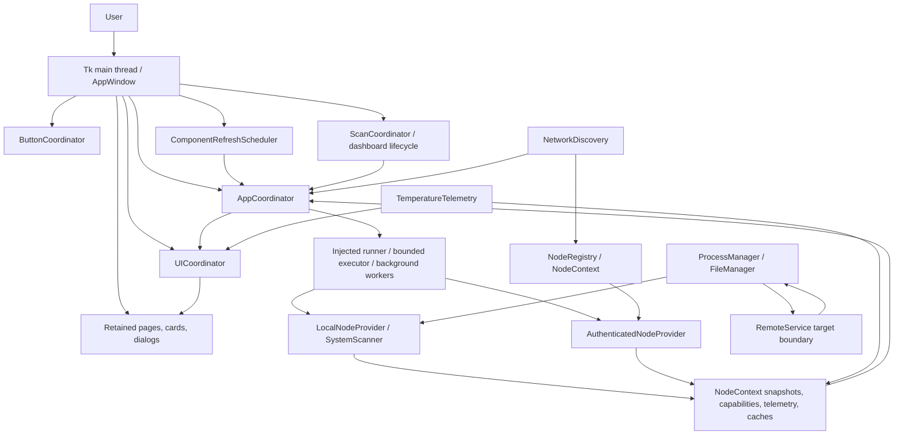
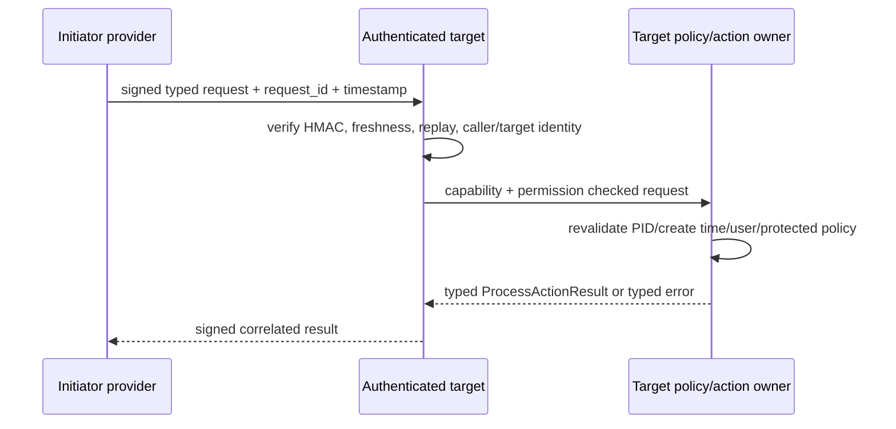

# System Analyzer - Technical & Product Review

**Review date:** 2026-09-10  
**Repository version:** `1.4.6.0` (`maintenance/_version.py`)  
**Evidence basis:** current source, tests, packaging files, selected Git history, and the external references listed at the end of this document.

This is a review of the repository as it exists today. A design document, an old
phase plan, a capability enum, or a protocol abstraction is not treated as proof
that a user-facing feature is complete. Where the implementation is incomplete,
the review says so.

## Executive Summary

System Analyzer is a local Tk desktop application for understanding the current
machine and performing a small set of deliberately constrained maintenance
actions. Its implemented center of gravity is a six-card resource dashboard:
CPU, memory, storage, GPU, network, and battery. It also provides process
review, Downloads review and Move to Trash, a dedicated thermal history page,
preferences, a read-only snapshot CLI, and a substantial model for discovering
and authorizing other System Analyzer nodes.

The product is best described as **lightweight desktop diagnostics with safe,
local maintenance**, not as a general optimizer, enterprise monitoring system,
or working remote administration suite. The local path is the mature product
surface. Multi-node discovery, identity, trust, authenticated protocol
contracts, and target-side process actions exist in code, but the normal pairing
and cross-machine connection path is not currently wired as a production-ready
LAN feature.

### Current / partial / future

| State | Meaning in this review |
|---|---|
| **CURRENT** | Implemented in the application and represented in tests or packaging. |
| **PARTIAL** | Significant code exists, but an important user path, platform, or lifecycle is incomplete. |
| **EXPERIMENTAL** | A contract or prototype exists without enough runtime evidence to call it mature. |
| **FUTURE** | A useful opportunity identified from evidence; not represented as current behavior. |
| **NOT IMPLEMENTED** | No current implementation was found, or the product explicitly declines the operation. |

### Product philosophy

The code consistently favors:

- useful current readings over an always-on telemetry database;
- component isolation and fail-soft unavailable states over one failed sensor
  breaking the dashboard;
- explicit user action over automatic cleanup;
- Move to Trash rather than permanent deletion;
- target-side process validation rather than trusting a caller's PID list;
- independent machines with per-node state rather than pretending to pool CPU or
  memory;
- a readable desktop overview rather than HWiNFO-level hardware inventory.

The architecture supports a broader multi-node product, but the current product
should not advertise remote monitoring or remote control as generally available
until target grant provisioning, connection wiring, transport confidentiality,
and cross-machine validation are complete.

## Current Capability Matrix

| Capability | User-facing behavior | Architectural owner | Local | Remote | Platform notes | Status |
|---|---|---|---|---|---|---|
| System overview | Dashboard cards, health/status, scan time, manual analyze action | `SystemScanner`, `window.AppWindow`, dashboard UI | Yes | Contract/read model exists | Tk desktop; headless snapshot also exists | **MATURE** |
| CPU | Usage, core counts, frequency, classified temperature when available | `SystemScanner`, `scanner_support/dashboard.py` | Yes | Snapshot contract | Temperature coverage is platform/sensor dependent | **WORKING** |
| Memory | RAM usage and swap information | `SystemScanner` | Yes | Snapshot contract | `psutil` required | **WORKING** |
| Storage | Home filesystem usage, trash size, Downloads candidates, drive temperature when available | `SystemScanner`, `StorageMixin`, `FileManager` | Yes | Review data contract only | Downloads resolution has Windows-specific fallback logic | **WORKING** |
| GPU | Hardware identity and supported utilization/temperature detail | `GpuMixin`, optional NVML and platform commands | Yes | Snapshot/component contract | Coverage is not equivalent on Linux, macOS, and Windows | **PARTIAL** |
| Network | Interface/global counters, rates, active/tunnel state where available | `SystemScanner` network reads and dashboard card | Yes | Snapshot contract | `psutil` data varies by OS and interface | **WORKING** |
| Battery | Presence, charge/status, battery temperature where available | `SystemScanner`, thermal telemetry | Yes | Snapshot contract | Absent batteries are a normal state | **WORKING** |
| Thermals | Current values, bounded history, min/max, warning/critical status, recovered spike events, graphs | `TemperatureTelemetry`, `AppWindow` render intents, `ThermalsPage` | Yes | Signed sample codec and provider contract | Sensor drivers are uneven across platforms | **WORKING / PARTIAL** |
| Processes | Review candidates and request graceful or force quit for safe targets | `ProcessesMixin`, `ProcessManager`, dialogs | Yes | Typed process review/action contract | Actions are target-side when remote wiring is available | **WORKING locally** |
| Cleanup scan | Downloads large/duplicate/reviewable file candidates; content hashing is bounded/cached | `DownloadScanner`, `SystemScanner` | Yes | Remote candidate read contract | Filesystem cost grows with the selected Downloads tree | **WORKING** |
| Move to Trash | Explicitly selected valid Downloads files are moved through `send2trash` | `FileManager` | Yes | Deliberately unavailable | Rejects symlinks, directories, paths outside Downloads, and changed files | **MATURE** |
| Manual full scan | Runs a separate dashboard scan with progress, timeout, cancellation, and stale-result rejection | `ScanCoordinator`, `DashboardScanLifecycle`, `AppCoordinator` | Yes | Provider abstraction | 30-second UI timeout plus grace handling | **MATURE** |
| Settings / preferences | Refresh intervals, card visibility, unavailable-card hiding, appearance, reset | `AppPreferences`, `PreferencesStore`, settings pages | Yes | Per local app | Atomic JSON persistence; platform-aware config paths | **WORKING** |
| Appearance | Central semantic colors, accent themes, typography, spacing and graph tokens | `maintenance.ui.styles` | Yes | N/A | Tk/ttk styling | **WORKING** |
| Nodes | All Systems view and Nodes & Connections settings page | `NodeRegistry`, `NodeContext`, cluster UI | Local plus model | Intended target | Discovered nodes are not selectable until trusted | **PARTIAL** |
| Discovery | mDNS/zeroconf presence advertisement, browsing, normalization, deduplication, TTL expiry | `NetworkDiscovery`, `DiscoverySession`, `AppCoordinator` | Yes | Presence only | Same reachable LAN and multicast support required | **EXPERIMENTAL / WORKING** |
| Trust / pairing | Persistent node records, fingerprints, explicit pairing states, revocation model | `NodeRegistry`, `ClusterStore`, node actions | Local control plane | Target grant required | Normal composition has no default target-grant provisioner | **PARTIAL** |
| Remote monitoring | Authenticated typed read/provider infrastructure | `maintenance.remote` | N/A | Protocol supports reads | Production peer connection is disabled/no-op in current composition | **EXPERIMENTAL** |
| Remote process actions | Typed request-quit and force-quit operations with target validation | `RemoteService`, `ProcessManager` | N/A | Protocol supports actions | Do not describe as generally usable LAN control today | **EXPERIMENTAL** |
| Remote file cleanup | None; remote storage candidates are read-only | Deliberate product boundary | N/A | No | Avoids opaque remote paths and unsafe deletion semantics | **NOT IMPLEMENTED** |
| Arbitrary remote shell | None | Deliberate product boundary | N/A | No | No generic command or arbitrary signal endpoint | **NOT IMPLEMENTED** |
| Snapshot CLI | Read-only JSON snapshot using the same `algo.Analyzer` facade | `maintenance.snapshot` | Yes | No separate remote CLI | Console script is packaged | **MATURE** |
| Packaging | Wheel, console scripts, shell/PowerShell installers, optional Linux desktop entry | `pyproject.toml`, `install/`, `packaging/` | Yes | N/A | Current online checksum artifact requires release hygiene | **PARTIAL** |

## UI and Navigation Map

The current page router registers and eagerly builds these retained pages in
`window.AppWindow._build_window()`:

```text
System Overview
  +-- CPU
  +-- Memory
  +-- Storage
  +-- GPU
  +-- Network
  +-- Battery
  +-- Scan / health / cleanup actions

Thermals
  +-- CPU temperature graph
  +-- GPU temperature graph
  +-- Storage temperature graph
  +-- Battery temperature graph when supported
  +-- Recent recovered thermal events

All Systems / Cluster
  +-- Current local system
  +-- Trusted or authorised node contexts when available

Settings
  +-- Preferences
  |     +-- refresh intervals
  |     +-- card visibility
  |     +-- hide unavailable cards
  |     +-- appearance
  |     +-- reset
  +-- Nodes & Connections
        +-- discovered candidates
        +-- pairing/revocation controls
        +-- trusted-node metadata and status
```

Detail dialogs are built in `maintenance/dialogs.py` and include process review,
storage review, information/detail views, and confirmation/action flows. The
router in `maintenance/ui/navigation.py` uses `pack_forget`/`pack`: pages are
not destroyed during navigation, so widget state and scroll positions survive.
The generic loader API exists, but the current `AppWindow` composition uses
explicit page builders and controller methods rather than making every page a
loader-backed route.

## Architecture Overview



### Composition root and providers

`main.py` configures logging, creates `AppWindow`, and starts Tk. The window
creates preferences and cluster stores, the local analyzer and action managers,
the node registry, the schedulers/coordinators, retained pages, peer/discovery
services, and the initial scan. `algo.py` is the application facade used by the
dashboard and snapshot CLI; `maintenance/scanner.py` remains the compatibility
facade over focused scanner support modules.

The provider boundary is in `maintenance/nodes.py`. `LocalNodeProvider` adapts
the local analyzer. `AuthenticatedNodeProvider` in `maintenance/remote.py`
adapts typed remote reads and actions. `NodeContext` keeps provider, scheduler,
coordinator, managers/backends, snapshot, capability state, connection state,
retry state, and per-node thermal telemetry together. Operation and cache keys
are node-qualified so one node cannot overwrite another node's work.

## Responsibility Matrix

| Component | Owns | Does not own | Key dependencies |
|---|---|---|---|
| `ComponentRefreshScheduler` | Per-component cadence, due times, pause/resume, one in-flight lease, one coalesced request | Worker execution, Tk widgets, full dashboard scan lifecycle | `RefreshIntervals`, monotonic clock, selected node runtime |
| `AppCoordinator` | Per-key worker lifecycle, coalescing, generation checks, cached last-good results, cooperative cancellation, subscribers, injected UI delivery, discovery event bridge | Widget mutation, sensor logic, authority decisions, a universal timer | Injected runner/delivery; default `ThreadPoolExecutor(max_workers=4)` |
| `ScanCoordinator` | Dashboard scan active flag, generation, queued rerun, cancellation invalidation | Component cadence and provider implementation | Dashboard scan lifecycle and `AppWindow` |
| `DashboardScanLifecycle` | Timeout/watchdog/grace lease and scan completion state | Per-card polling and widget drawing | `ScanCoordinator`, background orchestration, node-qualified scan state |
| `UICoordinator` | Render intents, batching/coalescing, visibility gating, target generation, node ownership, stale render rejection | Scanning, scheduling, telemetry acquisition, direct widget creation | Controller-prepared `RenderIntent` and page apply callbacks |
| `ButtonCoordinator` | Stable action IDs, widget binding/replacement, enable state, dead-widget pruning, semantic dispatch | Background jobs, permissions, destructive action policy | Pages, dialogs, Tk widgets |
| `NodeRegistry` | Stable identity records, discovered candidates, trust/pairing state, selection, node contexts, capability separation | mDNS transport, credentials on the wire, widgets, sensor reads | `NodeContext`, `ClusterStore`, discovery callbacks |
| `NetworkDiscovery` | mDNS advertisement/browse, normalization, self-filtering, deduplication, TTL expiry | Trust, authorization, remote reads/actions, registry persistence | `zeroconf` or injected discovery backend |
| `SystemScanner` | Local resource reads, static caches, process/file candidates, temperature acquisition, cancellation seams | Tk rendering, user confirmation, final destructive actions | `psutil`, optional NVML, platform commands, scanner support modules |
| `ProcessManager` | Target validation and process termination semantics | Candidate presentation and user confirmation | `psutil`, protected-process policy |
| `FileManager` | Downloads-root/path/file identity validation and Move to Trash | Discovery of candidates and automatic deletion | `send2trash`, resolved Downloads root |

There is intentional overlap at the application boundary: `AppWindow` still
contains compatibility wrappers and mirrors selected-node/runtime fields while
`NodeContext` is the newer owner of per-node state. This preserves historical
imports and monkeypatch seams, but increases synchronization surface. There are
also multiple background execution paths: `AppCoordinator`, the window
`BackgroundOrchestrator`, dialog `BackgroundTaskRunner`, scanner-specific CPU/GPU
threads, and the peer socket server. They are not interchangeable lifecycle
contracts.

## End-to-End Data Flows

### Periodic component refresh

```text
Tk timer wake-up
  -> selected node's ComponentRefreshScheduler.collect_due()
  -> begin(component) claims an in-flight lease
  -> AppCoordinator keyed run for node/component
  -> LocalNodeProvider or AuthenticatedNodeProvider
  -> SystemScanner.scan_component() or typed remote read
  -> ResourceSummary and capability observation
  -> NodeContext snapshot / TemperatureTelemetry
  -> controller prepares RenderIntent
  -> UICoordinator coalesces, visibility-gates, and rejects stale delivery
  -> card/page mutates widgets on Tk thread
  -> scheduler.finish(component)
```

### Manual full-system scan

The Analyze action is separate from component cadence. It captures the selected
provider and node identity, claims a `ScanCoordinator` generation, runs
`scan_dashboard()` through the scan/background path, reports progress, and
applies only a result whose scan generation and node identity are still current.
The dashboard scanner reads the six catalog components independently and retains
static hardware information in scanner caches. Timeout and cancellation release
the UI lease without permitting a late worker result to replace a newer scan.

### Button action and process review

`ButtonCoordinator` routes a stable semantic action ID to a page/dialog callback.
The callback opens or refreshes process/storage work through the application
coordinator. Candidate review is read-only until the user selects an operation.
The page owns confirmation and presentation; the action owner performs policy
validation; no worker mutates Tk widgets directly.

### Safe process termination

```text
User confirmation
  -> typed ProcessTerminationRequest
  -> local ProcessManager or authenticated RemoteService target
  -> capability + permission + target-node checks
  -> target re-resolves PID, user, protected status, executable and create time
  -> terminate() for request-quit or kill() for force-quit
  -> bounded wait / ProcessActionResult
  -> typed result delivered back to the originating UI
```

### Storage review and cleanup

The scanner walks the configured Downloads directory, identifies candidates,
uses bounded SHA-256/hash/content-marker work for duplicate validation, and
returns review records. `FileManager.move_to_trash()` only accepts real files
under the resolved Downloads root, rejects symlinks and directories, rechecks
device/inode identity, and calls `send2trash`. There is no automatic cleanup and
no remote file mutation.

### Thermal sample to graph

```text
psutil/platform sensor read
  -> normalized TemperatureSample / TemperatureScan
  -> ResourceSummary temperatures
  -> per-node TemperatureTelemetry
  -> bounded 600-second history + bounded event queue
  -> immutable TemperatureRenderState
  -> AppWindow render intent
  -> ThermalsPage / TelemetryMiniGraph Canvas rendering
```

### Discovery and remote read

Discovery emits only normalized presence candidates. `AppCoordinator` bridges
transport events onto the Tk thread; `NodeRegistry` stores the candidate as
untrusted and non-selectable. Pairing is a separate explicit flow. Once a valid
trusted record and target-owned grant exist, a provider can perform `hello`,
validate node identity/fingerprint/capabilities, and make typed reads. In the
current composition, the grant provisioner is optional and production peer
connection reconciliation supplies a no-op connector, so this remains a
protocol-capable but operationally incomplete path.

## Scheduling, Concurrency, and Lifecycle

### Current scheduling model

`ComponentRefreshScheduler` is the one component cadence scheduler. Defaults are:

| Component | Default interval |
|---|---:|
| CPU | 1 s |
| Network | 1 s |
| Memory | 5 s |
| GPU | 3 s |
| Storage | 30 s |
| Battery | 30 s |

Intervals are loaded from validated `AppPreferences` before scheduler creation.
The scheduler uses a monotonic clock wrapper, advances the next due time by
elapsed periods, and does not perform catch-up bursts after a delayed worker.
An in-flight lease prevents overlap; a refresh request is coalesced rather than
creating unlimited pending work.

Tk timers wake the application to inspect due work and deliver background
results. `AppCoordinator` is not a competing cadence scheduler: it is a keyed
work shock absorber. It coalesces triggers, keeps the last good result, carries a
generation, and injects delivery back to Tk. Manual dashboard scans have their
own lifecycle because they need progress, timeout, rerun and cancellation
semantics.

Timeout timers, discovery TTL expiry, UI delivery/drain timers, delayed status
transitions, and graph/presentation timers are unrelated timer responsibilities;
they should not be collapsed into the component cadence scheduler merely because
they use Tk's `after()` mechanism. Older ClockCoordinator/ResourceGovernor
experiments are historical context, not current architecture.

### Thread boundary

Tk widgets and Tk variables belong to the main thread. Workers perform sensor,
filesystem, process, and remote work. `AppCoordinator.deliver`, the window
background queue, or a dialog delivery queue posts completion to the main loop.
Generations reject late results; node IDs reject results for a previous selected
node; UICoordinator rejects stale or hidden presentation intents. Cancellation is
cooperative through `threading.Event` and does not forcibly kill arbitrary Python
work.

The architecture prevents common duplicate/stale-work failures through four
layers: scheduler leases, coordinator keyed coalescing, scan generations, and
node-qualified render/cache ownership. Remaining risk is lifecycle diversity:
background daemon threads, specialized scanner threads, and remote handlers do
not all have identical shutdown behavior. Shutdown is deterministic at the
controller level, but a worker that ignores cancellation can outlive the UI
operation and must be contained rather than forcibly terminated.

## Memory and Resource Behavior

Evidence for a lightweight design is concrete but bounded:

- the default `AppCoordinator` executor has four workers;
- peer handlers are bounded by the remote server's active-handler and queue
  limits;
- the scanner's hash cache is capped at 1,024 entries;
- temperature history is limited to 600 seconds and event queues to eight events
  per component policy;
- graph rendering caps points through shared graph tokens;
- failed-card values are retained only for a configured small count;
- hidden presentation targets do not render until visible;
- component work is coalesced instead of queued without bound;
- static hardware, temperature, and trash reads have explicit caches.

Potentially growing structures still deserve monitoring: `AppCoordinator` state
and cached last results are keyed dictionaries, node registry records persist
trusted nodes, and per-sensor telemetry history creates a deque per sensor ID.
These are bounded by normal node/sensor cardinality rather than a global byte
budget. Persistent historical telemetry is not implemented, so the application
does not currently accumulate an unbounded on-disk time series.

## Hardware and System Capabilities

The canonical component catalog is `maintenance/components/catalog.py`; scanner
dispatch is in `SystemScanner.scan_component()`.

| Component | Current meaningful information |
|---|---|
| CPU | Current usage, physical/logical core counts, frequency, and classified CPU temperature samples when the platform exposes them. CPU sampling uses a persistent worker/cache rather than blocking every UI refresh. |
| Memory | Virtual memory totals/availability/usage and swap information from `psutil`. |
| Storage | Home filesystem capacity/free/used values, cached trash size, Downloads review candidates, and storage temperature samples when classified sensors exist. |
| GPU | Hardware identity from platform-specific probes and optional NVIDIA NVML detail including supported memory/utilization readings. Missing or timed-out GPU support becomes an unavailable/failed capability rather than blocking the dashboard. |
| Network | Global and per-interface counters/rates, interface state, and tunnel-interface classification where available from `psutil`. |
| Battery | Presence and battery state/charge data from `psutil`, plus a thermal sample when available. A machine without a battery is a normal unsupported state. |

This is not a complete hardware inventory. The repository does not currently
provide a mature motherboard/firmware/PCI tree, fan-control surface, SMART
health report, per-core sensor matrix, power-limit analysis, or persistent
exportable sensor log.

## Thermal Telemetry

Thermal acquisition remains hardware-specific. `DashboardMixin` reads
`psutil.sensors_temperatures()` and classifies known CPU, GPU, and NVMe driver
families; GPU platform probes and storage/CPU details retain their own provider
logic. The common layer is `TemperatureTelemetry`, not a universal sensor
driver.

Each normalized sample contains component, sensor ID/name, Celsius value,
wall-clock timestamp, and monotonic timestamp. The shared layer maintains a
600-second bounded history, per-sensor histories, current/minimum/maximum
snapshots, and a bounded event queue. Default policy uses 90 C warning, 95 C
critical, 85 C recovery, two consecutive hot samples, a 30-second cooldown, and
rapid-rise detection of 12 C over four samples. Events capture a bounded prelude
and post-event sequence and are emitted after recovery; the UI shows recent
recovered events.

`TemperatureTelemetry` exposes immutable `TemperatureTelemetryUpdate` and
`TemperatureRenderState`. `AppWindow` prepares render intents, while
`ThermalsPage` owns graph widgets and `maintenance/ui/thermal_graph.py`/
`telemetry_graph.py` owns drawing geometry. This is a strong boundary: sensor
acquisition and history can be tested without Tk, and the UI does not scan
hardware. Remote sample decoding is typed and signed, although decoded sample
range/finite validation is weaker than local scanner filtering and should be
treated as a future hardening point.

## Process and Maintenance Safety

Safety is a product boundary, not just a dialog warning.

### Process review and termination

`ProcessManager` rejects protected PIDs, foreign-user processes, protected names
and executable names, and unreadable descendants during force-quit. A requested
process's `create_time` can be supplied and is revalidated immediately before
the action to reduce PID reuse risk. Graceful quit calls `terminate()`; force
quit calls `kill()` and applies the same target policy to recursive children.
The result reports stopped, still-alive, and error sets. Remote typed actions
repeat target-side capability, permission, node, PID, create-time, and process
policy checks; the initiator's candidate list is not treated as authority.

The final check and operation are not an atomic operating-system transaction,
so a narrow process identity race remains possible. That is an honest residual
risk, not a reason to remove the revalidation.

### File review and cleanup

The scanner does not silently delete. The user reviews candidates and confirms a
Move to Trash operation. `FileManager` resolves the allowed Downloads root,
rejects symlinks, requires regular files, checks path containment, re-stats the
file, compares device/inode identity, and calls `send2trash`. It reports partial
failures per path. The check/use sequence still has a filesystem race window,
but the operation is non-permanent and substantially narrower than arbitrary
deletion.

### Deliberate non-capabilities

The current product has no fake optimizer/registry cleaner, no automatic
destructive cleanup, no blind force-kill, no arbitrary remote shell, no
arbitrary remote signal endpoint, and no remote file deletion. These constraints
are coherent with the product's safety philosophy.

## Nodes, Cluster, Discovery, and Trust

### Independent node model

Nodes remain independent machines. `NodeRegistry` and `NodeContext` provide a
selected-node abstraction, not distributed computation: there is no shared RAM,
CPU pool, scheduler, or workload migration. Each node has its own provider,
snapshot, capabilities, telemetry, connection state, and operation/cache keys.
The All Systems/Cluster pages present independent systems side by side.

Stable IDs are random installation identifiers (`node-` plus random material)
and are persisted. Hostnames and addresses are metadata, not identity. A
fingerprint is used for continuity display/validation; it must not be confused
with proof that a network endpoint is honest.

### Discovery

`NetworkDiscovery` uses the `_system-analyzer._tcp.local.` service through
`zeroconf`. It advertises minimal presence metadata, browses add/update/remove
events, filters the local instance, normalizes candidates, deduplicates by
stable identity, and expires records after a 120-second TTL. The application
ticks expiry from its existing application timer rather than creating an
unbounded per-peer timer.

Discovery requires a reachable LAN path, multicast/mDNS support, and firewall or
VPN conditions that permit the traffic. Missing `zeroconf`, mDNS startup errors,
network isolation, or unsupported multicast fail soft to a single-node app.
Discovery is not peer authentication and does not retrieve data, store
credentials, pair, or execute actions.

```mermaid
flowchart LR
    Advertise[mDNS advertisement] --> Browse[zeroconf browser/listener]
    Browse --> Normalize[normalize / self-filter / deduplicate]
    Normalize --> Candidate[untrusted candidate]
    Candidate --> Registry[NodeRegistry]
    Registry --> Discovered[DISCOVERED: visible, not selectable]
    Discovered --> Confirm[explicit user pairing confirmation]
    Confirm --> Grant[target-owned grant provisioning]
    Grant --> Trusted[TRUSTED / capability state]
    Trusted --> Hello[authenticated hello + identity validation]
    Hello --> Authorized[authorized provider/action path]
```



### Trust, authentication, and authorization

The critical distinction is:

```text
DISCOVERED != TRUSTED != AUTHORIZED
```

The registry keeps these states separate. A discovered machine cannot become
selectable or gain a read/action capability merely by advertising itself.
Pairing requires protocol compatibility, fingerprint information, explicit user
confirmation, target-side grant provisioning, and durable initiator persistence.
Revocation removes trusted records and credentials. Authentication uses a
versioned JSON envelope and HMAC-SHA-256 with a 256-bit shared secret; freshness,
replay, request-ID correlation, target/caller identity, and capability checks are
also enforced.

The current code stores the shared secret in `cluster.json` as part of the local
cluster record. HMAC provides authenticity/integrity, not confidentiality. The
current socket server binds to loopback and discovery advertises
`connectable=False`, which limits exposure but also means the normal application
is not a working cross-machine service. If a socket were exposed beyond
loopback, TLS or another confidentiality layer would be needed before treating
process data, file paths, or action traffic as private.

## Remote Transport and Actions

There is no FastAPI server in the current repository. `maintenance/ui/navigation.py`
uses FastAPI only as an analogy for modular registration; it does not depend on
FastAPI. The actual transport is an injectable contract plus a threaded socket
implementation in `maintenance/remote.py`, with an in-process memory transport
for tests.

The protocol has:

- protocol version `1`;
- JSON envelopes with strict validation and an 8 MiB maximum;
- HMAC-signed requests and responses;
- a 60-second freshness window;
- a 300-second, 4,096-entry replay cache;
- at most eight active handlers and a bounded server queue;
- typed errors for protocol, authentication, authorization, transport, and
  execution failures;
- capabilities parsed as metadata, with unknown capabilities never granting
  permission;
- `hello`, dashboard snapshot, component summary, process candidates, storage
  candidates, request-quit, and force-quit operations.

Remote read operations are **READ ONLY**. Remote process operations are
**CONTROL** and potentially destructive. Remote file cleanup is not implemented.



Production readiness is **partial**: the protocol and target policy are real and
well tested, but normal pairing lacks a default target-grant provisioner,
production peer reconciliation supplies a no-op connector, discovery advertises
no connectable endpoint, and transport confidentiality is not provided. These
facts make the architecture promising but do not justify marketing it as
working remote management.

## UI Architecture and Design System

The UI is a presentation layer over application state. State belongs in scanner,
provider, coordinator, node, preference, and telemetry models. Presentation
state includes active page, visibility, pending render intent, widget lifetime,
scroll position, and style selection.

`UICoordinator` accepts controller-prepared intents, merges repeated target
updates, suppresses hidden targets, tracks generation/node ownership, and drops
stale commits. It never scans, schedules workers, or draws widgets. Pages own
their widgets; the thermal page owns graph instances; `thermal_graph.py` and
`telemetry_graph.py` own geometry/drawing. This prevents a common failure mode in
which a worker thread updates a widget after a page or node has changed.

`ButtonCoordinator` is intentionally narrower. It handles semantic action
routing and widget lifecycle, not authorization or background execution.
`maintenance/ui/layout.py` provides scroll shells, metric rows, cards, dialogs,
headers, footers, settings rows, and resize-aware wrapping.

`maintenance/ui/styles.py` is the design-system owner. It centralizes semantic
colors, accent themes, typography hierarchy, spacing, control padding, card and
graph tokens, progress bars, status styles, and danger states. Current themes
include indigo, emerald, rose, amber, and sky. Centralization reduces visual
drift between dashboard cards, settings, dialogs, lists, and graphs. Tests use
recording widgets and fake masters; live resize tests are display-dependent.

## Packaging and Platform Support

`pyproject.toml` declares Python `>=3.10`, `psutil`, `send2trash`, `zeroconf`,
and optional non-Darwin `nvidia-ml-py`. It packages the top-level compatibility
modules and the `maintenance` package. Entrypoints are:

- `system-analyzer -> main:main` for the Tk GUI;
- `system-analyzer-snapshot -> maintenance.snapshot:main` for read-only JSON.

Install scripts exist for Linux/macOS/WSL shell environments and native Windows
PowerShell, with an optional per-user Linux desktop entry. The source has
platform branches for Windows Downloads/Recycle Bin/GPU commands, macOS GPU
`system_profiler`, and Linux `lspci`/NVML/sensor conventions.

| Platform claim | Evidence-based assessment |
|---|---|
| Linux local GUI and scanner | **WORKING / TESTED** in the current environment; this is the strongest runtime evidence. |
| macOS code paths | **CODE-PATH EXISTS / PARTIAL**; native execution was not verified here. Sensor and GPU coverage differ from Linux. |
| Windows code paths | **CODE-PATH EXISTS / PARTIAL**; native execution was not verified here. Download, Recycle Bin and WMI/PowerShell branches exist. |
| WSL installer path | **CODE-PATH EXISTS**; it is an installer target, not proof of full native hardware behavior. |
| Cross-machine remote feature | **NOT VERIFIED / NOT READY** as a normal LAN product flow. |
| Python 3.10 minimum | **DECLARED**, but packaging/deployment tests import `tomllib`, which is standard-library-only from Python 3.11; minimum-version test portability is therefore incomplete. |

Preferences use XDG config on Linux, Application Support on macOS, and APPDATA
or a Windows roaming fallback. The README's platform-equivalent log-location
description is broader than `main.py`, which currently defaults logging to
`.local/state/system-analyzer` unless `XDG_STATE_HOME` is set. That is a small
platform/documentation inconsistency.

## Test Architecture

The suite is `unittest` under `tests/`, with shared setup in `tests/support/`.
The repository validation previously recorded **1,134 tests passing**. Coverage
includes:

- coordinator lifecycle, coalescing, cancellation, stale generations and stress;
- scheduler cadence and fake monotonic clocks;
- dashboard scans and timeout behavior;
- node contexts, selection, multi-node concurrency and registry transitions;
- discovery normalization, deduplication, TTL expiry and end-to-end fakes;
- cluster persistence and remote protocol contracts;
- process protection, PID/create-time checks and storage conservative behavior;
- temperature telemetry, event recovery, thermal cards and graphs;
- preferences, settings, navigation, dialogs, action routing and render intents;
- package structure, installers, release metadata and logging;
- live Tk resize when a display is available.

The testing principle is **share test setup, not test meaning**. Fakes provide
deterministic masters/widgets, deferred runners/timers, scanner environments,
providers, process actions, and telemetry. Assertions remain in each semantic
test module rather than being hidden in generic fixture helpers. This is a
significant strength for a Tk application.

Coverage limitations are equally important:

- live Tk rendering is skipped without a display;
- native macOS and Windows behavior is not verified in this environment;
- cross-machine pairing and actual LAN transport are not verified;
- performance audit schemas expose allocation/I/O dimensions that current
  reports do not fully populate;
- repository-wide static gates include generated/audit/skill paths with known
  failures even though application-scoped checks have passed.

## Performance and Resource Profile

### Observed and designed behavior

The design is intentionally moderate: CPU and network refresh at about one
second, memory at five seconds, GPU at three seconds, and storage/battery at 30
seconds by default. Static hardware is cached. Temperature reads are cached for
five seconds, trash size for 60 seconds, and GPU queries have explicit timeout
and abandonment controls. A persistent CPU worker avoids repeatedly blocking on
sampling. Manual Downloads work is the most likely local burst cost because it
walks files, reads metadata, and may hash content for duplicate validation.

Graph state is bounded and UI rendering is coalesced. Hidden pages do not need
to commit every update. These are architectural inferences supported by the
constants and tests; they are not a substitute for a representative runtime
profile on large Downloads trees or several peers.

### Likely hotspots

- large Downloads scans and duplicate hashing;
- platform GPU subprocess/NVML queries;
- process candidate inspection on process-heavy machines;
- multiple Tk card commits if coalescing is bypassed;
- remote polling if peer support is later enabled without per-peer budgets.

The repository contains performance-audit infrastructure, but its failure,
cancelled, and timeout matrix is not fully executed by the current tool, and
simulated macOS/Windows reports do not establish native performance. No native
extension is justified by current evidence. Coordinator, scheduler, and UI
branching should remain Python unless profiling identifies a measured hotspot.

## Failure and Degraded Modes

| Failure | Current behavior | Isolation / visibility / safety |
|---|---|---|
| One sensor fails | Component summary becomes failed/unavailable; other cards continue | Isolated; last-valid values may be retained briefly; safe |
| GPU absent or query times out | Capability becomes unavailable or failed with a user-facing unavailable message | Isolated; bounded query/abandonment behavior |
| Battery absent | Battery capability is unsupported/hidden according to policy | Normal degraded state; safe |
| Discovery unavailable | Logs reason and continues as a single-node application | Isolated; no trust is granted |
| Peer offline | Connection state/retry classification can represent offline; automatic trusted connection wiring is incomplete | Safe but partial; diagnostics need polish |
| Authentication/identity failure | Fails closed and disables automatic retry for trust failures | Safe; should be visible in node diagnostics |
| Permission denied | Typed authorization/execution failure returns without action | Safe; target owns decision |
| Worker failure | Coordinator delivers an error, preserves last good result, and settles the run | Isolated; callback/log visibility exists |
| Manual scan timeout | Timeout message, cancellation, grace handling, late-generation rejection | Recoverable; safe |
| Malformed remote response | Protocol/cluster decode error rejects the response | Fails closed |
| UI closes during work | Shutdown stops services, cancels coordinators, invalidates delivery and closes timers; cancellation remains cooperative | Safe at controller boundary; a non-cooperative worker can linger |

The main observability gap is not absence of all logging; it is the lack of a
compact operator/developer explanation for why a node is offline, why a result
was rejected stale, which work is in flight, or whether a failure is unsupported
versus transient. Lightweight structured status for those states would fit the
current product better than a large telemetry backend.

## External Utility Research

The comparison below uses first-party product/help material, not competitor
marketing as a specification for System Analyzer.

### HWiNFO

HWiNFO's current site describes a Windows/DOS-oriented professional information,
monitoring, diagnostics, and reporting product. Its feature description
emphasizes in-depth hardware information, real-time monitoring, extensive
reporting/status logging, broad component support, and frequent hardware
updates. The product is deliberately much deeper than System Analyzer in
hardware inventory, sensor breadth, reporting, and Windows-specific coverage.

Relevant sources:

- [HWiNFO product overview](https://www.hwinfo.com/)
- [HWiNFO supported components](https://www.hwinfo.com/about-software/supported-components/)
- [HWiNFO SDK](https://www.hwinfo.com/sdk/)

### HWMonitor

CPUID's current HWMonitor page describes readings for voltages, temperatures,
fan speeds, powers, currents, utilization, clock speeds, CPU/GPU monitoring,
memory thermal sensors, SSD/HDD SMART data, batteries, and more. Its version
history demonstrates the ongoing cost of hardware-specific support, including
new GPU/CPU devices, power rails, hotspots, and CSV logging.

Source:

- [CPUID HWMonitor](https://www.cpuid.com/softwares/hwmonitor.html)

### Windows Task Manager

Task Manager is the operating-system task and resource utility rather than a
hardware sensor inventory product. The relevant conceptual comparison is its
strong process hierarchy, application/system process visibility, CPU and memory
resource views, and direct process-control affordances. System Analyzer should
not try to duplicate every operating-system-specific process-management feature.
Microsoft's command documentation is a more stable reference for the underlying
Windows process visibility than screenshots or third-party summaries:

- [Microsoft `tasklist` reference](https://learn.microsoft.com/en-us/windows-server/administration/windows-commands/tasklist)
- [Microsoft `typeperf` reference](https://learn.microsoft.com/en-us/windows-server/administration/windows-commands/typeperf)

### GNOME System Monitor

GNOME's official help describes CPU/resource usage, memory and swap, processes,
process termination and priority, file systems, disk usage, and network
information. It also documents adjusting process refresh speed and using the
process list to identify resource-heavy programs. This is the closest conceptual
comparison for a Linux desktop user: System Analyzer overlaps in overview and
safe process review, but adds thermal history, cleanup review, and a cross-
platform provider model.

Source:

- [GNOME System Monitor help](https://help.gnome.org/users/gnome-system-monitor/stable/)

### iStat Menus

iStat Menus is a macOS menu-bar monitor with extensive current/history graphs,
alerts/rules, CPU/GPU/memory/disk/network/battery/sensor coverage, customization,
and supported fan-control features. It demonstrates the value of glanceable
history and configurable alerts, while also showing a product scope that is
deliberately more continuous and macOS-specific than System Analyzer.

Source:

- [Bjango iStat Menus](https://bjango.com/mac/istatmenus/)

## Comparative Capability Matrix

| Capability | System Analyzer | HWiNFO | Task Manager | GNOME System Monitor | Product interpretation |
|---|---|---|---|---|---|
| Resource overview | Six resource cards and health state | Deep hardware and sensor tree | Strong OS resource views | CPU, memory, filesystem, network views | System Analyzer's overview is intentionally smaller and cross-platform. |
| Hardware inventory | Basic system/GPU labels and core counts | Very deep component/inventory coverage | Limited relative to dedicated tools | Limited relative to dedicated tools | **Missing but valuable** only if inventory remains a focused diagnostic aid. |
| Live sensor breadth | Selected CPU/GPU/storage/battery temperatures and resource values | Broad sensors, voltages, fans, powers, clocks | OS performance counters | Primarily resource/process information | HWiNFO/HWMonitor are a different depth target. |
| Min/max/current | Thermal series snapshots and current/min/max | Extensive sensor readings and logs | Resource charts/current values | Resource charts/current values | **Missing but valuable** for more components and clearer sessions. |
| Historical graphs | Bounded thermal history and events | Real-time/history/reporting features | Resource history | Resource history | Thermal graph foundation is a strong fit for incremental growth. |
| Alerts | Thermal spike/event state in the page | Broad configurable monitoring/reporting | OS-level signals rather than this product's alert model | Limited process/resource workflow | **Missing but valuable**: user-configurable thermal/resource alerts. |
| Process review | Candidate review plus protected local quit/force quit | Not primarily a process manager | Core strength | Core strength including priority/kill workflows | System Analyzer should complement, not replace, the OS manager. |
| Filesystem review | Downloads candidates and safe Move to Trash | Hardware/storage diagnostics | Storage/resource views | Filesystem and disk usage | Cleanup is a deliberate System Analyzer differentiator. |
| SMART/NVMe depth | Temperature classification only | SMART and broad drive sensors | Limited | Filesystem-oriented | **Missing but valuable** if platform APIs and permissions justify it. |
| Network visibility | Counters, rates, interface/tunnel state | Hardware/system information focus | OS networking/resource views | Network resource view | Better network identity/session reporting is plausible. |
| Remote monitoring | Protocol/provider architecture, not production-wired | Product/infrastructure dependent | OS-local | OS-local | **Missing intentionally for now** as a marketed feature until trust/transport are complete. |
| Export/reporting | Read-only JSON snapshot; no session export | Extensive reports/logging | OS views | Command-line equivalents | **Missing but valuable**: bounded human/JSON session export. |
| Cross-platform parity | Python branches, Linux tested, macOS/Windows partial | Primarily Windows | Windows-native | Linux/GNOME-native | Full parity is expensive; capability transparency matters more. |

The comparison does not imply that every missing feature belongs in System
Analyzer. HWiNFO-style sensor inventory, logging, and alerts are useful only if
they reinforce a focused desktop diagnostic product. Fan control, overclocking,
and a permanent monitoring daemon do not follow from the current architecture.

## Product Maturity Review

| Area | Maturity | Evidence and reason |
|---|---|---|
| Local dashboard | **MATURE** | Clear component catalog, independent scans, fallback summaries, scheduler tests, and strong current test coverage. |
| Process safety | **MATURE** | Explicit protected-process, ownership, create-time, child, and target-side validation. Residual OS races remain. |
| Local cleanup | **SOLID BUT NEEDS POLISH** | Conservative Downloads-only Move to Trash boundary; large-tree performance and richer candidate explanations remain opportunities. |
| Preferences and theme | **SOLID BUT NEEDS POLISH** | Immutable model, atomic persistence, central design tokens, retained page state. |
| Thermal telemetry | **SOLID BUT NEEDS POLISH** | Shared normalized model, bounded history/events and graph page; acquisition breadth is still platform/sensor dependent. |
| UI coordination | **SOLID BUT NEEDS POLISH** | Explicit render intents, visibility and stale-node protection; broad `AppWindow` compatibility surface remains. |
| Test architecture | **MATURE for local/headless behavior** | Approximately 1,134 tests and extensive deterministic fakes; native platform/live-display evidence is incomplete. |
| Packaging | **SOLID BUT NEEDS POLISH** | Wheel and installers exist, but checksum/release artifact drift and Python 3.10 test portability need attention. |
| Discovery | **WORKING presence layer** | Zeroconf lifecycle, normalization, deduplication and TTL are implemented and tested. |
| Pairing/trust | **PARTIAL** | Domain model, persistence, grant contracts and revocation exist; default target provisioning is absent. |
| Remote reads/actions | **EXPERIMENTAL** | Strong typed/HMAC contract and target safety, but production connector/listener wiring is not enabled for a normal LAN flow. |
| Cross-platform runtime | **PARTIAL** | Explicit branches exist; Linux is the only environment verified in this review context. |

## Architectural Strengths

1. **Clear safety authority.** `maintenance/actions.py` is the only place that
   performs process termination or Move to Trash, and target-side remote calls
   return through the same safety policy.
2. **Good coordinator boundaries.** The scheduler owns cadence, AppCoordinator
   owns keyed work, ScanCoordinator owns dashboard generations, UICoordinator
   owns presentation commits, and ButtonCoordinator owns action routing.
3. **Strong stale-result defense.** Generations, node-qualified keys, visibility
   gating, and render ownership address the hard problems of a multi-node Tk UI.
4. **Fail-soft capability modeling.** Unsupported, no-data, failed, and valid
   states allow hardware variation without treating absence as an exception that
   breaks the whole app.
5. **Shared thermal mechanism with separate acquisition.** Sensor-specific reads
   remain platform-aware while history, event policy, and presentation state are
   reusable and testable.
6. **Deterministic test seams.** Fake clocks, masters, widgets, providers,
   runners, discovery backends, and process objects make asynchronous behavior
   testable without requiring a live desktop or LAN.
7. **Independent-node semantics.** The registry does not imply distributed
   hardware, which avoids a misleading cluster product promise.
8. **Centralized visual language.** Styles and layout primitives give the UI a
   coherent visual contract rather than duplicating colors and widget geometry.

## Technical Debt and Risks

| Risk | Level | Reasoning |
|---|---|---|
| Remote feature may be overstated | **HIGH** | Protocol, grants, providers, and UI concepts exist, but default target provisioning, connectability, production connection, confidentiality, and cross-machine evidence are incomplete. |
| Multiple async execution models | **HIGH** | AppCoordinator, window/dialog background runners, scanner threads, and socket handlers have different cancellation and shutdown semantics. |
| Compatibility state mirrors | **MEDIUM** | `AppWindow` facade fields coexist with `NodeContext`; extraction preserves historical seams but creates drift risk. |
| Platform parity evidence | **MEDIUM** | macOS/Windows branches are present, but native runs and live sensor coverage were not verified. |
| Release hygiene | **MEDIUM** | Current online checksum metadata was reported stale relative to the current wheel; generated artifacts and historical wheels complicate release selection. |
| Minimum Python test portability | **MEDIUM** | Project declares 3.10 while tests use `tomllib` without a compatibility fallback. |
| Diagnostics for async state | **MEDIUM** | Logs exist, but stale rejection, in-flight work, peer state, and authorization failures are not surfaced in one developer/operator view. |
| Filesystem/process check-use races | **LOW to MEDIUM** | Revalidation reduces risk, but cannot make a normal path-based OS action atomic. |
| Decoded remote thermal sample validation | **LOW to MEDIUM** | Signed payload structure is checked, but finite/range checks are weaker than local acquisition checks. |
| Eager page construction | **LOW** | All retained pages are built at startup, increasing composition cost and keeping widgets alive; it preserves page state and is not currently a measured bottleneck. |

Repository-wide static checks also have hygiene debt: generated `build/` copies,
bug-hunt POCs, and OpenCode skill artifacts can pollute broad `pyright`, `mypy`,
Ruff, and formatting commands. Application-scoped checks have been green, but a
clean contributor/release gate should either scope these artifacts explicitly or
make their status intentional.

## Prioritized Future Opportunities

These are opportunities, not an automatic implementation plan.

### High value / lower complexity

- Add a compact diagnostics panel or export containing component state,
  last-success time, last failure, in-flight status, node connection state, and
  stale-result rejection reason.
- Add bounded session export for dashboard/thermal summaries in JSON and a
  human-readable report, reusing the snapshot codecs rather than inventing a
  second model.
- Make platform capability coverage explicit in the UI: supported, unavailable,
  no data, and permission-limited should be distinguishable.
- Complete release hygiene: regenerate current checksums, keep generated/build
  paths out of static gates, and make Python 3.10 tests compatible with the
  declared minimum.
- Add min/max/average display and configurable thresholds for the existing
  thermal history before adding a permanent database.

### High value / higher complexity

- Finish remote operation only after target-grant provisioning, endpoint
  lifecycle, TLS or equivalent confidentiality, cross-machine validation, and
  explicit UI status are designed together.
- Add richer sensor providers behind capability-scoped adapters: fans, power,
  SMART/NVMe health, per-core readings, and platform-native thermal APIs.
- Add a real bounded peer diagnostics/reconciliation loop with connection budgets,
  backoff visibility, and per-node failure reporting.
- Improve Downloads analysis with measured large-tree performance, resumable or
  staged scans, and clearer duplicate identity explanations.

### Polish

- Improve accessibility and keyboard traversal across retained pages, dialogs,
  graphs, and destructive confirmations.
- Add clearer empty/error/unsupported states and consistent units/tooltips.
- Measure startup cost of eager page construction before considering lazy pages.
- Add live-display CI or a documented display-backed validation job.

### Optional / niche

- User-configurable notification rules for thermal/resource thresholds.
- Per-session sensor annotations or a small rolling export buffer.
- Better network identity and connection summaries, provided privacy remains
  explicit.

### Out of scope unless the product changes direction

- Arbitrary remote shell or unrestricted remote administration.
- Permanent enterprise telemetry ingestion and a cloud control plane.
- Fan control, overclocking, voltage tuning, or hardware writes.
- Shared cluster scheduling, pooled RAM/CPU, or distributed computation.
- Automatic registry/"optimizer" cleanup and permanent file deletion.

## What System Analyzer Should Not Become

The current product should resist becoming:

- a giant always-on enterprise monitoring daemon;
- a fake PC booster that claims to improve performance by deleting or killing
  arbitrary things;
- a generic remote shell or unrestricted administration tool;
- a hardware overclocking or fan-control utility;
- a replacement OS scheduler or process supervisor;
- a permanently logging telemetry database by default;
- a distributed-compute cluster disguised as a system dashboard.

These anti-goals preserve the architecture's strongest properties: local
clarity, deliberate actions, bounded state, independent node identity, and
trust boundaries that are understandable to a desktop user.

## Architecture Invariants

Future changes should preserve these rules:

1. One component cadence owner: `ComponentRefreshScheduler` owns component due
   times, leases, and coalesced refresh requests.
2. `AppCoordinator` owns application worker orchestration semantics, not widgets
   or sensor interpretation.
3. `ScanCoordinator` and dashboard lifecycle remain separate from periodic card
   cadence.
4. `UICoordinator` owns presentation coordination only; it must not scan,
   schedule workers, or draw graph widgets.
5. `ButtonCoordinator` owns action routing only; authorization and destructive
   policy stay with their owners.
6. Workers never mutate Tk; all UI delivery crosses an injected main-thread
   boundary.
7. Generations and node identity must be checked before applying results.
8. `DISCOVERED != TRUSTED != AUTHORIZED`; discovery never grants access.
9. Remote destructive actions require target-side capability, permission,
   identity, and resource revalidation.
10. No destructive local operation occurs without deliberate user action.
11. Process termination and file cleanup remain behind the canonical safety
    owners.
12. Thermal history, event queues, graph points, caches, and peer work remain
    bounded or explicitly budgeted.
13. Per-node snapshots, telemetry, caches, and operation keys remain isolated.
14. Unsupported hardware and unavailable optional dependencies fail soft and do
    not masquerade as healthy readings.
15. New reusable mechanisms require repository-wide ownership search before a
    second implementation is introduced.

## Conclusion

System Analyzer is a credible local desktop diagnostics and safe-maintenance
application with unusually explicit boundaries for a Tk utility. The dashboard,
local process/file safety, preferences, thermal history, UI delivery model, and
test seams are the strongest current areas. The main product risk is not that
the repository lacks ambitious architecture; it is that the multi-node and
remote architecture can be mistaken for a finished feature. Treat it as a
carefully designed experimental boundary until pairing, connection, transport
confidentiality, and cross-machine evidence are complete.

The most product-aligned next improvements are better diagnostics, bounded
session export, clearer capability/error presentation, richer but optional
sensor coverage, and thermal thresholds built on the existing telemetry model.
The least aligned improvements are generic remote administration, permanent
telemetry infrastructure, and hardware-control features. The repository is in
the best position when it remains a focused, safe, inspectable desktop tool.

## Repository Source References

The following are the primary implementation locations used in this review:

- Entry points and composition: `main.py`, `window.py`, `algo.py`,
  `maintenance/snapshot.py`
- Scanner facade and local capability reads: `maintenance/scanner.py`,
  `maintenance/scanner_support/`, `maintenance/components/catalog.py`
- Coordinators and scheduling: `maintenance/components/coordinator.py`,
  `maintenance/components/dashboard_scan.py`,
  `maintenance/components/background_orchestration.py`
- Node model and registry: `maintenance/nodes.py`,
  `maintenance/components/node_context.py`, `maintenance/cluster.py`
- Discovery: `maintenance/components/network_discovery.py`,
  `maintenance/components/discovery_session.py`
- Remote contract and provider: `maintenance/remote.py`
- Safety: `maintenance/actions.py`,
  `maintenance/components/process_safety.py`,
  `maintenance/scanner_support/storage.py`
- Thermal model and UI: `maintenance/components/temperature.py`,
  `maintenance/ui/thermals_page.py`, `maintenance/ui/thermal_graph.py`,
  `maintenance/ui/telemetry_graph.py`
- UI coordination and design system: `maintenance/ui/navigation.py`,
  `maintenance/ui/render_coordinator.py`, `maintenance/ui/action_coordinator.py`,
  `maintenance/ui/layout.py`, `maintenance/ui/styles.py`
- Persistence and preferences: `maintenance/preferences.py`,
  `maintenance/persistence.py`
- Tests and shared fakes: `tests/`, `tests/support/`
- Packaging: `pyproject.toml`, `install/`, `packaging/`, `dist/`

Selected history was used to understand current transitions rather than to make
a changelog. Relevant architectural transitions include scanner extraction
(`8b095f8`), trusted cluster work (`372f028`), authenticated remote management
(`111a300`), discovery hardening/component extraction (`cf64df3`), coordinator
consolidation/discovery release repair (`30eaa79`), and node-scoped rendering
(`98addbf`). The current source, not those historical plans, controls the status
judgments above.

## External References

- HWiNFO, [product overview](https://www.hwinfo.com/)
- HWiNFO, [supported components](https://www.hwinfo.com/about-software/supported-components/)
- HWiNFO, [SDK](https://www.hwinfo.com/sdk/)
- CPUID, [HWMonitor](https://www.cpuid.com/softwares/hwmonitor.html)
- Microsoft Learn, [`tasklist`](https://learn.microsoft.com/en-us/windows-server/administration/windows-commands/tasklist)
- Microsoft Learn, [`typeperf`](https://learn.microsoft.com/en-us/windows-server/administration/windows-commands/typeperf)
- GNOME, [System Monitor help](https://help.gnome.org/users/gnome-system-monitor/stable/)
- Bjango, [iStat Menus](https://bjango.com/mac/istatmenus/)

## Review Validation Notes

- No runtime source files were changed for this review; the intended artifact is
  this Markdown document.
- Repository tests and application-scoped static checks were already recorded as
  passing before this documentation task: 1,134 unit tests, Ruff, formatting,
  Pyright, and Mypy for the application/test scope.
- The document was checked against current source paths and current Git history;
  old phase documents were used only as historical context and were not treated
  as current behavior.
- Mermaid diagrams are fenced as `mermaid` and use only flowchart or sequence
  constructs supported by common Mermaid renderers.
- Native Windows/macOS execution, live-display Tk rendering, cross-machine
  pairing, and actual LAN remote exchange were not verified in this environment.
