# System Analyzer — Current Architecture & Connection Review

> **Canonical owner.** This file is the authoritative module-ownership and
> call-graph reference.  It supersedes `docs/SYSTEM_ANALYZER_REVIEW.md`
> (2026-09-10, version 1.4.6.0) — see §Corrections for specific stale claims
> in that prior review.  Evidence basis: direct source reading, version 1.5.7.2,
> commit `6480895`.

**Review date:** 2026-09-13
**Repository version at time of audit:** `1.5.7.2` (`maintenance/_version.py`), commit `6480895`
**Evidence basis:** direct reading of current runtime source, tests, and packaging files in this
session. Historical/plan Markdown under `docs/` was consulted only as context and is explicitly
called out wherever it disagrees with current code — never as a substitute for reading the code.
`docs/SYSTEM_ANALYZER_REVIEW.md` (2026-09-10, three days before this audit) is the prior
capability-level product review; this document supersedes several of its claims about the remote
path (see [Corrections to the 2026-09-10 review](#corrections-to-the-2026-09-10-review)) and is
scoped differently: that document asks "what does the product do for a user," this one asks "what
calls what, and where does state actually live."

Status vocabulary used throughout, per the audit brief: **VERIFIED CURRENT**, **PARTIAL**,
**MISSING**, **BROKEN**, **DRIFTED**, **EXPERIMENTAL**, **TEST-ONLY**, **DEAD/UNREFERENCED**,
**FUTURE SEAM**, **NOT VERIFIED**. A claim marked NOT VERIFIED means the audit did not find
sufficient evidence either way — it is not a claim that something is wrong.

---

## Executive Summary

System Analyzer is a single-process Tk desktop application (`window.AppWindow`) built around one
composition root that owns every coordinator, store, and registry — there are no module-level
singletons. Three coordinators divide almost all runtime responsibility cleanly:

- **`AppCoordinator`** (`maintenance/components/coordinator.py`) — the shared, keyed,
  coalescing/cancelling/caching bridge between background work and the UI thread. It runs
  per-component dashboard refreshes, page async loads, and the Storage/Process dialogs' scans, and
  also owns the discovery lifecycle bridge.
- **`ButtonCoordinator`** (`maintenance/ui/action_coordinator.py`) — stable action-ID registration
  for buttons, decoupling widget identity from callback identity. Structurally cannot register a
  page's own back button (the shared `page_shell()` primitive never wires one).
- **`UICoordinator`** (`maintenance/ui/render_coordinator.py`) — batches, coalesces, and
  visibility-gates presentation commits (`RenderIntent`s), rejecting stale generations and
  wrong-node deliveries. It never touches widgets itself; callers supply the apply callback.

A fourth, older mechanism, `BackgroundOrchestrator`/`ScanCoordinator`/`DashboardScanLifecycle`,
independently solves the same "run one cancellable background operation, deliver safely" problem
specifically for the manual "Analyze" full-dashboard scan, using an unbounded raw-daemon-thread
model instead of `AppCoordinator`'s 4-worker pool. This is real, working, well-tested duplication —
flagged as **POSSIBLE DRIFT**, not a bug (see [Finding B-1](#findings--risks)).

The product is genuinely two things at once, both fully wired: (1) a local single-machine
dashboard/thermals/process/storage tool that works with zero network exposure beyond an
always-on TLS pairing listener, and (2) a working multi-node system with real discovery, pairing,
trust, authenticated remote dashboard/process/storage browsing, and a cluster
coordinator/worker/placement model. The remote path is considerably more complete than the
2026-09-10 product review states — that review's claim that "production peer connection is
disabled/no-op" is **stale**: every installation binds a TLS-protected listener on `0.0.0.0`
unconditionally at startup, and pairing, trust, and remote process/dashboard/storage reads are
live, tested, end-to-end features. The one genuinely incomplete remote area is **cluster job
placement**: `PlacementPolicy`/`AppCoordinator.choose_placement` is a fully implemented,
deterministic placement engine with **zero production callers** — today a human always picks the
target node manually; nothing in the app ever auto-places work.

The codebase is unusually well self-defended against the class of bug this session's earlier work
targeted (page/button/coordinator wiring drift): `tests/test_page_wiring_consistency.py` already
exists and already caught two real gaps this session (a `ThermalsPage` button and a
`ProcessDialog`/`StorageDialog` coordinator-passing gap). This audit found one more instance of
exactly that pattern that the existing test suite does not yet cover — see
[Finding A-1](#findings--risks) (`DiagnosticsPage`'s "Copy diagnostics" button).

Two real security-relevant facts are asserted without spin: (1) every installation is a
TLS-protected pairing target from first launch, independent of the discovery preference, and (2)
pairing/grant secrets are stored as plaintext JSON in `cluster.json` with no confirmed extra
file-permission hardening (unlike the adjacent TLS private key, which is explicitly `chmod 0o600`).
Neither is presented here as a proven exploit — both are handed to the user as facts to weigh.

---

## Repository Runtime Map

Only architecture-relevant files are listed; trivial single-purpose leaves are folded into their
package's row. Paths are exact and were confirmed against `git ls-files`.

| Path | Primary responsibility | State it owns | State it must not own |
|---|---|---|---|
| `main.py` | Entrypoint: logging setup, constructs and runs `AppWindow` | Log path resolution only | Any app state |
| `window.py` (1043 lines) | Composition root + `AppWindow` controller: Tk root, every coordinator, node registry, cluster/preferences stores, page router, all `_show_*`/`_build_*` methods, shutdown | Tk root, all coordinator instances, node registry, preferences/cluster state, scan state, page router | Widget-drawing details, scanner internals, remote transport details (all delegated) |
| `algo.py` | `Analyzer` facade: `dashboard_snapshot`, `component_summary`, `process_candidates`, `storage_candidates`, `reset_component_sample`, `stop_background_workers`, `_call_with_cancel` — 7 methods, nothing else | Nothing (delegates to `SystemScanner`) | Scanner internals |
| `maintenance/scanner.py` | `SystemScanner` facade (mixin composition); the one hand-written `scan_component` dispatch; `scan_dashboard` loop; all class-constant thresholds; instance-level caches/locks | Static hardware cache, temperature-scan cache, trash-size cache, hash-cache alias, CPU worker thread state | Cleanup/mutation actions (that's `actions.py`) |
| `maintenance/scanner_support/{dashboard,gpu,processes,storage,paths,temperature_platform,smc,_compat}.py` | One mixin/module per scan responsibility; call back into `maintenance.scanner`'s module globals for test-patch seams | Per-component read logic | Nothing persistent |
| `maintenance/components/coordinator.py` | `ScanCoordinator`, `RefreshIntervals`, `ComponentRefreshScheduler`, `AppCoordinator` | Per-key run state, discovery lifecycle handle, scan generation counters | Widget mutation, business validation |
| `maintenance/components/background.py`, `background_orchestration.py` | `TkDeliveryQueue`, `BackgroundTaskRunner` (dialogs' one-shot actions); `BackgroundOrchestrator`/`run_daemon` (manual full scan) | Delivery queues, daemon-thread spawning | Cancellation policy (caller-supplied) |
| `maintenance/components/catalog.py` | `ResourceFeatureCatalog` — the canonical CPU/Memory/Storage/GPU/Network/Battery feature list + capability-declaration matrix | The one source of truth for card order/action-kind/capability declarations | Scanner dispatch (still hand-written, see [Finding B-2](#findings--risks) reference to the existing wiring test) |
| `maintenance/components/downloads.py` | `DownloadScanner`, `DownloadsPathResolver` — Downloads walk, duplicate detection, hashing | Hash cache (LRU, 1024 entries) | Filesystem mutation |
| `maintenance/components/process_safety.py` | Shared protected-process policy (names, same-user, protected-PID snapshot) | Nothing persistent | Action execution |
| `maintenance/components/temperature.py` | `TemperatureTelemetry`, `TemperatureSample/Event/RenderState/Policy` — thermal state machine | Per-node bounded thermal history/events | Tk/UI, acquisition |
| `maintenance/components/network_discovery.py`, `discovery_session.py` | mDNS advertise/browse; the Tk-timer-driven session wrapper | Discovered-candidate normalization, TTL | Trust, UI |
| `maintenance/components/node_context.py`, `node_selection.py`, `peer_connection.py`, `placement.py` | Per-node runtime construction; selection; connection retry/reconciliation; job placement policy | Connection state (`peer_connection.py`), placement decisions (unused, see findings) | Trust/pairing decisions |
| `maintenance/components/cluster_roles.py` | `RoleState`, `RoleAssignment`, `CoordinatorEpoch` — pure cluster-role state machine | Role/lease/job-assignment state | Trust (imports nothing from the trust model at all) |
| `maintenance/components/cluster_storage.py` | `CoordinatorTimeline`/`StandbyBuffer` — bounded SQLite telemetry history | Cluster-role telemetry rows | Config/trust documents |
| `maintenance/nodes.py` | Node/target domain model: `NodeId`, `NodeDescriptor`, `NodeContext`, `NodeRegistry`, capability/permission enums, `Protocol`s (`NodeReadProvider`, `ProcessActionBackend`, `FileActionBackend`) | The node registry, per-node contexts | Discovery/pairing network I/O itself |
| `maintenance/cluster.py` | `ClusterState`/`ClusterStore` — the persisted trust/pairing/cluster-role document | Durable trust/grant/role/invite records | Live connection sockets |
| `maintenance/remote.py`, `remote_security.py`, `remote_support/{protocol,server,transport}.py` | Remote domain: `AuthenticatedNodeProvider`, `RemoteService`, TLS material, signed envelope protocol, socket transport | Wire protocol, TLS material files | Business logic (delegates to canonical local owners on the target) |
| `maintenance/actions.py` | `ProcessManager`, `FileManager` — the **only** place that terminates processes or moves files to Trash | Nothing persistent | Discovery of candidates (that's the scanner) |
| `maintenance/preferences.py` | `AppPreferences`, `IntervalPolicy`, `PreferencesStore` | The on-disk preferences file | Runtime scheduler state |
| `maintenance/persistence.py` | Shared atomic-write primitive (`atomic_write_text`, `read_text_or_none`, `fsync_directory`) | Nothing (pure functions) | Any specific document's schema |
| `maintenance/diagnostics.py`, `health.py` | Pure, uncached projections of live state into UI-facing snapshots | Nothing (rebuilt every call) | The live state itself |
| `maintenance/ui/navigation.py` | `PageRouter`/`PageSpec` — register-once, `pack`/`pack_forget` page switching | `_pages`, `_active_key`, `_loaders` | Data freshness |
| `maintenance/ui/action_coordinator.py` | `ButtonCoordinator` | `_actions: dict[str, _ActionRecord]` | Background work, cancellation |
| `maintenance/ui/render_coordinator.py` | `UICoordinator` | `_pending`, `_visible`, `_generations`, `_target_nodes` | Widget mutation |
| `maintenance/ui/window_*.py` (13 files) | Thin `controller: Any` adapter functions called from `window.py`'s same-named `_foo` methods — page building, lifecycle, discovery wiring, node actions, presentation/dialog routing, preferences apply | Nothing themselves (mutate `controller.__dict__`) | Any state not already on `controller` |
| `maintenance/ui/{settings_home,preferences_page,nodes_connections,cluster_page,thermals_page,diagnostics_page,help_page}.py` | One Page class per registered route; presentation-only, dependency-injected callbacks | Own widget/incremental-render state | The domain data they render (injected) |
| `maintenance/ui/help_content.py` | Static `HELP_TOPICS` data (17 topics) | The static topic text | Any live/dynamic data |
| `maintenance/ui/styles.py`, `layout.py` | Central design tokens; reusable widget-construction primitives | Token dictionaries; nothing runtime | Business logic |

---

## Composition / Startup

Entry point (`main.py:73-76`):

```
main() -> setup_logging() -> app = AppWindow() -> app.run() -> master.mainloop()
```

`AppWindow.__init__` (`window.py:172-253`) construction order — **exact, confirmed by direct
read**:

1. `self.analyzer = algo.Analyzer()` (scanner facade)
2. `self.process_manager = ProcessManager()`, `self.file_manager = FileManager(...)`
3. `self._preferences_store` / `self._preferences = ...load()` — **preferences load before
   anything else reads them**
4. `self._cluster_store` / `self._cluster_state = ...load()`
5. `self._cluster_timeline` / `self._standby_buffer` — constructed **only if** the local node's
   persisted roles already include `coordinator`/`subcoordinator` (lazy provisioning, not
   always-on)
6. `self._scan_coordinator = ScanCoordinator()`, `self._background_queue = Queue()`,
   `self._coordinator = AppCoordinator(deliver=self._submit_ui, on_activity=self._start_background_poll)`
   — **`AppCoordinator` exists before the Tk root does**; `deliver` is pre-root-safe because it
   only enqueues onto a plain `Queue`
7. `self._component_scheduler = ComponentRefreshScheduler(self._preferences.refresh_intervals.as_dict())`
   — confirms the preferences-before-scheduler ordering
8. `self._button_coordinator = ButtonCoordinator()`, `self._ui_coordinator = UICoordinator()` —
   both plain-Python, pre-Tk
9. `self._background_orchestrator = self._make_background_orchestrator()`
10. `self._feature_catalog = ResourceFeatureCatalog()`
11. `self._node_registry = NodeRegistry()`, then `_build_local_node_context()` and
    `_restore_trusted_nodes()` — local identity and persisted trust are established **before** the
    Tk root and **before** discovery starts
12. `self.master = master or tk.Tk()` — **the Tk root appears here**, roughly two-thirds through
    `__init__`; nothing above this line touches Tk
13. `self._timer_delivery = TimerDelivery(...)` — the one `after()`/`after_cancel()` wrapper
14. Window chrome (`title`/`geometry`/`minsize`/`protocol("WM_DELETE_WINDOW", self._close)`)
15. `self._configure_styles()` — registers every ttk style
16. `self._build_window()` — page registration + first `show("dashboard")` (below)
17. `self._start_peer_listener()` — **unconditional**, binds a TLS socket on `0.0.0.0` (see
    [Pairing & Trust](#pairing--trust))
18. `self._start_discovery()` — **unconditional call**, but the discovery *session* itself
    respects the persisted `discovery_enabled` toggle and no-ops if it's off
19. `self._schedule_timer(350, self.handle_analyze)` — the first scan is **deferred** 350ms, not
    run synchronously, so the window paints before any scan can block it

`_build_window` (`window.py:289-315`) registers, in order: `dashboard`, `settings`,
`preferences`, `nodes`, `cluster`, `thermals`, `diagnostics`, `help`, then one `help:<topic.key>`
page per `HELP_TOPICS` entry (17 as of this session), via
`functools.partial(self._build_help_topic_page, topic=topic)`. `PageRouter.register()`
(`navigation.py:61-75`) **builds every page's frame immediately and eagerly** — all base pages
plus every help-topic page exist as real widgets at startup, even though only `dashboard` is
packed. This is a deliberate, documented trade-off: instant, state-preserving navigation later, at
the cost of ~25 eagerly-built page frames at startup.

**Ownership answers:**

- **What's constructed first?** Plain-Python domain/coordination objects — `Analyzer`, managers,
  preferences, cluster state, `AppCoordinator`, `ButtonCoordinator`, `UICoordinator`,
  `NodeRegistry` — all before the Tk root exists.
- **Who owns lifetime?** `AppWindow` itself, for everything. Nothing is a module-level singleton.
  Tests construct fresh `AppWindow` instances freely (`AppWindow(master=..., preferences_store=...,
  cluster_store=...)`).
- **Who shuts them down?** `AppWindow._close()` → `finalize_shutdown()` (full chain in
  [Shutdown Flow](#shutdown-flow)).
- **What's injected into what?** `ButtonCoordinator`/`UICoordinator` into every Page class
  constructor; `AppCoordinator` into `ProcessDialog`/`StorageDialog` and into every
  `NodeContext.coordinator`. `PageRouter` is constructed **without** a coordinator argument — its
  own optional lazy-loader feature (`register_loader`/`refresh`) is unused by `window.py` (a
  genuine but low-stakes unused capability, not a bug: eager-build-everything makes lazy loading
  moot for this app's page count).
- **Global/singleton-like?** None. `styles.py`'s `COLORS`/`FONTS` are module-level but immutable
  dict literals, not runtime state.
- **Per-node?** `NodeContext` (provider, scheduler, coordinator, snapshot, telemetry, connection,
  retry state) — one per registered node, owned by `NodeRegistry`.
- **Per-page/dialog?** Every Page class instance (one per registered route key, built once,
  retained for process lifetime). Dialogs (`ProcessDialog`/`StorageDialog`/`InfoDialog`) are
  transient `tk.Toplevel`s, rebuilt on every open.

---

## Dependency Direction

Normal direction, confirmed throughout:

```
window.py (controller)
  -> maintenance/ui/window_*.py        (adapters: controller: Any, no import cycle back)
  -> maintenance/ui/<page>.py          (Page classes: layout/styles/action_coordinator only)
  -> maintenance/ui/layout.py, styles.py, action_coordinator.py, render_coordinator.py, navigation.py
  -> tkinter
```

Page classes import **only** `maintenance.ui.layout`, `maintenance.ui.styles`,
`maintenance.ui.action_coordinator` (type hint), and their own callbacks dataclass — never
`window`, a scanner, or a manager. Matches `AGENTS.md`'s stated rule exactly, confirmed by reading
every page module's import block.

Two facts worth naming explicitly (both explained, neither a bug):

1. **`maintenance/preferences.py` imports `maintenance.ui.styles`** (for `ACCENT_THEMES`,
   `DEFAULT_APPEARANCE`). This looks like domain→UI inversion. In practice `styles.py` is a pure
   token module (no Tk-heavy or window-level import beyond `tkinter.font`/`ttk` for style
   registration) and does not import `preferences.py` back, so there is no cycle and no real
   widget dependency introduced into the preferences model. Classified **INTENTIONAL** — `styles.py`
   is treated as a shared constants module, not "UI" in the layering sense that matters here.
2. **`window_lifecycle.py`/`window_presentation.py`/`window_pages.py` import `window` itself via a
   deferred, function-local `_window_symbols()` helper**, not a top-level `import window`. This is
   the standard resolution for a genuine two-way dependency: `window.py` imports these adapter
   modules at module scope, so they cannot `import window` at module scope without a circular
   import; each does a function-local `import window` only when it needs a symbol (e.g.
   `window.LOGGER`, page-name constants). Classified **INTENTIONAL cycle-avoidance idiom**, applied
   consistently across all three files.

No unexplained circular imports were found. No Page class imports `window.py` directly; no
`layout.py`/`styles.py` import anything above them; no `maintenance/ui/*` module imports a
scanner, a manager, or network code — importing any UI module creates no Tk root as a side effect.

Cross-cutting: every `platform.system()`/`os.name`/`sys.platform` branch in the whole repository
lives in `maintenance/scanner_support/*`, `maintenance/components/downloads.py`,
`maintenance/components/node_context.py`, `maintenance/preferences.py`, or
`maintenance/remote_security.py` — never in `maintenance/ui/*` or `window.py`. No platform
assumption leaks into shared or UI code (see [Cross-Platform Adapters](#cross-platform-adapters)
for the full table).

---

## UI Navigation / Routes

All pages are registered in `window.py:_build_window` and built via `PageRouter.register`, which
calls the builder **once**, eagerly, at startup. "Opened"/"Left" below describe navigation, not
construction.

| Route key | Source | Builder/Class | Opened via | Left via | Data sources | Background work | UICoordinator target |
|---|---|---|---|---|---|---|---|
| `dashboard` | `maintenance/ui/dashboard_page.py` | `build(controller, parent)` — a function, not a Page class (deliberately outside `test_page_wiring_consistency.py`'s registry per its own docstring) | Startup default; any sub-page's back button | Settings/All Systems/Thermals nav buttons, or a card click (dialog) | `controller.snapshot`, `controller._feature_catalog` | Periodic component refresh + Manual Scan | `"dashboard-snapshot"`, `"scan-status"`, `"dashboard-discovery"`, one `"component:<key>"` per catalog feature |
| `settings` | `maintenance/ui/settings_home.py` | `SettingsHome` | Dashboard's "Settings" button; any sub-page's back-to-Settings button | Back (→ dashboard); any category card (→ sub-page) | Static `SettingsCategorySpec` list | None | — |
| `preferences` | `maintenance/ui/preferences_page.py` | `PreferencesPage` | Settings hub's Preferences card | Back (→ settings) | `AppPreferences`-derived specs (injected) | Manual Scan (same pipeline as dashboard) | `"scan-status"` (visible on `{dashboard, preferences}` — the only non-dashboard page sharing this target) |
| `nodes` | `maintenance/ui/nodes_connections.py` | `NodesConnectionsPage` | Settings hub's Nodes & Connections card — **refresh-then-show**, not show-then-refresh | Back (→ settings) | Peer/trusted/manual node specs | Discovery/pairing network calls | `"discovery-pages"` (shared with `cluster`), `"nodes-status"` |
| `cluster` | `maintenance/ui/cluster_page.py` | `ClusterPage` | Dashboard's "All Systems" button (`_show_cluster_page`, `window.py:499`); Settings hub's "All Systems" card | Back (→ **dashboard**, not settings — see [asymmetry note](#page-connection-diagram) below) | Cluster node specs | Cluster role/placement actions | `"discovery-pages"` |
| `thermals` | `maintenance/ui/thermals_page.py` | `ThermalsPage` | Dashboard's "Thermals" button; pre-renders via `render()` before the page is mapped | Back (→ dashboard) | `TemperatureRenderState` per selected node | None (pure render of already-recorded telemetry) | literal target `"thermals"` |
| `diagnostics` | `maintenance/ui/diagnostics_page.py` | `DiagnosticsPage` | Settings hub's Diagnostics card | Back (→ settings) | `build_diagnostics_snapshot()`, rebuilt fresh every call | None (pure read) | **No `UICoordinator` target** — driven by a separate, parallel mechanism (see below) |
| `help` | `maintenance/ui/help_page.py` | `HelpPage` | Settings hub's Help & Guide card; fallback when an unknown topic key is requested | Back (→ settings) | Static `HELP_TOPICS` | None | No dedicated target (static content) |
| `help:<topic.key>` (×17) | `maintenance/ui/help_page.py` | `HelpTopicPage` via `functools.partial(controller._build_help_topic_page, topic=topic)` | Help hub's "Open" buttons; direct cross-links from Thermals and Nodes & Connections | "All topics" back button (→ help hub) | One matching `HelpTopic` | None | No dedicated target |

Modal/dialog edges (separate from retained-page navigation — a `tk.Toplevel`, not a `PageRouter`
page):

```
dashboard (card click) -> ProcessDialog    [cpu, memory cards; action_kind="process"]
dashboard (card click) -> StorageDialog    [storage card; action_kind="storage"]
dashboard (card click) -> InfoDialog       [gpu, network, battery cards; action_kind="informational"]
```
Pinned by `test_window.py::test_open_resource_routes_every_card_to_intended_dialog`
(`process_dialog.call_count == 2`, `storage_dialog.call_count == 1`,
`info_dialog.call_count == 3`).

**Diagnostics has a second, independent "is this page visible" mechanism.** Every other
render-visibility-driven page target goes through `UICoordinator.set_visible`. Diagnostics instead
runs a raw 1-second `_schedule_timer` loop in `window.py` gated on
`controller._page_router.is_mapped(DIAGNOSTICS_PAGE)`, calling `DiagnosticsPage.render()` directly
— it never touches `UICoordinator`. This is classified **INTENTIONAL** (Diagnostics data is a
cheap, pure recomputation of already-in-memory state with no generation/node-ownership concerns,
so `UICoordinator`'s coalescing/staleness machinery has no value here), but it means "how is
page-visibility-gated refresh done" has two different answers depending which page you look at —
flagged as a soft [ownership note](#ownership-conflicts).

### Page connection diagram

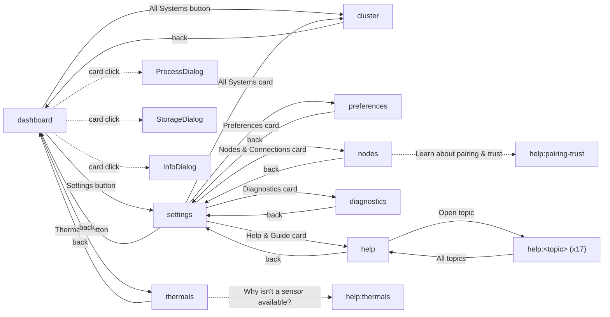

**Asymmetry flagged:** `cluster`'s back button returns to `dashboard`, not `settings`, even though
`cluster` is reachable from *both*. Every other Settings-hub-reachable page returns to the Settings
hub; `cluster` is the one exception. Classified **POSSIBLE DRIFT** (could be an intentional
"All Systems is dashboard-adjacent" decision — see [Finding A-2](#findings--risks)).

---

## User Action Routing

**Preferences interval commit** (Spinbox arrow / Return / FocusOut) — a direct, synchronous
controller-callback path, correctly **not** routed through `ButtonCoordinator`/`AppCoordinator`
(no background work, no reusable stable ID needed — it's a `Var` binding, not a button click):

```
Spinbox -> PreferencesPage._commit_interval(key) -> PreferencesPageCallbacks.on_interval_commit
  -> window_preferences.on_interval_commit -> AppPreferences.with_interval(key, ms)   [validates via IntervalPolicy]
  -> window_preferences.apply_preferences(controller, candidate)
       -> preferences_store.save(candidate)          [atomic JSON write]
       -> controller._preferences = candidate
       -> controller._reconcile_intervals()           [retimes ComponentRefreshScheduler]
       -> controller._reconcile_cards_and_polling()
       -> controller._apply_appearance()
       -> preferences_page.refresh_from(...); .show_status("Preferences saved")
```
A failed validation (`ValueError`) reverts the UI to the last-committed value and shows an error —
confirmed for interval/appearance/card paths (the appearance path has its own near-identical
inline copy of this catch/revert/show-error logic rather than reusing the shared helper — minor,
harmless duplication, not a correctness issue).

**Preferences Reset** — confirmation-gated (`messagebox.askyesno`) before calling
`apply_preferences(controller, AppPreferences.defaults())`.

**Settings-category navigation**:
```
navigation_card "Open" button (ButtonCoordinator id "settings:category:<key>")
  -> SettingsHomeCallbacks.on_select_category(key)
  -> window_pages.select_settings_category
  -> dict dispatch {"preferences": ..., "nodes": ..., "cluster": ..., "diagnostics": ..., "help": ...}.get(key)
  -> handler()
```
An unknown `key` silently does nothing — `.get(key)` returns `None`, guarded, no error surfaced or
logged. Currently unreachable (the 5 category keys are hand-matched 1:1 against the dispatch dict,
confirmed identical today), but there is no test pinning that correspondence — a **low-severity
missing-test-coverage** item, not a live bug.

**Manual Scan / Cancel Scan** (button plumbing; pipeline detail in
[Manual Scan Flow](#manual-scan-flow)): `"preferences:scan"` → `controller.handle_analyze`;
`"preferences:cancel-scan"` (starts disabled) → `controller._cancel_analysis`.

**Process review, quit/force quit, storage review, Move to Trash**: see
[Process Architecture](#process-architecture) and [Storage / Cleanup Architecture](#storage--cleanup-architecture)
for the full per-action trace (widget → `ButtonCoordinator`/dialog handler → `AppCoordinator` scan
or direct `ProcessManager`/`FileManager` call → result → dialog UI).

**Pair / Accept / Reject / Revoke / Remove Connection / cluster invite / role changes / Test
Connection**: see [Pairing & Trust](#pairing--trust) and
[Cluster / Coordinator / Workers](#cluster--coordinator--workers) for the full per-action trace.

**Node selection / refresh**: `NodeSelection.switch` (`node_selection.py:59-79`) is the single
mutator of `NodeRegistry._selected_id`, re-validated against `selectable_descriptors()` on every
call; the UI mirror `controller._selected_node_id` is kept paired at each of its few call sites
(confirmed, no drift found — see [Ownership Conflicts](#ownership-conflicts) for the one caveat).

**Graceful/force quit at the window level**: `WM_DELETE_WINDOW` → `AppWindow._close()` is a full
**application** shutdown path, not a per-process quit (that's `ProcessManager.request_quit`/
`force_quit`, a completely different action reached through `ProcessDialog`).

---

## Coordinators

### ButtonCoordinator

Registers `(action_id, callback)` pairs (`register`, `action_coordinator.py:29-51`); widgets bind
via `bind(widget, action_id)`, which **overwrites** the widget's `command=` with a coordinator
dispatch wrapper. Every page constructs its buttons with a plain `command=<callback>` first (so
the button works standalone, e.g. in a headless test with no coordinator), then conditionally
`register`+`bind`s only if a coordinator was actually injected — confirmed identical pattern across
every page in this audit's scope.

Action IDs are plain string literals, namespaced by convention (`"<page>:<action>"`,
`"<page>:<action>:<key>"`) with **no central enum** — `ButtonCoordinator.registered_ids()` is the
only runtime enumeration. Destroyed-widget handling is self-healing: `set_enabled`/`_apply_state`
call `_widget_exists()` (a `winfo_exists()` probe wrapped in `try/except`) and filter dead widgets
out of the tracked list automatically.

**Authorization and background work are explicitly not this layer's job** (per its own module
docstring): `dispatch()` only checks `record.enabled`; every callback either is a direct
synchronous controller method or itself delegates further down to `AppCoordinator`/dialog scans.

**The back-button exemption is structural, not conventional.** `page_shell()` (`layout.py:432-487`)
— the one shared shell used by every sub-page — constructs the back button directly with
`command=on_back` and its signature **does not accept a `button_coordinator` parameter at all**.
There is no code path by which a page built through `page_shell` could register its own back
button, by design or by accident. This is a stronger guarantee than "every page happens not to do
it" — it is structurally impossible for a `page_shell`-based page to do it.

**Confirmed bypass — `DiagnosticsPage`'s "Copy diagnostics" button** (see
[Finding A-1](#findings--risks)): the page accepts and is actually passed a live
`ButtonCoordinator`, but its one content button is wired with a raw `command=self._copy` and is
never registered/bound to the coordinator. No other coordinator-capable page in the registry
leaves its own content button unregistered. Not caught by the existing
`test_page_wiring_consistency.py` (which checks constructor-acceptance and builder-pass-through,
not per-button usage inside the class).

### UICoordinator

```
data/state change
  -> controller builds a RenderIntent(target, generation, node_id, components/payload, priority)
  -> controller._request_render(intent, apply)
       -> coordinator = controller._render_coordinator()      [None -> apply immediately, fail-open]
       -> coordinator.request(intent, apply)
  -> UICoordinator.request(...)
       - rejects if closed (post-shutdown)
       - rejects (stale) if intent.generation < current generation for that target
       - rejects (stale/wrong-owner) if intent.node_id differs from the target's already-bound node
       - coalesces: merges with any pending intent for the same target (dirty fields OR'd, max
         generation/priority) rather than replacing outright
       - applies immediately if not batching AND the target is visible (default: visible)
       - otherwise queued in `_pending` until flush() or set_visible(target, True)
  -> UICoordinator._apply_target(target)
       - re-checks generation/owner staleness and visibility at commit time (second check)
       - calls the caller-supplied apply(intent) — the actual widget mutation
       - wraps the call in try/except, logging on failure rather than propagating (a destroyed
         widget must never break a shared batch-flush loop)
```

Target IDs observed: `"dashboard-snapshot"`, `"scan-status"`, `"dashboard-discovery"`,
`"nodes-status"`, `"discovery-pages"`, `"thermals"`, one `"component:<key>"` per catalog feature.
Coalescing and stale-rejection counts are surfaced directly on the Diagnostics page — a nice closed
loop from internal coordinator metric to user-visible diagnostic data.

**Hidden-page behavior**: setting a target invisible does not clear its pending intent — it is
simply excluded from `flush()`'s ready filter, and applies the moment the page becomes visible
again. A render queued while the user is on another page is **held, not dropped**.

**Node ownership**: `_target_nodes: dict[str, node_id]` — once bound, an intent for a *different*
node for the same target is rejected as stale unless `invalidate()` is called first with a new
generation (used when the selected node actually changes).

**Main-thread enforcement** is not internal to `UICoordinator` (it has no thread-affinity check
itself) — the guarantee comes from `AppCoordinator`'s `deliver` always crossing onto the UI thread
before any `_request_render`/`apply` call happens.

### AppCoordinator

The universal per-key "shock absorber" (`maintenance/components/coordinator.py:308-849`). One
instance, shared by the dashboard, every component scan, page async loads, and the Storage/Process
dialogs. `run(key, task_factory, on_result=, on_error=, on_progress=)` coalesces duplicate triggers
into one in-flight run plus at most one pending rerun, caches the last good result for instant
`last_result` retrieval, cancels cooperatively (per-key `threading.Event` + generation-based
late-result dropping), and delivers every completion/error/progress onto the UI thread through the
injected `deliver` — worker threads never touch widgets. `begin/finish/subscribe/unsubscribe/
store/clear/in_flight/generation` expose the pure per-key state for non-`run` consumers (e.g.
dialogs joining an in-flight shared scan). `start_discovery/stop_discovery/discovery_tick/post`
additionally own the network-discovery lifecycle bridge. Backed by a bounded
`ThreadPoolExecutor(max_workers=4)` by default (or an injected `runner` for tests/standalone
dialogs) — **dialog scans, dashboard component scans, and page async loads all compete for the
same 4 worker threads**; the manual full-dashboard scan does **not** (it uses a separate mechanism,
see [Background Execution Map](#background-execution-map)).

---

## Scheduling

```
ComponentRefreshScheduler(preferences.refresh_intervals)   [coordinator.py:83, built from loaded preferences]
  driven by a Tk timer, NOT a thread:
window.AppWindow._schedule_component_poll -> window_components.schedule_component_poll
  -> component_poll_delay() -> ComponentRefreshScheduler.next_deadline(now)
  -> controller._schedule_timer(delay, controller._run_component_cycle)   [TimerDelivery -> master.after()]

controller._run_component_cycle
  -> for key in scheduler.due_keys(time.monotonic()):
       if dashboard visible: controller._launch_component_scan(key)
       else: AppCoordinator.defer(operation_key, launch_deferred_component)
  -> reschedules itself

controller._launch_component_scan(key)
  -> resolves source_scheduler/source_provider: local, OR per-node (source_context.scheduler/provider)
     if a remote node is selected
  -> operation_key = node-qualified when remote (node_operation_key)
  -> guards overlap: if in-flight, coalesce via scheduler.request_refresh(key); return
  -> source_scheduler.begin(key, now)                     [the in-flight "lease" acquisition]
  -> AppCoordinator.run(operation_key, task_factory, on_result=, on_error=, on_finished=)
       task_factory() -> source_provider.component_summary(key, cancel_event=...)
  -> on completion (already on UI thread via AppCoordinator.deliver):
       source_scheduler.record_success/record_error(...)
       RenderIntent(target=f"component:{key}", ...) -> UICoordinator
       -> apply_component(controller, key, resource): capability tracking, thermal telemetry
          record, merge into controller.snapshot, AppCoordinator.store(...) [re-cache last-good],
          controller.cards[key].update_summary(...), refresh thermals, refresh health banner
  -> finish_component(): source_scheduler.finish(key), reschedule poll
```

**Next-due/in-flight/coalesced-rerun state** all live in `_RefreshEntry` (`coordinator.py:72-80`):
`interval`, `next_due` (monotonic), `in_flight`, `paused`, `refresh_requested`, `last_success`/
`last_error`. Clock wrapped in `_make_monotonic_clock` (defensive against a clock going backwards).

**Pause/resume**: `ComponentRefreshScheduler.pause`/`resume`/`is_paused`, driven by
`card_policy.should_pause_polling` — network/battery pause when manually hidden OR
(`hide_unavailable_cards` AND `capability == UNSUPPORTED`); GPU pauses only on the auto-hidden
case; CPU/memory/storage never pause.

**Interval defaults** (`RefreshIntervals`, ms): `cpu=1000`, `network=1000`, `memory=5000`,
`gpu=3000`, `storage=30000`, `battery=30000`. Live values come from `AppPreferences.refresh_intervals`,
validated against `IntervalPolicy`/`INTERVAL_POLICIES` bounds: CPU/Network 1-60s step 1, Memory
2-300s step 1, GPU 3-300s step 1, Storage 15-600s step 5, Battery 10-600s step 5.

**Node-specific ownership**: each `NodeContext` owns its own `ComponentRefreshScheduler` instance;
selecting a different node swaps which scheduler drives the poll loop. A component result for a
non-selected node is dropped (`queue_component_result`'s stale/wrong-node check) — VERIFIED
CURRENT.

## Manual Scan Flow

Manual "Analyze" is a **completely separate lifecycle** from per-component refresh — it scans the
whole dashboard (`scan_dashboard`, all 6 components) under `ScanCoordinator` +
`DashboardScanLifecycle`, **not** `ComponentRefreshScheduler`, and not `AppCoordinator` either (see
[Background Execution Map](#background-execution-map)'s Finding B-1).

```
button/timer -> AppWindow.handle_analyze() -> window_scan.handle_analyze
  -> DashboardScanLifecycle.start(on_started, start_worker)
       -> ScanCoordinator.begin() -> (generation, started)
            if already active: rerun_requested=True, started=False   [exactly one queued rerun]
       -> cancel_event created; render targets "scan-status"/"dashboard-snapshot" invalidated
       -> timeout_id = schedule_timer(SCAN_TIMEOUT_MILLISECONDS=30000, timeout_callback, generation)
       -> start_worker(generation, cancel_event) -> _run_in_background(dashboard_task, on_success=queue_snapshot)
            -> BackgroundOrchestrator.run_in_background (raw daemon thread, NOT AppCoordinator)
            dashboard_task() -> provider.dashboard_snapshot(cancel_event, progress_callback) -> SystemScanner.scan_dashboard
            progress -> RenderIntent(target="scan-status", priority=1) -> _show_progress
       -> queue_snapshot(): resolution_for_generation(generation) gates late/duplicate results;
          on success RenderIntent(target="dashboard-snapshot", priority=3) -> merges into snapshot+cards
       -> _schedule_rerun_if_requested: a trigger that coalesced in during the scan re-invokes handle_analyze
```

**Timeout**: fires at 30s, sets the cancel event, shows the timeout message, and starts a
**10-second grace period** (`SCAN_LEASE_GRACE_MILLISECONDS`) — a worker finishing within grace still
resolves normally; one that doesn't is force-released after grace so the lease can never be stuck
even if a cancelled worker never notices its event.

**Where state lives** (all on `DashboardScanLifecycle`, mirrored onto `AppWindow.__dict__` for
inspectability/tests): active/generation/rerun-requested on `ScanCoordinator`; timeout/grace ids on
the lifecycle object; cancellation is a plain `threading.Event` checked cooperatively inside
`SystemScanner.scan_dashboard`/`scan_component` via `_check_cancelled` (raises `ScanCancelled`);
progress is stateless, carried per-message through the `RenderIntent` path, not stored.

**Relationship to periodic refresh**: deliberately independent — both write into the same
`controller.snapshot`/`controller.cards`, but manual scan replaces the whole `DashboardSnapshot`
while periodic refresh patches one `ResourceSummary` at a time.

## Background Execution Map

| Name | Path | Owner | Thread model | Concurrency | Cancellation | Timeout | Delivery | Shutdown | Use cases |
|---|---|---|---|---|---|---|---|---|---|
| **AppCoordinator executor** | `components/coordinator.py:308-849` | `AppCoordinator` (one instance) | `ThreadPoolExecutor(max_workers=4)`, or injected `runner` | 4 concurrent tasks system-wide | Per-key `threading.Event` + generation check | None built in (caller-bounded) | Injected `deliver` → `window._submit_ui` → background queue → Tk drain | `shutdown()`: `executor.shutdown(wait=False, cancel_futures=True)`; `cancel_all()` first | Component refresh, page async loads, Process/Storage dialog scans |
| **BackgroundOrchestrator / run_daemon** | `components/background_orchestration.py` | `AppWindow._background_orchestrator` | Raw `threading.Thread(daemon=True)` per call — **unbounded**, no pool | Unbounded | None built in (caller's own `cancel_event`) | None built in at this layer | Items pushed onto `window._background_queue`, drained by a Tk timer every 10ms | No executor to join; daemon threads abandoned at process exit | The **one** current use is manual "Analyze" (`_run_in_background`) |
| **Scanner's persistent CPU-delta worker** | `scanner_support/dashboard.py:123-206` | One `SystemScanner` instance | One long-lived daemon thread, restarted if dead | 1 | Not cancellable mid-sample (non-blocking `cpu_percent(interval=None)`); the *wait* is cancellation-aware | `CPU_WORKER_TIMEOUT_SECONDS=5.0` bounds the wait | Direct return, same call stack | `Analyzer.stop_background_workers()` → `_stop_cpu_sampler()`: event + `join(timeout=1.0)` | Avoids re-blocking psutil on every 1s refresh |
| **Scanner's GPU query watchdog** | `scanner_support/gpu.py:43-134` | One `SystemScanner` instance | One short-lived daemon thread per probe | 1 in-flight, lock+generation guarded | Not interruptible (NVML/subprocess); abandoned via generation bump instead | `GPU_QUERY_TIMEOUT_SECONDS=12.0` join; abandon after `GPU_QUERY_ABANDON_SECONDS=60.0` | Direct return, synchronous | None explicit; an abandoned worker is orphaned by design | `gpu_details()`, called by both manual scan and periodic GPU refresh |
| **Dialog scans via AppCoordinator** | (cross-ref) | Same `AppCoordinator` instance | Same 4-worker pool | Shares pool with row 1 | Same | None built in | Same | Same | `ProcessDialog`/`StorageDialog` scans |
| **BackgroundTaskRunner one-shot actions** | `components/background.py:71-183` | Per-dialog | Raw daemon thread per call, own `TkDeliveryQueue`/ad-hoc queue | Unbounded (one-shot) | Caller-supplied `threading.Event` if cancellable | None built in | Own delivery queue, drained by a Tk timer bound to the dialog widget | Widget-destroy-safe (drops rather than crashes on a dead widget) | Delete-file / kill-process one-shot dialog actions (deliberately separate from the keyed `AppCoordinator` scans — a different concern: one-shot mutation, not a coalesced/cached read) |
| **Remote server handlers** | `remote_support/server.py` | `RemoteSocketServer` | `socketserver.ThreadingTCPServer`, `daemon_threads=True`, `BoundedSemaphore(8)` admission | Up to 8 concurrent handlers | None (hard stop only) | None | Synchronous request/response per connection | `server.shutdown()` + `server_close()`; in-flight handlers are **not** waited on (documented intentional) | Every inbound remote operation |

**Finding B-1** (see [Findings & Risks](#findings--risks)): manual "Analyze" uses the older,
unbounded-thread `BackgroundOrchestrator` model while everything else — periodic refresh, dialog
scans — uses the shared, 4-worker `AppCoordinator`. `ScanCoordinator`'s own docstring says it was
"extracted from the live-scan coordination flow" that predates `AppCoordinator`, i.e. this looks
like historical layering (the original, purpose-built single-scan mechanism, superseded everywhere
else but never ported here) rather than a deliberate split. Both paths are correct and well-tested;
this is duplicated authority, not a defect.

## Scanner Architecture

`SystemScanner` (`scanner.py:113`) is a facade composed via mixin inheritance:
`class SystemScanner(DashboardMixin, GpuMixin, ProcessesMixin, StorageMixin, PathsMixin)`. Each
mixin calls back into `maintenance.scanner`'s own module globals (via `from ._compat import
scanner_module`) rather than importing `psutil`/`platform`/`subprocess` directly — a deliberate
test-patch-seam pattern (`patch("maintenance.scanner.psutil", ...)` reaches every mixin).

What remains directly on `SystemScanner` (not delegated to a mixin): class constants (all
thresholds/timeouts), `__init__` (locks, caches, CPU-worker primitives), `scan_dashboard` (the
top-level 6-component loop), **`scan_component`** (the one hand-written, catalog-independent
`if key == "...":` dispatch — already covered by
`tests/test_page_wiring_consistency.py::ScannerCatalogWiringTests`), and the Downloads
scan/hash/cancellation delegations to `ComponentDownloadScanner`.

**Access routes into the scanner** (all confirmed as either sharing state correctly or
appropriately isolated — no accidental duplicate scanning found):

```
1. Dashboard periodic refresh:  launch_component_scan -> Analyzer.component_summary(key) -> SystemScanner.scan_component(key)
2. Manual full scan:            handle_analyze -> Analyzer.dashboard_snapshot() -> scan_dashboard() -> loops scan_component per key
3. Storage review dialog:       StorageDialog -> Analyzer.storage_candidates() -> scan_downloads() -> ComponentDownloadScanner
4. Process review dialog:       ProcessDialog -> Analyzer.process_candidates() -> scan_processes()
5. Snapshot CLI:                maintenance/snapshot.py -> a FRESH Analyzer()/SystemScanner() in a separate process -- shares no state with a running GUI
6. Remote target:                the NodeReadProvider Protocol both LocalNodeProvider and AuthenticatedNodeProvider implement
                                  -- on the TARGET, RemoteService._solve dispatches to the target's own local provider,
                                  i.e. the SAME local scan_component/dashboard_snapshot path, not a duplicate implementation
```
Routes 1 and 2 correctly share one `SystemScanner` instance (`controller.analyzer.scanner`) — its
static caches, temperature cache, trash-size cache, and persistent CPU worker are all legitimately
shared. Route 5 (CLI) is intentionally isolated (separate process). Route 6 confirmed to converge
on the same canonical local scan path on the target, not a parallel implementation.

## Component Catalog / Dispatch

`ResourceFeatureCatalog.DEFAULT_FEATURES` (`components/catalog.py:70-77`):

```python
ResourceFeature("cpu", "CPU", order=0, action_kind="process")
ResourceFeature("memory", "Memory", order=1, action_kind="process")
ResourceFeature("storage", "Storage", order=2, action_kind="storage")
ResourceFeature("gpu", "GPU", order=3, action_kind="informational")
ResourceFeature("network", "Network", order=4, action_kind="informational")
ResourceFeature("battery", "Battery", order=5, action_kind="informational")
```
`order` controls dashboard card layout; `action_kind` selects which dialog `open_resource` opens
(`"process"` → `ProcessDialog`, `"storage"` → `StorageDialog`, else → `InfoDialog`).

| Component | Catalog | Scanner dispatch | Resource builder | Snapshot key | Card | Details view |
|---|---|---|---|---|---|---|
| CPU | order 0, `process` | `scanner.py:308-324` | `_cpu_resource` (`dashboard.py:401-431`) | `resources` tuple, `.key=="cpu"` | `controller.cards["cpu"]` | `ProcessDialog` |
| Memory | order 1, `process` | `scanner.py:326-333` | `_memory_resource` (`dashboard.py:454-474`) | same | `controller.cards["memory"]` | `ProcessDialog` |
| Storage | order 2, `storage` | `scanner.py:335-350` | `_storage_resource` (`dashboard.py:566-595`) | same | `controller.cards["storage"]` | `StorageDialog` |
| GPU | order 3, `informational` | `scanner.py:352-365` | `_gpu_resource` (`dashboard.py:597-622`) | same | `controller.cards["gpu"]` | `InfoDialog` |
| Network | order 4, `informational` | `scanner.py:367-377` | `_network_resource` (`dashboard.py:691-739`) | same | `controller.cards["network"]` | `InfoDialog` |
| Battery | order 5, `informational` | `scanner.py:379-391` | `_battery_resource` (`dashboard.py:963-1029`) | same | `controller.cards["battery"]` | `InfoDialog` |

No component's path differs structurally — all six are `_component_value` best-effort read →
`_resource_with_fallback` wrapping → typed `ResourceSummary`. The one real variation: CPU/Storage/
GPU/Battery each pull a slice of the shared temperature-scan result; Memory/Network never attach
temperature (correct — matches the app's claim that only CPU/GPU/NVMe/Battery get attributed
temperatures).

`ResourceFeatureCatalog.CAPABILITY_DECLARATIONS` (`catalog.py:79-188`) is a **separate**,
declarative per-platform capability matrix consumed for capability-transparency purposes
(`tests/test_capability_transparency.py` exists to exercise it).

---

## Component Data Flows

### CPU

```
psutil.cpu_percent (first call blocks 0.2s to seed a baseline)
  -> _read_cpu_percent: starts a persistent daemon worker thread
  -> subsequent calls: non-blocking delta via the worker (request/result Event pair)
  -> psutil.cpu_freq() read live per-call, no caching
  -> core counts: fingerprint-cached on (platform.node(), boot_time), invalidated by reset_static_cache()
  -> thermal: shared 5s-TTL temperature-scan cache, .samples_for("cpu")
  -> _cpu_resource builds ResourceSummary(capability=SUPPORTED, details=(cores, frequency, [temp]))
  -> scan_component("cpu") wraps in _resource_with_fallback: ANY exception degrades to
     unavailable_summary(PERMISSION_LIMITED|TEMPORARILY_UNAVAILABLE) -- the CPU card never raises out
  -> reaches the UI via BOTH periodic refresh AND the manual-scan loop, converging on
     controller.cards["cpu"].update_summary(...)
  -> Process review linkage: action_kind="process" -> card click opens ProcessDialog, which reads a
     SEPARATE scan (scan_processes, per-process psutil.Process readings) -- the card's aggregate
     CPU% and the dialog's per-process CPU% are not the same data path
```

### Memory

```
psutil.virtual_memory() + psutil.swap_memory() -- read fresh every call, no caching (the 5s default
  refresh interval is the only throttle, applied at the scheduler level)
  -> Linux swap/zram: reads /proc/swaps directly (NOT via psutil) to distinguish zram from
     disk-backed swap by device-name prefix; falls back to the psutil aggregate on non-Linux or if
     /proc/swaps is unreadable
  -> _memory_resource: ResourceSummary(value=percent, subtitle=available, details=(total,
     available, in-use, swap lines))
  -> same fallback-on-exception wrapping as every component
  -> NO thermal attribution (memory has no temperature-sensor category in this app)
```

### GPU

```
scan_component("gpu") -> gpu_details() -> _gpu_probe()  [bounded-time watchdog, see Background Execution Map]
  -> lock+generation guarded so full-scan and component-refresh can never start two probes
     concurrently; the lock is NOT held across the blocking join (a second caller sees
     "query timed out" immediately rather than blocking)
  -> GpuDetector with 4 loaders:
       nvidia_loader  -- ALWAYS tried first, regardless of platform.system() (NVIDIA hardware can
                         exist on Linux/Windows); LIVE per-call, not static-cached (usage%/memory
                         are live metrics); a failed nvmlInit is remembered per-scanner-instance so
                         a host without the NVML library never repeats the failed probe+log
       mac_loader     -- `system_profiler SPDisplaysDataType -json`, static-cached
       windows_loader -- PowerShell `Get-CimInstance Win32_VideoController ... | ConvertTo-Json`,
                         CREATE_NO_WINDOW on Windows, static-cached
       linux_loader   -- raw `lspci`, filters VGA/3D/Display controller lines, static-cached
  -> all three external-command probes go through the shared run_json_command/run_text_command
     (10s timeout)
  -> _gpu_resource: value = a CONCISE derived name (raw identifier preserved in details for View
     Details), capability from a thread-local dict (deliberately per-thread-id keyed since
     dashboard and dialog scans can run concurrently on different AppCoordinator worker threads)
Optional dependency: pynvml (nvidia-ml-py), NOT installed on Darwin at the pyproject level;
  absence handled via a None-guard, falling straight through to the platform-native loader.
```

### Network

```
psutil.net_io_counters() [global] + net_io_counters(pernic=True) + net_if_stats() -- all THREE read
  once per call, bundled into one _NetworkObservation so a single scan never queries psutil
  inconsistently across the three
  -> rate calculation: a persistent (monotonic_time, bytes_sent, bytes_recv) baseline; first call
     after construction or after a pause-triggered reset shows "--"; counter resets (e.g. reboot)
     clamp the delta to 0, never negative
  -> active-interface classification: busiest UP, non-loopback interface by total bytes
  -> VPN/tunnel hint: a NAME-PREFIX heuristic only (tun/tap/utun/ppp/ipsec/wg) -- cannot identify
     WHICH VPN, only that a tunnel-shaped interface is up
  -> capability: SUPPORTED if global counters succeeded; UNSUPPORTED only if BOTH detail probes
     succeeded and found no non-loopback adapter; UNKNOWN if the global read itself failed
```
Discovery networking (mDNS/zeroconf) is a **completely separate subsystem** — no shared code,
caches, or state with resource-metric networking; the only overlap is both eventually crossing
`AppCoordinator`.

### Battery

```
psutil.sensors_battery() -- three explicit outcomes:
  1. a real battery object -> present, charging/discharging known
  2. None, no exception -> "no battery present" (a NORMAL desktop state)
  3. an exception -> "battery info unreadable" (kept DISTINCT from "no battery")
  -> present: percent, charging state, time-remaining (only when not plugged in AND psutil's
     secsleft is a finite positive number -- POWER_TIME_UNLIMITED/UNKNOWN sentinels correctly
     produce no estimate rather than a fabricated one)
  -> absent + has temperature_lines: value="No battery", but SURFACES CPU/GPU/storage temperature
     context through the battery card (legacy from before the dedicated Thermals page existed)
Battery's OWN temperature capability is declared UNSUPPORTED on all three platforms -- this app
  makes no claim to read a battery's own thermal sensor; the behavior above is about OTHER
  components' temperatures being shown through the battery card as a fallback location.
```

---

## Thermal Pipeline

Core data model — `maintenance/components/temperature.py` (632 lines, Tk-free, pure data + one
stateful class):

- `TemperatureState`: `VALID | NO_DATA | UNSUPPORTED | ERROR`.
- `TemperatureSample` (frozen): `component, sensor_id, sensor_name, value_celsius, sampled_at,
  sampled_monotonic`.
- `TemperaturePolicy` (frozen, per-component): `warning_celsius=90.0`, `critical_celsius=95.0`,
  `recovery_celsius=85.0`, `consecutive_samples=2`, `cooldown_seconds=30.0`,
  `pre_event_samples=4`/`post_event_samples=4`, `rapid_rise_celsius=12.0`/`window=4`,
  **`history_limit=600`** (samples), **`event_limit=8`**, `unsupported_confirm_samples=20`.
  `battery`'s policy overrides warning/critical/rapid-rise to `None` — battery never generates
  warning/critical/spike events.
- `TemperatureEvent` (frozen): one detected excursion, bounded to ≤10 samples
  (`pre_event_samples + post_event_samples + 2`).
- `TemperatureSeriesSnapshot`/`TemperatureRenderState`/`TemperatureScan` — the per-component "as of
  now" view, the multi-component UI bundle, and the raw platform-acquisition result, respectively.

**`TemperatureTelemetry` is the stateful owner — one instance per node, never global.** The
**only** production construction site is `NodeContext.telemetry: TemperatureTelemetry =
field(default_factory=TemperatureTelemetry)` (`nodes.py:675`) — confirmed by a repo-wide grep, so
per-node isolation is an architectural guarantee, not a convention. Per-component state
(`_ComponentTelemetry`): `state`, `current`, `history: deque(maxlen=600)` (aggregate),
`sensor_histories: dict[sensor_id, deque(maxlen=600)]` (per-sensor), `events: deque(maxlen=8)`,
`active_event`, `last_error`, `consecutive_hot`, `cooldown_until`, `empty_reads`. **Retention is
bounded by both count (600 samples) and wall/monotonic age (600 seconds)** — `_prune_component`
drops anything older than 600s from both the aggregate and every per-sensor history, on every write
*and* every read.

Two production entry points, with **confirmed asymmetric behavior**:

- `record_summary(component, summary)` — the live path (used by `apply_component`). No samples:
  classifies via `temperature_unavailable_reason` → `ERROR`; `capability == UNSUPPORTED` → that;
  `failed` → `ERROR`; else increments `empty_reads` and holds `NO_DATA` until 20 consecutive empty
  reads, then flips to `UNSUPPORTED`. Samples arriving: resets `empty_reads = 0`.
- `record_scan(scan: TemperatureScan)` — **does not reset `empty_reads`** on a valid sample, unlike
  `record_summary`. **DRIFTED, but currently dead in production** (grep confirms zero production
  callers outside tests). A one-line fix (reset `empty_reads` for symmetry) or removal is the
  recommended follow-up; low priority since nothing calls it today.

Platform acquisition (`maintenance/scanner_support/temperature_platform.py`, Tk-free) names two
explicit permission-denial reasons — `"CPU temperature requires administrator privileges"`,
`"Thermal sensors require administrator privileges"` — via an English-only `"denied"` substring
match (a documented, known limitation for non-English Windows locales, not a silent assumption).
This is the exact mechanism behind this session's earlier Windows-admin-privilege fix: platform
layer names the reason → `ResourceSummary.temperature_unavailable_reason` carries it →
`TemperatureTelemetry.record_summary`'s `ERROR` branch treats a genuine permission wall as a
stronger, more specific signal than "no data yet," rather than waiting out the 20-sample
confirmation budget and misreporting a permission wall as unsupported hardware. macOS SMC access
lives in `scanner_support/smc.py` (raw Apple SMC via `ctypes`/IOKit).

Wiring into the live render pipeline:

```
apply_component(controller, key, resource)                    [window_components.py:249]
  -> record_thermal_summary: context.telemetry.record_summary(key, resource)
  -> thermal_render_state(controller, context) -> context.telemetry.render_state(("cpu","gpu","storage","battery"))
  -> RenderIntent(target=THERMALS_PAGE, node_id=context.node_id, priority=2)
  -> UICoordinator.request(...)
       - rejects stale-generation or wrong-node-owner intents (the exact "stale-node deliveries"
         rejection)
       - applies immediately only if THERMALS_PAGE is visible; otherwise held in _pending
       - THERMALS_PAGE visibility driven from exactly one call site (sync_render_visibility, on
         every page navigation) -- a render queued while on another page is applied the moment
         Thermals becomes active
  -> ThermalsPage.render(state, capabilities)
       - iterates the fixed tuple (cpu, gpu, storage, battery)
       - _should_show(component, state) decides whether to keep or destroy that component's graph
         section (see the confirmed asymmetry below)
       - _refresh_events recomputes a dedupe signature and only rebuilds rows on real change
       - the events list shown is capped to the last 6 across all visible components -- a DISPLAY
         cap, distinct from and smaller than the 8-per-component retention cap; not a bug, but the
         two numbers are easy to conflate
```

**Confirmed UI-reachability asymmetry for `UNSUPPORTED`** (independently re-derived against the
current `thermals_page.py`/`dashboard.py` sources, not merely cited from history): for CPU/GPU/
Storage, `_should_show` returns `False` whenever `state == UNSUPPORTED` — the entire graph section
is destroyed, not shown with a placeholder; if every component ends up unsupported the page falls
back to a generic status line. For **battery specifically**, `_should_show` special-cases it to
also show when `capability == SUPPORTED` — and `_battery_resource` sets `capability=SUPPORTED`
**unconditionally** for a physically-present battery, regardless of whether it has a temperature
sensor. So a laptop whose battery genuinely lacks a temperature sensor still shows a battery
thermal graph in the `UNSUPPORTED` state, while a CPU/GPU/storage sensor in the identical state
shows nothing. This is a real, currently-shipping behavioral difference, not hypothetical — see
[Finding D-1](#findings--risks).

**Compatibility naming note**: `maintenance/ui/telemetry_graph.py` (13 lines) is a pure
re-export shim over `maintenance/ui/thermal_graph.py` (303 lines, the real Tk-free geometry +
Canvas-drawing implementation) — the naming is the *reverse* of what a skim suggests
(`thermal_graph.py` = real implementation, `telemetry_graph.py` = the shim). `ThermalsPage` imports
through the shim. Classified **COMPATIBILITY SHIM, intentional** (explicit docstring), just easy to
misread.

**Answers to the standard questions:**
- *Where is temperature history stored?* In-memory only, per-node, inside
  `NodeContext.telemetry._components[component].history`/`.sensor_histories`. No file/JSON write
  site was found for thermal history anywhere in the repository — it does **not** survive restart.
- *What is bounded?* History (600 samples AND 600 seconds), per-sensor history (same), events
  (≤8/component), event sample snapshots (≤10 each), UI event display window (last 6 total).
- *Per-node vs global?* Entirely per-node — nothing thermal-related is global or shared across
  nodes.

---

## Process Architecture

```
ProcessDialog.__init__
  -> coordinator.last_result(operation_key) for instant reopen
  -> refresh() -> AppCoordinator-backed scan -> provider.process_candidates(cancel_event=...)
       (provider = context.provider if a node is selected, else controller.analyzer)
  -> renders rows into self.tree, tags "protected"/"low" for styling
  -> user selects rows, "Quit Selected" -> confirms -> manager.request_quit(pids, create_times)
       [ProcessManager]
  -> on force_required, offers Force Quit -> repeats with force_quit
  -> on_changed() callback + self.refresh()
```

`SystemScanner.scan_processes()` (`scanner_support/processes.py`): iterates
`psutil.process_iter(attrs=["pid","create_time"])` **twice**, spaced by a sample window, to compute
a CPU-delta per process. **create_time is captured** on the first pass into
`process_creation_times`; **rechecked** on the second — a mismatch (PID reuse during the sampling
window) **silently drops** that process from the candidate list rather than showing it as if it
were the original.

**Protected-policy lives in exactly one place**: `maintenance/components/process_safety.py`
(`PROTECTED_PROCESS_NAMES`, same-user matching, protected-PID snapshot) — the scanner side uses it
for display only (`ProcessCandidate.action_allowed`/`.protected`); this is explicitly **not** the
security boundary.

**Local revalidation at action time (defense in depth)**: `ProcessManager._allowed_processes`
(called by both `request_quit` and `force_quit`) re-derives everything from scratch at the moment
of action, never trusting the scan-side display flag:
1. Fresh protected-PID snapshot; if ancestry can't be read, **all actions are refused**.
2. Per PID: fresh `psutil.Process(pid)`, and if an `expected_create_time` was supplied, compares it
   to the process's *current* `create_time()` — refuses on mismatch ("PID changed since it was
   scanned"), so a recycled PID can never be acted on from a stale selection.
3. Same-user check and protected-name-or-executable check (both display name and, when readable,
   executable basename).

**Children**: only queried during `force_quit` (`include_children=True`,
`process.children(recursive=True)`), and each child is independently re-validated before being
added to the kill target list — an unreadable child fails closed (treated as protected). Graceful
quit is never recursive.

**Remote variant — VERIFIED CURRENT, symmetric with local for termination:**

```
RemoteProcessActionBackend(provider)   [wired onto context.process_manager on successful auth,
                                          window_node_actions.py:886]
  -> AuthenticatedNodeProvider.request_quit/force_quit -> signed transport request
     op "process_request_quit"/"process_force_quit"
  -> target's RemoteService._dispatch: refuses if target NodeStatus != ONLINE or its own
     process_manager is None; else builds a typed ProcessTerminationRequest and calls
     self._process_manager.terminate(...)
  -> the TARGET's own local ProcessManager.terminate() runs the EXACT SAME local safety pipeline
     documented above -- the remote path is not a weaker parallel implementation, it is the same
     ProcessManager reached over the network, with the TARGET enforcing safety
  -> result serialized back and decoded client-side into a normal ProcessActionResult
```
`ProcessDialog`'s `read_only` for a remote node is computed from **both**
`NodeCapability.PROCESS_TERMINATION` presence **and** `NodePermission.PROCESS_TERMINATION` being
granted — a capability+permission double gate (contrast with storage's unconditional
`read_only=True`, below).

---

## Storage / Cleanup Architecture

**Ownership boundary, applies to every subsection below**: two disjoint owners, never overlapping.
The **discovery/read side** (`SystemScanner`/`StorageMixin`/`DownloadScanner`) only ever reads —
`os.stat`, directory walks, hashing — and never calls `send2trash`, never deletes. The
**mutation/action side** (`maintenance/actions.py::FileManager`) is confirmed, by a repo-wide grep
for `send2trash`, `.kill(`, `.terminate(`, `os.remove`, `os.unlink`, `shutil.rmtree`, to be the
**only** class in the repository that performs a destructive filesystem action.

**A. Storage capacity** — a separate code path (the dashboard's Storage card), not the same scan
as the Downloads-review flow below.

**B. Downloads scan** — `DownloadScanner.scan_downloads()`:
1. `DownloadsPathResolver.select(...)` resolves the root once at construction. **Windows**: tries
   `SHGetKnownFolderPath` for the real Downloads known-folder GUID, then `%USERPROFILE%\Downloads`,
   then `%OneDrive%\Downloads` if present, then a safe fallback. **macOS/Linux**: `Path.home() /
   "Downloads"`. If a `Downloads` entry exists but isn't a directory, a sibling sentinel path is
   used instead of scanning the wrong thing.
2. Re-entrancy guarded by a lock; a concurrent call polls (checking `cancel_event`) rather than
   blocking indefinitely.
3. `_download_file_stats` walks the tree, rejecting symlinks, non-files, and dot-prefixed path
   components.
4. `_prune_hash_cache` runs before reason computation (see cache detail below).
5. Reasons computed via `_mark_large_downloads` + `_mark_duplicate_downloads` (C below).
6. Each `(path, reasons)` becomes a `FileCandidate`, sorted largest-first.

**C. Duplicate detection** — staged: Stage 1 groups by exact size (only files ≥1 MiB;
size-unique files are never hashed). Stage 2, only for 2+-member size groups, computes a content
hash per file and groups by digest; within a digest group, all but the first (by sorted path order)
are marked duplicate. **Duplicates are identified by content only, never by filename.**

**D. Hash/cache handling** — `DownloadScanner._hash_cache: OrderedDict[Path, (fingerprint,
content_marker, sha256_hex)]` — see the [Cache Map](#cache-map) for the full bound/eviction
detail. `_cached_file_hash` is defence-in-depth against a file changing mid-hash: it re-stats and
re-reads a bounded content marker both before trusting a cached digest and again immediately after
computing a fresh one; a mismatch retries once, then raises rather than ever returning an
unverified digest.

**E. Trash size** — `StorageMixin.trash_size()`: **Windows** via `SHQueryRecycleBinW`;
**macOS** sums `~/.Trash`; **Linux** sums `~/.local/share/Trash/files`; unknown platform → `0`.
Failures never raise, always degrade to `0`.

**F. Storage temperature** — reads through the same `TemperatureSample`/`temperature.py` pipeline
as CPU/GPU (see [Thermal Pipeline](#thermal-pipeline)), not through `downloads.py`/`storage.py`.

**G. Review candidates** — `FileCandidate` (frozen dataclass), produced fresh by every scan.
**They do not persist anywhere.** They live only as `AppCoordinator`'s cached `last_result`
(one entry per key, for instant re-open) and as `StorageDialog.candidates: dict[Path,
FileCandidate]`, which dies with the dialog. No `candidates.json`, no database, ever.

**H. Move to Trash — local target:**

```
StorageDialog.move_selected() -> confirms -> coordinator.run(trash_key, trash_task)
  trash_task() -> FileManager.move_to_trash(paths)
FileManager.move_to_trash(paths):
  1. dict.fromkeys(paths)   -- de-dupe, preserve order
  2. path.expanduser()
  3. REJECT if path.is_symlink()
  4. path.resolve(strict=True) -> resolved_path; capture initial_stat
  5. REJECT if allowed_root not a directory, OR resolved_path not relative to allowed_root, OR not a regular file
  6. Re-stat immediately before acting: REJECT if st_dev/st_ino changed since step 4 (TOCTOU-hardened
     identity check), or the path is no longer a file
  7. send2trash_fn(str(resolved_path))
  8. Collects moved paths and per-file errors into FileActionResult -- one bad file never blocks the rest
```
`allowed_root` is the **same** `DownloadsPathResolver` logic the scanner side uses, not a second
independently-maintained root — no drift possible between "what was scanned" and "what is allowed
to be trashed."

**Move to Trash — remote target: MISSING WIRING (verified, not speculative).**
`window_presentation.open_resource` forces `read_only=True` **unconditionally** for every
non-local node's `StorageDialog` (not gated on capability/permission the way `ProcessDialog`'s
`read_only` is). The remote protocol's operation set (confirmed exhaustive — see
[Remote Operation Route Table](#remote-operation-route-table)) has **no** `storage_move_to_trash`
op at all. `maintenance/nodes.py:649` defines `FileActionBackend(Protocol)` with one method,
`move_to_trash`, clearly the intended remote analogue of `ProcessActionBackend` — but
`FileActionBackend` **has zero implementations anywhere in the repository** (grep confirms only
its own definition), and a remote/trusted node's `context.file_manager` is **never** assigned
anything but `None` (no "upgrade file_manager on successful auth" step exists, unlike the
symmetric step for `process_manager`). This is currently **safe** (the forced `read_only=True`
means `move_selected()` bails out at its own guard before ever touching `self.manager`), but it
means remote Move to Trash is not merely policy-disabled — the backend does not exist at any layer.
Matches `docs/SYSTEM_ANALYZER_REVIEW.md`'s existing "deliberately unavailable" framing, so this is
long-standing, intentional-looking incompleteness — classified **FUTURE SEAM / MISSING WIRING**,
not new drift (see [Finding C-1](#findings--risks)).

---

## State and Persistence

Shared primitive: `maintenance/persistence.py` — `read_text_or_none()` (missing/`OSError`/
`UnicodeError` → `None`, never raises) and `atomic_write_text()` (`mkstemp` in the same directory →
write+flush+fsync → `os.replace` → best-effort parent-directory fsync). Every JSON store below is
built on these two functions, so **every one of them is atomic by construction**.

| Data | Owner | Path resolution | Format | Atomic? | Sensitive? | Lifetime | Platform paths |
|---|---|---|---|---|---|---|---|
| Preferences (intervals, visible cards, hide-unavailable, appearance) | `PreferencesStore` | `default_preferences_path()` | JSON `schema_version: 1` | Yes | No | Survives restart | Windows `%APPDATA%\system-analyzer\`; macOS `~/Library/Application Support/system-analyzer/`; Linux `$XDG_CONFIG_HOME/system-analyzer/` (`~/.config/...` fallback) |
| Cluster/trust state (discovery toggle, trusted-node records + pairing secrets, peer grants + secrets, local node id, cluster id, role assignments, coordinator epoch/fencing token, active invites, promotion epochs) | `ClusterStore` | `default_cluster_path()` (same directory, filename `cluster.json`) | JSON `schema_version: 2` (accepts legacy `1`) | Yes | **YES** — `TrustedNodeRecord.secret`/`PeerGrantRecord.secret` (256-bit hex credentials) stored in **plaintext JSON** | Survives restart; the durable trust/pairing/cluster-role database | Same directory as preferences |
| Per-installation TLS cert + private key | `remote_security.ensure_tls_material` | Same directory as `cluster.json`; `peer-tls.crt`/`peer-tls.key` | PEM, self-signed via `openssl req -x509 -newkey rsa:2048 -days 3650` | Yes (replace-based) | **YES** — private key; `chmod 0o600` on the key, `0o644` on the cert | Survives restart (10-year validity); regenerated only if either file is missing | `openssl` must be on PATH — no confirmed Windows-bundled fallback found; a missing `openssl` degrades gracefully to "listener unavailable" rather than crashing |
| Coordinator cluster-telemetry history | `cluster_storage.CoordinatorTimeline` | Explicit `path: Path` (exact caller not traced) | SQLite, `snapshot_batches` + `data_gaps` tables | Per-row SQLite transaction | No (resource metrics, not credentials) | Bounded and self-pruning (2 GiB, no age limit) | Not verified |
| Subcoordinator standby buffer | `cluster_storage.StandbyBuffer` | Same mechanism | SQLite, same schema | Same | No | Bounded: 256 MiB **and** 24h age (age-purged, unlike the coordinator timeline) | Not verified |
| Application log | `main.py::setup_logging()` | `default_log_path()` | Plain text, `RotatingFileHandler` (1 MB × 4 files) | N/A (rotation) | Not classified — no secret was found in any log line examined, not exhaustively checked | Rotates automatically, ~4 MB cap | Windows `%LOCALAPPDATA%\system-analyzer\`; macOS `~/Library/Logs/system-analyzer/`; Linux `$XDG_STATE_HOME/system-analyzer/`; falls back to stderr on any handler failure |

**Stable installation/node ID**: `generate_stable_node_id()` (`nodes.py`) returns
`f"node-{secrets.token_hex(16)}"`, generated fresh only when no existing identity is found.
Persisted as `ClusterState.local_node_id` inside `cluster.json` — **not** a separate identity file.
`ClusterStore.load()` handles three cases: no file (generate + best-effort persist, a failed save
just regenerates next launch), a legacy `"local"` sentinel (migrate in place), or a real id (reuse
unchanged). **VERIFIED CURRENT**: the installation identity is durable across restarts, with a
documented degrade-to-ephemeral path if the config directory is unwritable.

No credentials file independent of `cluster.json` was found (no OS keychain/keyring integration).
The two secret-shaped fields (`TrustedNodeRecord.secret`, `PeerGrantRecord.secret`) are both inside
`cluster.json`, in plaintext, with no confirmed extra file-permission hardening beyond whatever the
process umask leaves on a `tempfile.mkstemp` + `os.replace` (unlike the TLS private key, which is
explicitly `chmod 0o600`) — see [Finding G-1](#findings--risks).

## In-Memory State Map

| State | Owner | Lifetime | Bounded? | Thread access |
|---|---|---|---|---|
| Per-operation run state (`AppRunState`) | `AppCoordinator._states: dict[str, AppRunState]` | Process lifetime once touched; never evicted | Unbounded dict structurally, but the key-space (pages/components/dialog kinds, node-qualified) is small and finite in practice | `run`/`begin`/`finish`/`cancel` main-thread-only by contract; only `cancel_event` legitimately crosses into worker threads |
| Discovery lifecycle handle | Same `AppCoordinator` instance | Between `start_discovery()`/`stop_discovery()` | Single slot | Main-thread claims/releases; backend threads communicate only via `deliver` |
| Per-node runtime context (`NodeContext`) | `NodeRegistry._contexts: dict[NodeId, NodeContext]` | Process lifetime; no `unregister`/`remove_context` method found in the read range | Bounded by known/paired-node count (small, human-managed) | Main-thread owned by convention; no lock on the dataclass itself |
| Discovered-candidate cache (pre-trust) | `NodeRegistry._discovered` | Until TTL-expired | Bounded by LAN population, TTL-expired | Main-thread only; discovery threads reach it via `AppCoordinator.deliver` |
| Pairing-state overlay | `NodeRegistry._pairing_states` | In-progress handshakes | Bounded by concurrent pairing attempts (small) | Main-thread only |
| Selected node pointer | `NodeRegistry._selected_id` | Process lifetime, changes on `select()` | Single value | Main-thread only; see [Ownership Conflicts](#ownership-conflicts) for a re-validation caveat |
| Thermal telemetry | `NodeContext.telemetry` | Process lifetime per node | Bounded (see [Thermal Pipeline](#thermal-pipeline)) | Main-thread only (mutated after `AppCoordinator.deliver` marshaling) |
| Diagnostics snapshot | Not retained — `build_diagnostics_snapshot()` is a pure function, rebuilt fresh every call | Ephemeral | N/A | Inherits thread-safety from its already-owned inputs |

## Cache Map

| Cache | Owner | Key | TTL/Limit | Invalidation | Per-node? |
|---|---|---|---|---|---|
| Download file-hash cache | `DownloadScanner._hash_cache` (aliased onto `SystemScanner._hash_cache` — one object, two attribute names, not a duplicate) | `Path` | `HASH_CACHE_MAX_ENTRIES=1024`, LRU eviction | Explicit prune of files no longer present each scan, plus the LRU cap | No |
| Trash-size cache | `SystemScanner._trash_size_cache` | Singleton | `TRASH_SIZE_REFRESH_SECONDS=60.0` | Time-based **plus** explicit invalidation after a full dashboard scan or a cleanup action — a Move-to-Trash always shows the fresh number on the next read, not stale-for-60s | No |
| Temperature-scan cache | `SystemScanner._temperature_cache` | Singleton | `TEMPERATURE_REFRESH_SECONDS=5.0` | Time-based only; no explicit post-action invalidation was found (unlike trash size) — not verified whether that's intentional, since 5s is already near the fastest refresh cadence | No |
| Static hardware cache (system label, CPU cores, GPU model) | `SystemScanner` instance fields | Singleton per scanner | No TTL | `(platform.node(), boot_time)` fingerprint change, or explicit `reset_static_cache()` | No |
| NVML probe-failed flag | `SystemScanner._nvml_probe_failed` | Singleton | No TTL | Explicit reset only | No |
| Per-thread GPU capability memo | `SystemScanner._gpu_capabilities_by_thread: dict[int, CapabilityState]` | Thread id | No visible eviction | None found — low-risk structurally-unbounded dict, since the key-space is bounded by "threads this process has ever spawned" (a 4-worker pool + a few named workers), not by request volume | No |
| Thermal history (aggregate + per-sensor) | `_ComponentTelemetry` | See [Thermal Pipeline](#thermal-pipeline) | 600 samples AND 600 seconds | `deque(maxlen)` + explicit time-window prune every read/write | Yes |
| Coordinator/standby cluster history | `CoordinatorTimeline`/`StandbyBuffer` | `batch_id` / `(source_node_id, source_epoch, sequence)` | 2 GiB (no age limit) / 256 MiB **and** 24h | Byte-budget eviction (oldest-first); a batch exceeding `MAX_BATCH_PAYLOAD_BYTES=4 MiB` or a paused store refuses the write and sets a `history_writes_paused` flag surfaced on the Diagnostics page — a documented backpressure signal, not a silent drop | Per cluster-role instance |

No duplicate or unclear-ownership cache was found — every cache above has exactly one owning class
and (where applicable) one guarding lock. Every scanner-level cache follows the same shape:
TTL/count-bounded, lock-guarded, "never cache a failure" — a consistent, deliberate pattern across
hash/trash-size/temperature/static-hardware, not several ad hoc caches.

---

## Node Architecture

Chain: `NodeId` (opaque identity, never derived from display name/hostname/address) →
`NodeDescriptor` (immutable metadata) → `NodeContext` (mutable runtime state: provider, managers,
scheduler, coordinator, snapshot, telemetry, connection, retry) → `NodeRegistry` (central owner:
contexts, discovered candidates, pairing states, selected id, local id). `NodeRegistry` is
instance-local, constructed fresh per `AppWindow` — never a module-level singleton.

`NodeDescriptor` field classification:

| Field | Classification |
|---|---|
| `id` | identity |
| `display_name`, `hostname`, `platform`, `color` | presentation metadata |
| `is_local` | identity |
| `trust`, `identity_fingerprint`, `identity_status`, `pairing_state` | trust |
| `status` | connection (coarse) |
| `capabilities` | authorization (what the node *can* do) |
| `permissions` | authorization (what *this caller* may request) |
| `role` | cluster role |

`NodeContext.connection` (`ConnectionState`, a 6-state reconciliation machine) is a **separate,
finer-grained** model from `NodeDescriptor.status` (a coarse 3-state presentation value) — mirrored
at exactly one call site (`NodeRegistry.update_discovered`), confirmed as the only writer of
`descriptor.status` from `context.connection`. Two representations of "is this connected" exist by
design, kept in sync by convention rather than a single mutable field.

`capabilities` (what the node supports) and `permissions` (what this caller may invoke) are also
intentionally two different fields, enforced together everywhere a gate exists (both `target_state`
resource rules and `PlacementPolicy`'s rejection logic require capability AND permission).

`NodeRegistry.selectable_descriptors()` is the **one** canonical gate for "can the UI select this
as a dashboard target": local, OR (trusted/authorised AND identity-valid AND operational — has both
a provider and a scheduler). Discovered/untrusted candidates are never in this set; `select()`
re-checks membership before mutating `_selected_id` — no bypass found.

## Discovery

```
NetworkDiscovery                             SERVICE_TYPE = "_system-analyzer._tcp.local."
  advertises DiscoveryAdvertisement (stable_id, display_name, hostname, app_version,
    protocol_version, platform, connectable, port, identity_fingerprint, transport_fingerprint)
    -- confirmed NON-SENSITIVE: no process/health/credential field exists in the dataclass
  backend = zeroconf (optional import; missing -> single-node degrade, app continues)
  -> listener normalizes zeroconf ServiceInfo -> DiscoveredNodeCandidate
  -> self-filter + TTL (DEFAULT_TTL_SECONDS=120.0; expire_stale() emits one "lost" event per peer)
     -> DiscoverySession.tick() calls AppCoordinator.discovery_tick() every 10s via a TK TIMER,
        not its own thread loop
  -> AppCoordinator.start_discovery/stop_discovery/discovery_tick/post is the ONE bridge onto the
     UI thread; DiscoverySession never touches Tk directly
  -> on_candidate/on_lost -> NodeRegistry.update_discovered / PeerConnectionManager.mark_disconnected
     -> Nodes & Connections UI via a coalesced discovery-refresh path, not a direct widget write
```

**Composition wiring**: `window.py:252 self._start_discovery()` runs **unconditionally** at the end
of `AppWindow.__init__`, immediately after `self._start_peer_listener()`. `DiscoverySession.start()`
is itself a no-op returning `reason="disabled"` when the persisted `ClusterState.discovery_enabled`
toggle is off — so the listener/discovery *pair* always attempts to start, but mDNS
advertisement/browsing specifically respects the user's saved preference. The same session object
is reused (not rebuilt) across explicit disable/enable cycles.

**Discovery != trust**, confirmed structurally: `NetworkDiscovery`'s own docstring disclaims trust/
authorization, and `NodeRegistry.update_discovered` never assigns anything beyond
`NodeTrustState.UNTRUSTED` to a brand-new candidate.

## Pairing & Trust

### Outgoing pairing (initiator)

```
"Pair" button (Nodes & Connections page, ButtonCoordinator-registered)
  -> window_node_actions.pair_discovered_node(...)
     1. look up the live DiscoveredNodeCandidate by stable_id (must still be visible; else error)
     2. require an identity_fingerprint
     3. NodeRegistry.begin_pairing(node_id) -- fails closed if no fingerprint or incompatible
     4. messagebox.askyesno "Confirm peer fingerprint" -- a REAL Tk dialog showing identity +
        TLS fingerprints, the human-verification step
     5. on confirm: NodeRegistry.promote_to_trusted(..., capabilities=READ_CAPABILITIES) --
        LOCAL, in-memory only, read-only, trust=TRUSTED
     6. build a PeerGrantRecord(caller_node_id, secret=<fresh>, permissions=READ_PERMISSIONS)
     7. provision_target_grant(grant) -- defaults to request_target_grant, which opens a
        TLSRemoteTransport pinned to candidate.transport_fingerprint and calls
        AuthenticatedNodeProvider.request_pairing(...)
     8. ONLY if the target durably accepted (returned True) does the initiator persist a
        TrustedNodeRecord + append the PeerGrantRecord and save ClusterState -- every failure
        branch calls revoke_trusted(node) and restores the prior discovered-candidate state,
        enforcing "no automatic trust" structurally
     9. on success: refresh Nodes/Cluster pages, rebuild node selector, status "Paired (read-only)",
        then reconcile_peer_connections() starts the actual authenticated connection attempt
```
Source comments explicitly document "no automatic trust" and "trust vs. role are separate owners"
— matches code behavior exactly.

### Incoming pairing (target)

```
RemoteSocketServer, constructed at start_peer_listener time, with
  pairing_handler=lambda request: handle_pairing_request(controller, request)
  -> on an incoming PairingRequest:
     - single-flight guard (a non-blocking lock; a second concurrent request is refused)
     - marshals onto the Tk thread and shows a REAL messagebox.askyesno("Approve peer pairing", ...)
       naming caller node id, identity fingerprint, TLS fingerprint, requested permissions
     - blocks the server thread on a 60s wait; times out to "not approved"
     - on Yes: appends a PeerGrantRecord to the target's own ClusterState and saves it; the
       boolean result crosses back as the pairing response
```

**This is fully wired, real, and tested** — not a stub. See
[Corrections to the 2026-09-10 review](#corrections-to-the-2026-09-10-review).

### Startup-time exposure

```python
self._configure_styles()
self._build_window()
self._start_peer_listener()  # binds RemoteSocketServer(host="0.0.0.0", ssl_context=..., ...)
self._start_discovery()
```
`start_peer_listener` binds unconditionally, on `0.0.0.0` (all interfaces, not loopback-only),
every time `AppWindow` is constructed — there is no preference/opt-in gate before the listener
binds (`discovery_enabled` only gates mDNS advertisement/browsing, not the TCP/TLS listener
itself). A missing TLS identity or bind failure degrades gracefully (logged warning, no crash;
`controller._peer_server` stays `None`). **Every installation is a TLS-protected pairing target
from first launch**, even on a single-machine, never-discovered install — auth is still required
for anything beyond the pairing handshake, and pairing itself needs local-human confirmation on
both ends, but this is a security-relevant fact the product should state plainly (see
[Finding E-1](#findings--risks)).

### Remove Connection vs Revoke — verified distinct, not semantic drift

- **Remove Connection** (`remove_connection_node`): "The connection will close, but trusted
  reconnect remains available." Calls `PeerConnectionManager.disconnect_manual` (suppresses
  auto-reconnect; does **not** touch trust) and tears down the live provider/managers/scheduler on
  the `NodeContext`; the `TrustedNodeRecord` and role assignment are untouched. Reconnection just
  discards the manual-disconnect flag so the next reconcile tick retries.
- **Revoke** (`revoke_node`): "This invalidates trust and permissions. A new invite is required to
  reconnect." Revokes the cluster **role** assignment first (if any), **then always** calls
  `revoke_trusted_node`, which deletes the `TrustedNodeRecord`/`PeerGrantRecord`, cancels all
  in-flight node operations/connection/coordinator keys, clears live provider/manager/scheduler,
  and removes the context entirely. A source comment ("Role revocation and trust/provider cleanup
  are one user-visible action") confirms this union is **intentional**. Re-pairing after a Revoke
  explicitly clears the stale revoked-role record — the one call site that un-sticks a
  permanently-revoked role.
- **Rediscovery/re-pair**: a revoked node reappears as a fresh `DiscoveredNodeCandidate` (its old
  context was deleted), so re-pairing runs the identical first-time pairing path — no special-cased
  "re-pair" code exists or is needed.
- **Cluster invite**: see [Cluster / Coordinator / Workers](#cluster--coordinator--workers)'s
  missing-wiring finding — the consuming half is fully implemented, but there is no UI path to
  actually mint one.

## Cluster / Coordinator / Workers

Cluster role state (`ClusterRole.WORKER/COORDINATOR/SUBCOORDINATOR`, `RoleAssignment`, `RoleState`,
`CoordinatorEpoch`) lives in `maintenance/components/cluster_roles.py` — **pure, no persistence, no
transport, no Tk, and critically imports nothing from the trust model at all** (confirmed: only
imports `NodeId`). This is strong structural evidence for the invariant "coordinator/worker role
does not grant trust" — the role state machine is mechanically incapable of referencing trust,
because it has no reference to `NodeTrustState`/permissions/capabilities. Every caller must
separately establish trust before touching `RoleState` — confirmed across all call sites.

**Canonical owners:**
- **Cluster state**: `ClusterState` (`maintenance/cluster.py`), one document per installation,
  persisted via `ClusterStore` — combines trust/pairing (`trusted_nodes`, `peer_grants`) AND
  cluster roles (`role_assignments`, `coordinator_epoch`, `active_invites`, `promotion_epochs`) in
  the **same** document (see [Ownership Conflicts](#ownership-conflicts)).
- **Coordinator state**: `CoordinatorEpoch` (fencing token, lease expiry), renewed via
  `PeerConnectionManager.renew_cluster_lease`/`RoleState.renew_lease`; exactly one active
  Coordinator is enforced by a `RoleState.__post_init__` guard.
- **Worker state**: `RoleAssignment.has_active_job` per node, mutated only by
  `RoleState.assign_job`/`remove_job`, gated on the actor being an active, non-revoked,
  non-paused Coordinator.
- **Placement**: `maintenance.components.placement.PlacementPolicy` (pure, no side effects),
  exposed as `AppCoordinator.choose_placement`. `placement_view_for_context` projects a
  `NodeContext` into `trusted`/`authenticated`/`identity_valid`/`capabilities`/`permissions`;
  `PlacementPolicy._rejection_for` rejects on not-local (LOCAL_BOUND), target mismatch
  (TARGET_BOUND), not trusted, not authenticated, offline, incompatible protocol, invalid identity,
  shutting down, missing capability, missing permission, or invalid job count. `JobClass.MOVABLE`
  jobs prefer local under a configurable transfer-byte threshold, else the freshest (≤30s-old),
  least-loaded, lowest-latency remote node, tie-broken by stable node id — fully implemented and
  deterministic.

**MISSING WIRING — `choose_placement` has zero production callers.** A repo-wide grep for
`PlacementPolicy`/`PlacementRequest`/`placement_view_for_context` outside `components/placement.py`
itself and tests returns nothing. No UI action, remote handler, or scheduler path ever constructs a
`PlacementRequest`. **Placement is 100% manual today** — every scan/dialog action targets whatever
node the user selected via the node selector; the app never auto-decides which node runs work.
This is the single most important "implemented but not composed" finding in this audit (see
[Finding E-2](#findings--risks)).

**MISSING WIRING — `ClusterState.create_invite` has no UI caller.** `create_invite`/`InviteRecord`
is the token-minting half of an invite-based join flow; `consume_invite` **is** wired on both sides
(target: `handle_role_request` op `"consume_invite"`; initiator:
`AuthenticatedNodeProvider.consume_invite`). But `create_invite` has zero callers outside
`cluster.py` and tests — there is no button, menu, or dialog anywhere that mints a shareable invite
token. The only way a peer becomes trusted today is the direct discover-and-Pair flow above, not an
invite (see [Finding E-3](#findings--risks)).

**Conflict with base peer pairing**: none found at the mechanism level. Pairing (trust) and cluster
roles are genuinely separate state machines with exactly one intentional coupling point — `Revoke`
cascades a role-revoke into a trust-revoke by product design (confirmed via source comment), and
`clear_revocation` is the one call letting a fresh Pair undo a stale role-revoke. Nothing grants a
coordinator/worker role as a side effect of trust, and nothing grants trust as a side effect of a
role assignment, in either direction.

---

## Remote Transport

### Initiator (client) side

```
UI action (Test Connection / node activation / a Process-or-Storage dialog opened on a remote node)
  -> window_node_actions.test_connection()/activate_remote_node()
  -> AuthenticatedNodeProvider(node_id, secret, caller_node_id, transport)
  -> remote_support.transport.build_trusted_transport(record)
       -> TLSRemoteTransport(host, port, expected_fingerprint=record.transport_fingerprint)
  -> AuthenticatedNodeProvider._request(op, params, cancel_event)
       - builds an envelope via protocol.sign_request() -- HMAC-SHA256 over canonical JSON,
         node_id/op/params/request_id/nonce/ts/caller_node_id
       - transport.request(envelope_text, cancel_event)
  -> SocketRemoteTransport.request():
       - create_connection(host, port); ssl_context.wrap_socket(...) [TLS transport only]
       - reads the peer cert, computes certificate_fingerprint(), compares via
         hmac.compare_digest against expected_fingerprint -- PINNING, not CA-chain validation
       - length-prefixed (4-byte big-endian) JSON frame send/receive
  -> [network] -> RemoteSocketServer's handler decodes the frame, dispatches to RemoteService.handle()
  -> RemoteService.handle():
       - json.loads; look up caller's grant secret (grant mode) or the single shared secret
       - protocol.verify_request() -- signature, freshness window (default +-60s), replay cache
       - caller/target NodeId checks
       - destructive-op request-id replay guard (process_request_quit/force_quit)
       - role-fence check for ROLE_OPERATIONS (cluster_id/epoch/fencing_token)
       - RemoteService._solve(request, grant) -- capability check, permission check,
         validate_operation_params(), then dispatches to the TARGET's canonical domain owner:
           dashboard/component/process/storage reads -> self._provider (the target's own LOCAL,
             SystemScanner-backed provider -- the normal local scan path, not a duplicate)
           process_request_quit/force_quit -> self._process_manager (the SAME canonical
             maintenance.actions.ProcessManager local dialogs use)
           ROLE_OPERATIONS -> self._role_handler -> handle_role_request -> mutates
             controller._cluster_state (the canonical cluster-role domain owner)
       - sign_response() with the SAME secret used to verify the request
  -> [network] -> AuthenticatedNodeProvider._request() verifies the response (signature, node_id,
     request_id, freshness) and maps signed error strings to typed exceptions:
       "permission_denied"/"capability_unavailable" -> RemoteAuthorizationError
       "target_offline" -> RemoteUnavailableError
       anything else -> RemoteExecutionError
  -> typed result returned to caller
```

### Target (server) side composition

`window_discovery.start_peer_listener(controller)`, called unconditionally from
`window.py:251`: reads current `PeerGrant`s from persisted cluster state; builds `RemoteService`
bound to the **local** node's own descriptor, **local** provider, **local** process manager, a
freshly generated secret, and cluster fencing fields from the current coordinator epoch;
`ensure_tls_material(...)` generates (once) or reuses a self-signed cert/key pair, `chmod 600` on
the key; `server_context(material)` builds an `SSLContext(PROTOCOL_TLS_SERVER)` with minimum
TLS 1.2; `RemoteSocketServer(service, host="0.0.0.0", ssl_context=..., pairing_handler=...)` runs
its accept loop on one daemon thread, admission-limited to `DEFAULT_MAX_ACTIVE_HANDLERS=8`
concurrent handlers. Failure at any step degrades gracefully (logged warning, no remote listener,
no crash).

### TLS trust model — important nuance

`remote_security.client_context()` explicitly sets `check_hostname=False` and
`verify_mode=ssl.CERT_NONE`. **TLS here provides transport encryption, not authentication via CA
chain.** Authentication instead comes from **certificate fingerprint pinning**:
`SocketRemoteTransport.request()` compares the live peer cert's fingerprint against
`expected_fingerprint` via `hmac.compare_digest`, which is only ever non-`None` when the transport
was built via `build_trusted_transport()` from a **persisted** `TrustedNodeRecord.transport_fingerprint`
captured at pairing time. `build_trusted_transport()` refuses to build a transport at all when the
record has no pinned fingerprint. **VERIFIED CURRENT, documented, tested design choice** — a real
2026-09-12 security review (`docs/security_reviews/SEC-20260912-002-review.md`) audited exactly
this and concluded "disproven as an exploitable cross-boundary vulnerability for the tested
concerns."

### Pairing bootstrap — unauthenticated, TLS-protected, separate from the signed protocol above

The one place a fresh/unverified discovery-metadata fingerprint is trusted for a **single pairing
exchange** (compared again against what the target has *now*, never treated as durable identity).
The pairing envelope itself is **not** HMAC-signed (there is no shared secret yet) — TLS is the
only protection in flight. `PairingRequest.__post_init__` structurally **rejects any proposed
permission outside `READ_PERMISSIONS`** — "pairing is read-only" is enforced at the data-model
level, not as a runtime check a target implementation has to remember.

### Corrections to the 2026-09-10 review

`docs/SYSTEM_ANALYZER_REVIEW.md` states *"Production peer connection is disabled/no-op in current
composition"* and *"no default target-grant provisioner."* **Both are stale as of current code:**

1. The peer listener and discovery loop both start unconditionally at `AppWindow` construction.
2. `activate_remote_node()` (`window_node_actions.py:786-902`) is a fully implemented, coordinator-
   run activation flow: builds a real `AuthenticatedNodeProvider`, performs the `hello()` handshake,
   verifies node id and identity fingerprint against the persisted trusted record, and on success
   assigns `context.provider`, `context.process_manager` (`RemoteProcessActionBackend`),
   `context.scheduler`, `context.coordinator` — reachable from real UI
   (`open_cluster_node()` → `activate_remote_node` when `context.provider is None`).
3. `window_presentation.open_resource` — the **same function every local dialog goes through** —
   uses `context.provider`/`context.process_manager` transparently once a node is selected. Opening
   a Process/Storage dialog against a trusted, activated remote node is a **live, working feature
   through the ordinary dialog code path**, not a stub.
4. `request_target_grant` is the default initiator-side provisioner used by `pair_discovered_node`
   whenever no override is injected — a default target-grant provisioner does exist.
5. Two dated (2026-09-12) security reviews with real counter-test PoCs exist
   (`docs/security_reviews/SEC-20260912-001-review.md`, `-002-review.md`), auditing exactly this
   surface as live and security-relevant.
6. `tests/test_remote_security.py::test_pinned_tls_socket_completes_authenticated_hello` opens a
   real loopback TLS socket and completes an authenticated hello — this is real-socket testing, not
   mock-only.

**What is still genuinely true from the old doc, so as not to over-correct**: `maintenance/remote.py`'s
own module docstring says live remote data features "remain intentionally deferred elsewhere,"
which is itself now partially stale relative to the code below it in the same file
(`RemoteService._solve` fully implements dashboard/component/process/storage reads and
process-termination writes). What genuinely was **not verified** in this audit: the end-user
*discoverability* of getting from "no paired nodes" to "a remote node open in a dialog" for a
brand-new user — the plumbing is proven; the UX polish of the path is a separate question this
audit did not chase to completion.

**Recommend the product documentation mark this VERIFIED CURRENT going forward, not
"experimental."**

## Remote Operation Route Table

Source of truth: `OP_REQUIRED_CAPABILITY`/`OP_REQUIRED_PERMISSION`
(`remote_support/protocol.py:45-84`), `RemoteService._solve`, `AuthenticatedNodeProvider` client
methods, `validate_operation_params`. This is the **complete, exhaustive** operation set — any
other `op` value raises `RemoteProtocolError(f"unknown operation: {op}")`.

| Operation | Auth | Permission | Capability | Domain owner | Side effect | Failure types |
|---|---|---|---|---|---|---|
| `hello` | HMAC envelope | `dashboard_read` | `DASHBOARD_READ` | target descriptor (in-memory) | none | `RemoteAuthError`, `RemoteProtocolError` |
| `dashboard_snapshot` | yes | `dashboard_read` | `DASHBOARD_READ` | target's local provider | none | `RemoteExecutionError`, `RemoteAuthError` |
| `component_summary` | yes | `component_read` | `COMPONENT_READ` | target's local provider | none | `RemoteProtocolError`, `RemoteExecutionError` |
| `process_candidates` | yes | `process_review` | `PROCESS_REVIEW` | target's local provider | none | `RemoteExecutionError` |
| `storage_candidates` | yes | `storage_review` | `STORAGE_REVIEW` | target's local provider | none | `RemoteExecutionError` |
| `process_request_quit` | yes | `process_termination` | `PROCESS_TERMINATION` | canonical `ProcessManager` | **DESTRUCTIVE**: graceful terminate | `RemoteUnavailableError` (target offline), `RemoteAuthError` (replayed request_id), `RemoteExecutionError`, `RemoteProtocolError` |
| `process_force_quit` | yes | `process_force_termination` | `PROCESS_FORCE_TERMINATION` | canonical `ProcessManager` | **DESTRUCTIVE**: kill + child tree | same as above |
| `consume_invite` | yes + role fence | `remote_management` | `REMOTE_MANAGEMENT` | `ClusterState` | mutates persisted cluster state | fence errors, `RemoteAuthError` (unknown/expired/mismatched invite) |
| `assign_role` | yes + role fence | `remote_management` | `REMOTE_MANAGEMENT` | cluster-roles domain | mutates role assignment | fence errors, `RemoteProtocolError` |
| `renew_coordinator_lease` | yes + role fence | `remote_management` | `REMOTE_MANAGEMENT` | cluster-roles domain | mutates lease/epoch | fence errors |
| `worker_snapshot` | yes + role fence | `remote_management` | `REMOTE_MANAGEMENT` | cluster-roles/placement domain | uploads worker resource snapshot | fence errors, `RemoteProtocolError` (oversized/invalid) |
| `standby_batch` | yes + role fence | `remote_management` | `REMOTE_MANAGEMENT` | cluster-roles domain | uploads standby batch | fence errors |
| `pause_worker` / `resume_worker` | yes + role fence | `remote_management` | `REMOTE_MANAGEMENT` | cluster-roles domain | mutates worker pause state | fence errors |
| `revoke_worker` | yes + role fence | `remote_management` | `REMOTE_MANAGEMENT` | cluster-roles domain | mutates worker role | fence errors |
| `remove_connection` | yes + role fence | `remote_management` | `REMOTE_MANAGEMENT` | cluster-roles domain | mutates/removes connection state | fence errors, `RemoteProtocolError` (empty target) |
| `remove_job` | yes + role fence | `remote_management` | `REMOTE_MANAGEMENT` | cluster-roles/placement domain | removes job assignment | fence errors |

Role-fence errors (`RemoteService._verify_role_fence`, checked **before** `_solve`'s
capability/permission check, for every `ROLE_OPERATIONS` entry): cluster-id mismatch, coordinator-
epoch mismatch, fencing-token mismatch (compared with `hmac.compare_digest`).

Universal envelope-level failures (every operation): malformed JSON, wrong protocol version,
unknown envelope fields, bad/missing signature, unknown caller identity, timestamp outside the
freshness window, replayed `(node_id, request_id, nonce)`, wrong caller/target node id — all
`RemoteProtocolError`/`RemoteAuthError` as appropriate.

**Confirmed not present**: no bulk/batch dashboard op, no file-transfer or Move-to-Trash-over-the-
wire op. `NodePermission.CLEANUP` exists as an enum value but appears in **zero**
`OP_REQUIRED_CAPABILITY` entries (grep-confirmed) — matches `maintenance/README.md`'s framing of
Move to Trash as local-only, so classified **INTENTIONAL**, not a stale leftover.

## Security / Authorization

| Concern | Canonical owner | Notes |
|---|---|---|
| IDENTITY | `NodeId` + `node_identity_fingerprint()` | Re-validated on every `hello`/activation, not just at pairing time |
| DISCOVERY | `NetworkDiscovery`/`DiscoverySession` | Discovery's `transport_fingerprint` is used **once**, for the pairing handshake only — post-pairing traffic always re-reads the **persisted** record's fingerprint, never the live discovery candidate |
| PAIRING | `AuthenticatedNodeProvider.request_pairing()` (wire) + target `pairing_handler` UI callback | `PairingRequest.__post_init__` structurally enforces read-only-only pairing — no caller can construct an escalated request even by mistake |
| TRUST | Persisted `TrustedNodeRecord` | Re-verified at **every** activation, not just pairing time — a changed identity fingerprint after initial trust is caught on next connect |
| CREDENTIALS | 256-bit hex shared secret (`PeerGrant.secret` or the standalone `RemoteService` secret) | Shape-validated in two places (belt-and-suspenders, not conflicting) |
| TLS PIN | `TrustedNodeRecord.transport_fingerprint` | Pinning **is** the authentication mechanism, since TLS itself is `CERT_NONE` |
| AUTHENTICATION | `protocol.verify_request`/`verify_response` (HMAC-SHA256) | Single owner; `RemoteService.handle()` orchestrates but delegates the crypto check |
| AUTHORIZATION | `RemoteService._solve()`: capability check, then permission check, against server-held state | One canonical chokepoint for every operation, read or destructive, role or data — no second authorization check found elsewhere |
| CAPABILITY | `NodeCapability` enum + `OP_REQUIRED_CAPABILITY` static map | Hand-maintained, same "hand-written dispatch" drift-risk pattern already tested for `scan_component` — **no equivalent test exists for this map** (see [Finding F-1](#findings--risks)) |
| PERMISSION | `NodePermission` + `OP_REQUIRED_PERMISSION` | Same file/owner as CAPABILITY; a 10-case override block re-states destructive-op permissions explicitly rather than deriving them naively — verified equivalent, not drifted |
| CONNECTION | `RemoteSocketServer` (listener) / `SocketRemoteTransport` (client, one-shot per request) | **No persistent session** at the protocol layer — every operation is a fresh connect+handshake+request+close; "connection state" as a UI concept is really "do we have a valid trust record and did the last hello succeed" |
| CLUSTER MEMBERSHIP | `ClusterState` | Wire-level fencing fields are checked by `_verify_role_fence`, refreshed live via `update_cluster_fence()` without restarting the listener |
| COORDINATOR/WORKER ROLE | `cluster_roles` module, reached via `ROLE_OPERATIONS` → `handle_role_request` | Wire gate confirmed; state-machine semantics documented under Cluster/Coordinator/Workers |

**No competing/duplicate ownership found** for any concern in this list.

### Security Flow — one privileged remote action, traced in exact order

Traced action: a remote `force_quit` against an already-trusted, already-activated remote node.

```
1. UI precheck (CLIENT-SIDE, ADVISORY ONLY): ProcessDialog's read_only is computed from
   capability+permission at dialog-open time -- improves UX, is NOT the authoritative decision.
2. context.process_manager.force_quit(pids, create_times)  [RemoteProcessActionBackend]
3. -> AuthenticatedNodeProvider.force_quit() -> .terminate() -> ._process_action("process_force_quit", refs)
4. _request() HMAC-signs a fresh envelope (fresh request_id, fresh nonce, current timestamp) over
   the pinned TLS socket built at activation time.
5. Wire transit: the pinned certificate fingerprint is re-checked on THIS request specifically --
   there is no persistent connection, so this check runs fresh every single call, not once at
   connect.
6. Target authentication (RemoteService.handle()): signature check, freshness window, generic
   (node_id, request_id, nonce) replay cache, caller/target NodeId match, PLUS a SECOND,
   request-ID-only replay guard found ONLY on process_request_quit/force_quit -- so even a fresh
   nonce cannot resubmit the same destructive request_id twice.
7. Target authorization (RemoteService._solve()): capability check against the TARGET's own
   advertised capabilities (not the caller's claim), THEN permission check against the CALLER's
   specific granted permissions (not a global target setting).
8. *** THIS IS THE FINAL AUTHORITATIVE SECURITY DECISION POINT *** -- step 7's capability+permission
   check. A failure here is signed and returned as "capability_unavailable"/"permission_denied";
   the caller cannot forge a denial or distinguish the two beyond the signed payload.
9. Domain revalidation (DEFENSE IN DEPTH, not authorization): assuming step 7 passes,
   ProcessManager.terminate() -- the SAME canonical local manager -- independently re-checks
   protected PIDs/names, same-user ownership, and create_time match, REGARDLESS of the remote
   authorization outcome.
10. Signed response envelope returned; initiator verifies signature/freshness/node-id/request-id
    and returns a typed ProcessActionResult.
```

**Where the final authoritative security decision occurs**: step 8, `RemoteService._solve()`'s
capability-then-permission check, gated entirely on server-held state. The client-side `read_only`
dialog check (step 1) is provably not the authoritative gate — the server performs its own
independent check regardless of what shape the client's request takes. `ProcessManager`'s
revalidation (step 9) is an independent, additional safety layer, not a competing authority — both
are real, intentional defense in depth (confirmed by a dated security review explicitly examining
this exact local+remote convergence). **Classified INTENTIONAL, VERIFIED CURRENT** — no drift, no
bypass path found.

---

## Preferences / Theme

```
Preferences UI (interval spinbox / card checkbutton / auto-hide checkbutton / appearance radio / reset)
  -> typed PreferencesPageCallbacks (dependency-injected; the page never imports AppPreferences)
  -> window_preferences.py adapter functions
  -> AppPreferences.with_*(...)  [immutable "with" methods, raise ValueError on invalid input]
  -> apply_preferences(controller, candidate):
       -> preferences_store.save(candidate)         [atomic JSON write]
       -> controller._preferences = candidate       [runtime state updated AFTER a successful save]
       -> _reconcile_intervals()                    [retimes ComponentRefreshScheduler]
       -> _reconcile_cards_and_polling()
       -> _apply_appearance()
       -> preferences_page.refresh_from(...); .show_status("Preferences saved")
```
**Appearance specifically**:
```
UI -> on_appearance_change(theme) -> AppPreferences.with_appearance(theme) [validates against ACCENT_THEMES]
  -> apply_preferences(...) -> _apply_appearance()
  -> accent_theme_colors(preferences.appearance) -> configure_app_styles(style, colors=...)
     [re-registers every ttk style] -> every card.apply_colors(colors)   [re-themed live, in place]
```
**Update timing**: confirmed **immediate**, not restart-bound, for every preference audited —
intervals retime the live scheduler, card visibility triggers an immediate refresh when newly
shown, appearance re-registers styles and repaints already-built cards synchronously in the same
call. No "restart required" preference exists.

### Theme / Style Architecture

```
style token (styles.py: COLORS, FONTS, SPACING, CONTROL, LAYOUT, ACCENT_THEMES)
  -> configure_app_styles(style, colors=..., fonts=...)   [registers every named ttk style]
  -> page/card/dialog widgets reference styles BY NAME (style="Primary.TButton"), never raw
     bg/fg on ttk widgets
  -> plain tk.Frame/tk.Label (inside scrollable content areas, where ttk's bg support is
     platform-inconsistent) are colored directly from the injected `colors` dict
```
`maintenance/ui/styles.py` is the single owner of every token — confirmed no second palette
module exists anywhere in `maintenance/ui/*`, and pinned by
`tests/test_page_wiring_consistency.py::PageStyleFallbackTests` for every registered page.
`maintenance/ui/layout.py` owns the reusable widget-construction primitives
(`scrollable_area`, `page_shell`, `section_card`, `navigation_card`, resize-aware wrap helpers) —
**every page in the registry shares one scrollbar implementation**. Status colors, three
progress-bar styles (analysis-in-progress / complete / per-card mini), and scrollbars are all
centrally registered, never restyled ad hoc.

**A latent fragility, not a current bug**: `window.py`'s class body defines five color constants
(`BACKGROUND`, `CARD_BACKGROUND`, `TEXT_PRIMARY`, etc.) **once, at class-definition/import time**,
from the *default* (non-accent-themed) `COLORS` dict — not from `accent_theme_colors(...)`. Verified
this is **not currently a live bug**: `accent_theme_colors()` only ever overrides `accent`/
`accent_active`/`primary_disabled*`/`focus`, never `background`/`card`/`text`, so these five class
constants can never actually drift from the live theme today. But `AppWindow.colors` (the property,
which correctly calls `accent_theme_colors` fresh every time) and these five class attributes are
two different sources of "the current colors," and only the property is theme-live — worth naming
as a latent ownership trap if a future accent theme ever needs to change those three keys.

## Help / Guide Architecture

- **Route**: `help` (hub) + one `help:<topic.key>` page per `HELP_TOPICS` entry (17 topics).
- **Content model**: `maintenance/ui/help_content.py` — frozen `HelpSection(heading, paragraphs,
  bullets)` / `HelpTopic(key, title, summary, sections)`; `HELP_TOPICS` is a hand-written static
  tuple; `find_topic(key)` is a lookup helper. Purely static, hand-authored Python data — **not**
  rendered Markdown, **not** loaded from any file at runtime.
- **Navigation**: hub-and-spoke — one `navigation_card` per topic on the hub; `HelpTopicPage` has
  only an "All topics" back button, no prev/next between topics.
- **Cross-links from operational pages**: Thermals' "Why isn't a sensor available?" →
  `help:thermals`; Nodes & Connections' "Learn about pairing & trust" → `help:pairing-trust`.
- **Fallback behavior**: `show_help_topic` falls back to the hub if the requested page key isn't a
  registered `PageRouter` key — defensive, currently unreachable since every `HELP_TOPICS` entry is
  registered at startup.

## Diagnostics Architecture

```
runtime state (scheduler intervals/in-flight/errors, AppCoordinator per-key states, NodeRegistry
contexts, UICoordinator counters, cluster diagnostic projection)
  -> window._diagnostics_snapshot()                [rebuilt fresh on every call, no caching]
  -> diagnostics.build_diagnostics_snapshot(...)    [pure function; frozen dataclasses out]
  -> DiagnosticsSnapshot(components, operations, nodes, render, most_recent_failure, placement, cluster)
  -> DiagnosticsPage.render(snapshot)               [incremental row diff, not destroy/rebuild]
```
**Bounded**: every free-text diagnostic field is passed through `truncate_detail()`
(`MAX_DETAIL_LENGTH=160` chars) before reaching the snapshot or its JSON serialization.

**Secrets filtered**: `serialize_cluster_diagnostic` is explicitly commented "Serialize only the
bounded, non-secret cluster projection" — its field list is coarse status/counts (role,
coordinator_id, epoch, byte counts, retention pressure), never credentials. Not exhaustively
cross-checked against every upstream field for a possible leak through a free-text `reason` string
— classified **PARTIAL VERIFICATION**, high confidence, not proven exhaustively.

**Node connection diagnostics**: a node's `reason` falls back from its own connection-failure
reason to the window's general discovery-unavailable reason if it has none of its own — a small
cross-referencing detail, not verified as ever actually misleading in practice.

**Live refresh cadence**: the raw 1-second timer loop described in
[UI Navigation / Routes](#ui-navigation--routes) — independent of `UICoordinator`.

---

## Error, Cancellation, and Shutdown Flow

### Shutdown Flow

```
WM_DELETE_WINDOW  OR  KeyboardInterrupt during mainloop()
  -> AppWindow._close()  ==  window_lifecycle.close()
       1. controller._is_closing = True                          [set FIRST -- every later guard checks this]
       2. controller._finalize_shutdown():
            a. peer_server.stop()               -- stops accepting, closes the listening socket;
                                                    in-flight daemon handler threads are NOT waited on
                                                    (explicitly intentional in-source: "a provider may
                                                    not honour cooperative cancellation")
            b. controller._stop_discovery()      -- cancels the discovery-tick timer, DiscoverySession.stop()
            c. peer_connection_manager.shutdown() -- cancel_all() over every non-local NodeContext's retry state
            d. cancel the peer-reconciliation timer
            e. dashboard_scan_lifecycle().cancel()
            f. sync_dashboard_scan_state()
            g. AppCoordinator.cancel_all() then .shutdown()  -- executor.shutdown(wait=False, cancel_futures=True)
            h. cancel_all_node_operations()
            i. cluster_page.dispose()             -- the ONE page with an explicit disposal hook
            j. cancel_pending_timers()             ==  TimerDelivery.cancel_all()  -- every outstanding Tk after()
            k. defensive id resets (bookkeeping only; timers already cancelled in j)
            l. render_coordinator.shutdown()       -- _closed=True; every request() call after this is a no-op
       3. if _analysis_cancel_event is not None: .set(); then set to None   [wakes any thread polling it]
       4. controller._stop_all_node_workers():
            - analyzer.stop_background_workers()   -- stops the scanner's CPU-sampler thread,
              abandons any in-flight GPU-query watchdog
            - the SAME for every OTHER NodeContext's provider (skipping the local one, already stopped)
       5. controller.master.destroy()               [Tk root destroyed LAST, after every non-Tk service]
```
Order logic: remote listener and discovery stop **first** (so no new external work can start mid-
shutdown), then in-flight coordinated work is cancelled, then every Tk timer is cancelled (so
nothing can re-arm), then render is closed (so a late callback is a safe no-op), and only then are
scanner-owned OS threads stopped and the Tk root destroyed. `_is_closing` is set before any
cancellation call, and every adapter (`show_progress`, `show_error`, `_refresh_diagnostics_page`,
`run_daemon`) checks it and no-ops if true — this is the mechanism that prevented the intermittent
`Tcl_AsyncDelete` teardown crash this session fixed (that fix was about *tests* leaving real
discovery running, not a flaw in this ordering).

**Daemon threads intentionally left running past shutdown** (documented in-source, not oversights):
remote-server handler threads (`daemon_threads=True`), `AppCoordinator`'s executor workers (not
joined — `wait=False`), and the scanner's persistent CPU-sampler thread (signalled to stop but not
blocked on). **No duplicated shutdown ownership found** — each subsystem is stopped exactly once,
by exactly one call site.

**Alternate path**: a normal `mainloop()` return or uncaught `KeyboardInterrupt` calls
`_finalize_shutdown()` inside a `finally` block, **without** the rest of `_close()`'s steps
(`_stop_all_node_workers()`, `master.destroy()`) — matters only if `mainloop()` ever returns
*without* `_close()` having already run first, which no call site in the audited files does
directly. Flagged as a theoretical asymmetry, not a reachable bug.

### Cancellation Flow — cross-cutting

| Owner | Token | Sets it | Checks it | Settles the job | Late results |
|---|---|---|---|---|---|
| `AppCoordinator` (per-key) | `AppRunState.cancel_event` | `.cancel(key)` | the `task_factory` itself (e.g. `SystemScanner._check_cancelled`) | generation mismatch drops a stale completion | worker still runs to completion in the background; its result is discarded on delivery |
| `DashboardScanLifecycle` (manual scan) | `self.cancel_event`, fresh per `start()` | explicit user cancel or 30s `handle_timeout()` | `scan_dashboard`/`scan_component` via `_check_cancelled` | `ScanCoordinator.cancel()` bumps the generation | the raw daemon thread runs to completion; its callback checks `resolution_for_generation` before doing anything — a no-op if superseded |
| Scanner's CPU worker | none (non-blocking sample) | n/a | the *waiter* polls cooperatively | `CPU_WORKER_TIMEOUT_SECONDS=5.0` gives up and returns a failed read | worker keeps running, answers the next request |
| Scanner's GPU probe | none per-call (generation-based abandonment instead) | n/a | nothing polls a token | a later call bumps the generation, making a stale `finally` a no-op | abandoned worker's result is orphaned/unread, never corrupts a newer query's state |
| `ProcessDialog`/`StorageDialog` scan | shares `AppCoordinator` per-key state (node-qualified when applicable) | dialog's Close/Cancel handler calls `coordinator.cancel(key)` | same as row 1 | same | same drop-by-generation contract |
| `BackgroundTaskRunner` one-shot dialog action | an explicit `threading.Event`, caller-supplied or none | caller | the task function itself, cooperatively | a `finished` `Event` + queue drain loop | a destroyed widget's `enqueue`/`drain` catches `(RuntimeError, TclError)` and silently drops rather than crashing |
| `PeerConnectionManager` retry state | internal retry/backoff state per `NodeContext` | `shutdown()`'s `cancel_all()` over every non-local context | the manager's own retry loop | context removed from active retry tracking | **NOT VERIFIED**: whether an in-flight connection attempt's socket is forcibly closed or just no longer retried |
| Remote socket server | none (hard stop only) | `finalize_shutdown` | N/A | `server.shutdown()` + `server_close()` | in-flight handlers are daemon threads, not waited on — documented intentional |

Shutdown-time cancellation specifically: `Analyzer.stop_background_workers()` stops the scanner's
*own* persistent threads; it is a separate call from `AppCoordinator.cancel_all()` — both run, in
that order, during `finalize_shutdown`.

### Error Flow

Every component (`scan_component`) wraps its result in `_resource_with_fallback`: **any** exception
degrades to an `unavailable_summary` with a specific `CapabilityState` (`PERMISSION_LIMITED` /
`TEMPORARILY_UNAVAILABLE`) rather than raising out to the caller — no component's exception ever
reaches the UI unhandled. `AppCoordinator.run`'s `on_error` callback preserves the last-good cached
result (`store`/`last_result`) rather than clearing it on a transient failure, so a temporary scan
error never blanks a card that previously had data. Remote errors are mapped to typed exceptions
(`RemoteAuthorizationError`/`RemoteUnavailableError`/`RemoteExecutionError`) at the client boundary,
never a raw exception surfacing in the UI. `UICoordinator._apply_target` wraps every widget-mutation
callback in `try/except Exception`, logging rather than propagating — an intentional broad catch,
since a destroyed-widget `TclError` here must never break a shared batch-flush loop with other
pending targets. `PreferencesStore.load()` degrades a malformed file to defaults rather than
blocking startup, logged. No swallowed exception was found that also hides the failure from the
user entirely — every degrade path either shows an "unavailable" state, a status message, or a
logged warning.

---

## Cross-Platform Adapters

| Concern | Linux | Windows | macOS | Shared/UI leakage? |
|---|---|---|---|---|
| Thermals | `psutil.sensors_temperatures()` directly (no dedicated Linux module) | `scanner_support/temperature_platform.py`: ACPI via `_acpi_readings`, then installed monitor providers (`_optional_readings`); English-only permission-denial message matching, documented as a known limitation | Same module → `scanner_support/smc.py` (raw Apple SMC via `ctypes`/IOKit) | Dispatch lives in one place (`_temperature_scan` branches on `platform.system()`); Darwin/Windows get dedicated modules, everything else falls through to psutil. No platform branching in `thermals_page.py`/`thermal_graph.py`. |
| GPU | NVML where present; platform-specific probe for non-NVIDIA | Explicit `os.name == "nt"` branch (`CREATE_NO_WINDOW`) | NVML is **excluded at the dependency level** (`pyproject.toml`: `nvidia-ml-py>=12.0; platform_system != "Darwin"`) — never installed on macOS at all, not just unused at runtime | Dependency-level gating is a stronger, earlier guarantee than a runtime `if`. |
| Storage / Downloads root | Generic fallback | `DownloadsPathResolver._windows_downloads_path()` — explicit special case (registry/known-folder lookup) | Generic fallback | `PathsMixin` delegates every method to `DownloadsPathResolver` statics — single canonical resolver, no duplicate logic. |
| Trash size | Sums `~/.local/share/Trash/files` | `windows_windll()` → `SHQueryRecycleBinW` | Sums `~/.Trash` | — |
| Config/log paths | `XDG_CONFIG_HOME`/`~/.config` | `%APPDATA%` | `~/Library/Application Support` | Single-function dispatch, all injectable for tests, no `platformdirs` dependency. |
| Subprocess commands | — | `CREATE_NO_WINDOW` only if `os.name == "nt"` (prevents a console flash) | N/A (no subprocess for temperatures — direct SMC via ctypes) | Small, single-purpose check, not leaked into shared code. |
| Node platform label | `platform.system()` captured into `NodeContext.platform_name` | same | same | Metadata capture, not behavior branching. |

**Platform assumptions leaking into shared/UI code: none found.** Every `platform.system()`/
`os.name`/`sys.platform` branch lives in `maintenance/scanner_support/*`,
`maintenance/components/downloads.py`, `maintenance/components/node_context.py`,
`maintenance/preferences.py`, or `maintenance/remote_security.py` — never `maintenance/ui/*` or
`window.py`.

## Packaging

```
pyproject.toml [tool.setuptools] packages = [
    "maintenance", "maintenance.components", "maintenance.remote_support",
    "maintenance.scanner_support", "maintenance.ui", "maintenance.ui.window_supports",
]
py-modules = ["main", "window", "algo"]
    -> setuptools build (install/build.sh)
    -> wheel in dist/
    -> tests/test_packaging.py + tests/test_deployment_validation.py::BuiltWheelTests inspect the
       ACTUAL built wheel's file list/metadata/dependencies, not just the pyproject declaration
    -> console scripts: system-analyzer -> main:main, system-analyzer-snapshot -> maintenance.snapshot:main
```
All six architecture-relevant package directories confirmed on disk match exactly the six listed
in `packages = [...]` — no directory missing from the manifest, no manifest entry naming a
nonexistent directory. `maintenance.ui.window_supports` has its own dedicated regression test
(`test_packaging.py::test_window_supports_subpackage_is_shipped`) guarding against exactly the
"new subpackage forgotten in packaging" failure mode.

**Optional dependencies and their gated paths**: `nvidia-ml-py` (excluded on Darwin at the
dependency level, absence handled via a `None` guard); `send2trash` (required for
`FileManager.move_to_trash`); `zeroconf` (required for discovery; a documented degraded single-node
mode exists if it's somehow absent at runtime despite being declared); `psutil` (required for most
scans; `scan_dashboard` degrades gracefully if missing).

## Test Architecture

`tests/` is a flat `unittest` package (~90 `test_*.py` modules, close to 1:1 with a
`maintenance/**` module or a cross-cutting concern). `tests/support/` (never matched by `test*.py`,
so never discovered as tests) provides model builders, fake clocks/timer masters, psutil/scanner
monkeypatch scaffolding, fake Tk widgets (`RecordingWidget`/`WidgetRecorder`), a single fake-window
factory, zeroconf-shaped discovery fakes, `NodeContext`/candidate builders, fake `psutil.Process`
objects, and live-Tk guards for the small set of real-Tk tests.

**Stronger than expected**: remote transport testing is **real-socket, not mocked**
(`tests/test_remote_contract.py`, 1163 lines — `SocketTransportTests`, `RemoteServiceRoundTripTests`,
`SigningAndVerificationTests`, `ProcessActionCodecTests`, `TrustedTransportTests`); packaging is
tested against the **actual built wheel**, not just `pyproject.toml` text
(`BuiltWheelTests`).

**Weak/no coverage found (leads, not confirmed absences)**: no test asserting
`PeerConnectionManager.shutdown()`/`cancel_all()` actually halts in-flight retry state; no test
asserting `OP_REQUIRED_CAPABILITY.keys() == OP_REQUIRED_PERMISSION.keys()` or that every
`NodeCapability` is used by at least one remote operation (mirroring the existing scanner/catalog
drift test's pattern).

## Compatibility / Public Seams

| Symbol | Classification | Evidence |
|---|---|---|
| `algo.Analyzer` | REQUIRED PUBLIC API | 7 methods total (`dashboard_snapshot`, `component_summary`, `process_candidates`, `storage_candidates`, `reset_component_sample`, `stop_background_workers`, `_call_with_cancel`); used by `main.py`/`window.py` and the snapshot CLI |
| Retired `Analyzer` methods (`cpu_info`, `full_report`, `analyze_all`, `test_memory`, etc.) | DEAD/REMOVED, verified | None of these names exist in `algo.py` at all — real removal, not a stale doc claim |
| `reset_component_sample` | REQUIRED PUBLIC API | A `Protocol` method implemented identically by the local facade and the remote provider, exercised end-to-end in the remote contract test |
| `window.py`'s 19 `# noqa: F401 - retained ... patch seam` imports | TEST SEAM, verified current | Standard `unittest.mock.patch("window.X")` convention — tests patch names on `window`'s namespace even though `window.py`'s own code reaches the real implementation via `window_presentation.py`'s lazy `_window_symbols()` indirection |
| `dialogs.run_in_thread` | COMPATIBILITY SHIM (thin, live) | Forwards every argument to `BackgroundTaskRunner.run`; still the actual call site `ProcessDialog`/`StorageDialog`'s one-shot action buttons use |
| Top-level `main`/`window`/`algo` modules | REQUIRED PUBLIC API (documented historical entry surface) | `pyproject.toml` comment states this is deliberate, so `python main.py` and existing imports keep working |
| `maintenance.components.__init__` re-exports | TEST SEAM + REQUIRED PUBLIC API | Pinned by `tests/test_package_structure.py` (re-export identity, `__all__` completeness) |
| `maintenance.ui.telemetry_graph` | COMPATIBILITY SHIM, intentional | A 13-line re-export over the real `thermal_graph.py` — naming is the reverse of what a skim suggests |
| Monkeypatch seams (`patch("maintenance.scanner.subprocess.run")`, `.platform.system`, `_check_cancelled` injection) | TEST SEAM | Explicitly documented in `maintenance/README.md` |

No symbol in the audited scope looks like unexplained legacy/removable cruft — every seam checked
has either a docstring/README statement of intent or a dedicated regression test, often both.

---

## Ownership Conflicts

| State | Readers | Writers | Drift found? |
|---|---|---|---|
| **Selected node** | `NodeRegistry._selected_id`; UI mirror `controller._selected_node_id` | `NodeRegistry.select()` (only method that mutates `_selected_id`), called exclusively from `NodeSelection.switch` and a few explicit re-sync blocks after remove/revoke | **Two representations must be kept manually in sync.** Every current call site does keep them paired, but there is no single choke point enforcing it — a plausible future drift point, not a current one. |
| **Connection state** | `NodeContext.connection`; `placement_view_for_context`; `target_state.py` (indirectly, via `descriptor.status`) | Only `PeerConnectionManager` (`_start`/`complete`/`failed`/`mark_disconnected`) | Single owner — no drift found. |
| **Trust** | `NodeDescriptor.trust` (registry) + `ClusterState.trusted_nodes` (persisted) | Registry side: `promote_to_trusted`/`revoke_trusted`. Persisted side: `pair_discovered_node`/`revoke_trusted_node` | **Two owners for the same fact by necessity** (in-memory vs. on-disk); every current call site mutates both together, but this is enforced by convention across paired call sites, not a single function. |
| **Pairing state** | `NodeRegistry._pairing_states` (discovered-only) + `NodeDescriptor.pairing_state` (once a context exists) | All inside `NodeRegistry` itself | Single owner — no drift found. |
| **Cluster membership/role** | `ClusterState.role_assignments` (persisted), mirrored onto `NodeContext.descriptor.role` (plain `str`) | Only `_save_role_state`, which updates both in the same function | One writer, deliberately mirrors into a second field — no drift found. |
| **Friendly node name** | `NodeDescriptor.display_name` + `TrustedNodeRecord.display_name` | `rename_node` (writes both, rolls back on save failure); `NodeRegistry.update_discovered` (a third, narrowly-scoped writer that only fires before a human has ever chosen a custom name) | Three distinct call sites can write this field; each is individually justified, but it is a genuinely multi-writer field worth naming. |
| **Page-visibility-gated refresh** | Every page except Diagnostics: `UICoordinator.set_visible`. Diagnostics: a bespoke `PageRouter.is_mapped()` + raw timer | `sync_render_visibility` (for the `UICoordinator` targets) vs. `_set_diagnostics_visibility` (for Diagnostics) | Two different mechanisms answer the same conceptual question depending which page you're looking at — intentional (Diagnostics has no staleness/ownership concerns to coalesce), but worth naming for anyone extending either pattern. |
| **Cluster document scope** | `ClusterState` combines trust/pairing (`trusted_nodes`, `peer_grants`) AND cluster-role state (`role_assignments`, `coordinator_epoch`, `active_invites`) in one persisted document | `ClusterStore` | Not drift, but two conceptually distinct domains (trust vs. cluster roles) share one schema/file — a future split is possible but not required by any evidence found. |

---

## Architectural Invariants

Derived from actual code and tests, not aspiration:

1. **One component-cadence owner.** `ComponentRefreshScheduler` per node is the only source of
   "when is this component due" — confirmed no second timer independently triggers a component
   scan.
2. **`AppCoordinator` owns keyed background-job lifecycle** for everything except the manual
   full-dashboard scan (a confirmed, named exception — [Finding B-1](#findings--risks)).
3. **Workers never mutate Tk.** Every background execution model in this app crosses back onto the
   UI thread through exactly one delivery seam before touching a widget (`AppCoordinator.deliver`,
   `BackgroundOrchestrator`'s queue+Tk-timer drain, or a dialog's own `TkDeliveryQueue`).
4. **`UICoordinator` owns presentation coordination only** — it never scans, schedules workers, or
   mutates widgets itself; every apply callback is caller-supplied.
5. **Discovery != trust.** `NetworkDiscovery` cannot authorize anything; a freshly discovered
   candidate is always `UNTRUSTED`.
6. **Pairing != cluster role.** `cluster_roles.py` cannot even reference the trust model (no
   import of trust types exists) — mechanically incapable of granting or checking trust.
7. **Coordinator/worker role does not grant trust**, and trust does not grant a cluster role, in
   either direction — the one intentional coupling is that Revoke cascades role-revoke into
   trust-revoke as a single user-visible action.
8. **Destructive actions use one canonical safety owner.** `maintenance.actions.ProcessManager`/
   `FileManager` are confirmed (by a repo-wide grep for the actual destructive calls) to be the
   only code that terminates a process or moves a file to Trash — local and remote paths both
   converge on the same canonical objects, with the target always re-validating independently of
   what the remote authorization layer already decided.
9. **Node state is isolated.** `NodeRegistry`/`NodeContext`/`TemperatureTelemetry` are all
   instance-local per `AppWindow` (never a module-level singleton), and thermal history/render
   state is genuinely per-node — confirmed by the single production construction site of
   `TemperatureTelemetry` being a `NodeContext` field default.
10. **Thermal histories are bounded** — both by sample count (600) and by wall/monotonic age (600
    seconds), for the aggregate series and every per-sensor series, plus a separate bound on
    retained events (8/component) and event display (6 across all components).
11. **Scanner discovery never performs destructive cleanup.** Confirmed by the same repo-wide grep
    behind invariant 8 — `SystemScanner`/`DownloadScanner` only ever read.
12. **Every remote operation passes through one authorization chokepoint**
    (`RemoteService._solve()`'s capability-then-permission check) before it can have any effect —
    no second, competing authorization path was found.
13. **TLS pinning, not CA validation, is the remote identity guarantee** — deliberate
    (`CERT_NONE`/`check_hostname=False`), confirmed tested, not an oversight.
14. **A page built through `page_shell()` cannot register its own back button with
    `ButtonCoordinator`**, structurally — the shell's signature never accepts a coordinator
    parameter for that button.

---

## Findings & Risks

| ID | Finding | Area | Severity | Evidence | Recommended next move |
|---|---|---|---|---|---|
| A-1 | `DiagnosticsPage`'s "Copy diagnostics" button accepts and is passed a live `ButtonCoordinator` but is wired with a raw `command=` and never registered/bound — the same bug class `ThermalsPage` shipped earlier this session, not caught by the existing wiring test suite because it only checks constructor-acceptance/pass-through, not per-button usage. | UI wiring | LOW | `diagnostics_page.py` — grep for `_button_coordinator.` after the constructor finds zero uses; `test_page_wiring_consistency.py`'s expected-action-id set has no diagnostics entry | Register `"diagnostics:copy"` with the coordinator for consistency and testability, or add a one-line comment explaining a deliberate exemption, and extend the wiring test to cover it either way |
| B-1 | Manual "Analyze" full-dashboard scan uses a separate, older, unbounded-raw-thread mechanism (`BackgroundOrchestrator`) while every per-component refresh and every dialog scan uses the shared, 4-worker, coalescing `AppCoordinator`. Duplicated authority over "run one cancellable background operation safely." | Background execution | LOW–MEDIUM | `ScanCoordinator`'s own docstring: "Extracted from the live-scan coordination flow in `window.py:394-451`" — predates `AppCoordinator` | Not urgent (both paths are correct and well-tested); consider porting manual scan onto `AppCoordinator.run` keyed as e.g. `"dashboard-scan"` in a future consolidation pass, or document why the split is intentional |
| C-1 | Remote Move to Trash: the `FileActionBackend` protocol has **zero implementations** anywhere in the repo (unlike its `ProcessActionBackend` sibling, which is fully implemented). Currently safe only because `open_resource` unconditionally forces `read_only=True` for remote storage. | Storage / remote | LOW (matches documented intentional unavailability) | `nodes.py:649`; grep confirms no `FileActionBackend` subclass exists | No action required if remote Move to Trash stays out of scope; if it's ever wanted, the backend needs to be built from scratch, not just un-gated |
| D-1 | Thermal `UNSUPPORTED` state is reachable in the UI only for `battery` (which is unconditionally given `capability=SUPPORTED` for any physically-present battery); CPU/GPU/Storage instead have their entire graph section destroyed once `UNSUPPORTED`, with no placeholder shown. Independently re-derived, not merely cited from history. | Thermals | LOW–MEDIUM | `thermals_page.py::_should_show`; `scanner_support/dashboard.py`'s battery capability assignment | Decide whether CPU/GPU/Storage should also show an "unsupported" placeholder instead of disappearing entirely, for UI consistency with battery's behavior |
| D-2 | `TemperatureTelemetry.record_scan` does not reset `empty_reads` on a valid sample, unlike `record_summary` — an internal-consistency bug in the class's public API, currently dead in production (zero callers outside tests). | Thermals | LOW (dead code) | `temperature.py`; `docs/bug_hunts/patch_reviews/PATCH-20260912-001-review.md` | One-line fix for symmetry, or remove `record_scan` if genuinely unused |
| E-1 | Every installation binds a TLS-protected remote listener on `0.0.0.0` unconditionally from first launch, independent of the discovery-enabled preference — a security-relevant fact not currently stated in product documentation. | Security posture | MEDIUM (documentation gap, not a code defect) | `window.py:251`; `window_discovery.start_peer_listener` | State this explicitly in user-facing documentation (e.g. the Help & Guide "Permissions & Remote Access" topic); consider whether a first-run notice is warranted |
| E-2 | `AppCoordinator.choose_placement`/`PlacementPolicy` — a fully implemented, deterministic job-placement engine — has **zero production callers** anywhere in the app. Placement is 100% manual today. | Cluster | MEDIUM (large implemented surface with no runtime path) | Repo-wide grep for `PlacementPolicy`/`PlacementRequest`/`placement_view_for_context` outside its own module and tests returns nothing | Decide whether automatic placement is still a near-term goal; if not, consider documenting `placement.py` as a future seam rather than leaving its status ambiguous |
| E-3 | `ClusterState.create_invite` has no UI caller — there is no way to mint a shareable cluster invite token today, even though `consume_invite` is fully wired on both sides. | Cluster | LOW–MEDIUM | Grep for `create_invite` outside `cluster.py` and tests returns nothing | Add a UI entry point if invite-based joining is wanted, or document invite support as not-yet-exposed |
| F-1 | No structural test exists asserting `OP_REQUIRED_CAPABILITY.keys() == OP_REQUIRED_PERMISSION.keys()`, or that every `NodeCapability` is used by at least one remote operation — the same hand-written-dispatch drift risk already tested for `SystemScanner.scan_component`. | Remote protocol | LOW | `remote_support/protocol.py:45-84` | Add a wiring-consistency test mirroring `ScannerCatalogWiringTests`'s pattern |
| G-1 | Pairing/grant secrets (`TrustedNodeRecord.secret`, `PeerGrantRecord.secret` — 256-bit credentials) are stored in **plaintext JSON** inside `cluster.json`, with no confirmed extra file-permission hardening — unlike the adjacent TLS private key, which is explicitly `chmod 0o600`. | Security posture | MEDIUM | `maintenance/cluster.py`; `remote_security.py`'s TLS key handling for contrast | Consider applying the same `chmod 0o600` treatment to `cluster.json`, or document the accepted risk explicitly |
| A-2 | The `cluster` page's back button returns to `dashboard`, not `settings`, even though it's reachable from both — the one asymmetric back-target among otherwise-consistent hub-and-spoke navigation. | UI navigation | LOW | `window_pages.py:203` (`on_back=controller._show_dashboard_page`) | Confirm whether this is intentional ("All Systems" is dashboard-adjacent) or should return to Settings when opened from there |

No finding above was manufactured to fill the table — several categories the audit specifically
searched for (missing preference application, dead route handlers, unregistered pages) turned up
**no** new instance, which is itself evidence of a well-defended codebase for those failure
classes, not a gap in the search (see [Test Architecture](#test-architecture)).

---

## Diagrams

### Whole-application architecture

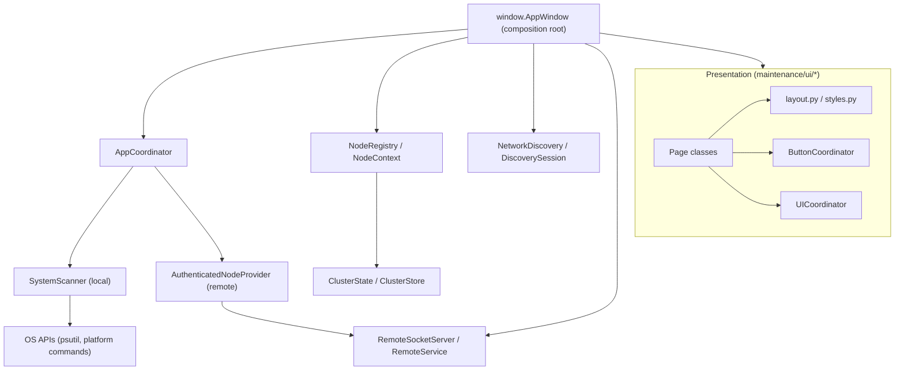

### Startup / composition

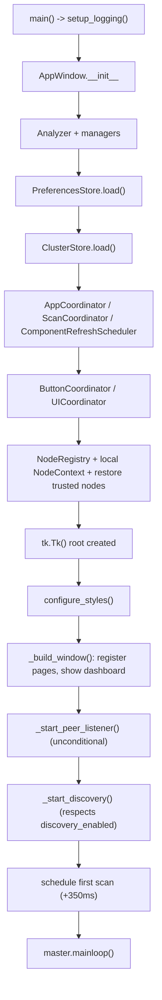

### Periodic component refresh

```mermaid
flowchart LR
    Timer["Tk timer (component_poll_delay)"] --> Due["ComponentRefreshScheduler.due_keys()"]
    Due --> Launch["launch_component_scan(key)"]
    Launch --> Begin["scheduler.begin(key) -- lease"]
    Begin --> Run["AppCoordinator.run(operation_key, task_factory)"]
    Run --> Provider["provider.component_summary(key)"]
    Provider --> Scanner["SystemScanner.scan_component(key)"]
    Scanner --> Deliver["AppCoordinator.deliver -> UI thread"]
    Deliver --> Render["RenderIntent(component:key) -> UICoordinator"]
    Render --> Card["controller.cards[key].update_summary()"]
    Deliver --> Finish["scheduler.finish(key) -- release lease"]
```

### Manual scan

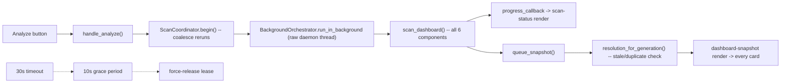

### Scanner / provider architecture

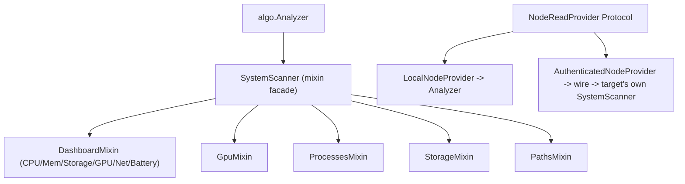

### Storage / cleanup


### Thermal pipeline

```mermaid
flowchart LR
    Platform["temperature_platform.py / smc.py"] --> Scan["TemperatureScan"]
    Scan --> Resource["ResourceSummary (per component)"]
    Resource --> Record["TemperatureTelemetry.record_summary()"]
    Record --> History["bounded history / events (per node)"]
    History --> RenderState["render_state() -> TemperatureRenderState"]
    RenderState --> Intent["RenderIntent(THERMALS_PAGE)"]
    Intent --> UICoord["UICoordinator (visibility-gated)"]
    UICoord --> Page["ThermalsPage.render()"]
    Page --> Graph["thermal_graph.py Canvas drawing"]
```

### Process action (local + remote)

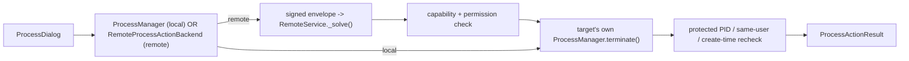

### Discovery


### Pairing / trust

```mermaid
flowchart LR
    UI["Pair button"] --> Confirm["Confirm peer fingerprint (local Tk dialog)"]
    Confirm --> Grant["build PeerGrantRecord (read-only)"]
    Grant --> Wire["TLS pairing request -> target"]
    Wire --> TargetPrompt["target: Approve peer pairing? (local Tk dialog)"]
    TargetPrompt -->|Yes| TargetSave["target persists PeerGrantRecord"]
    TargetSave --> InitiatorSave["initiator persists TrustedNodeRecord"]
    InitiatorSave --> Connect["reconcile_peer_connections() -- authenticated connection"]
```

### Cluster / coordinator / worker relationship

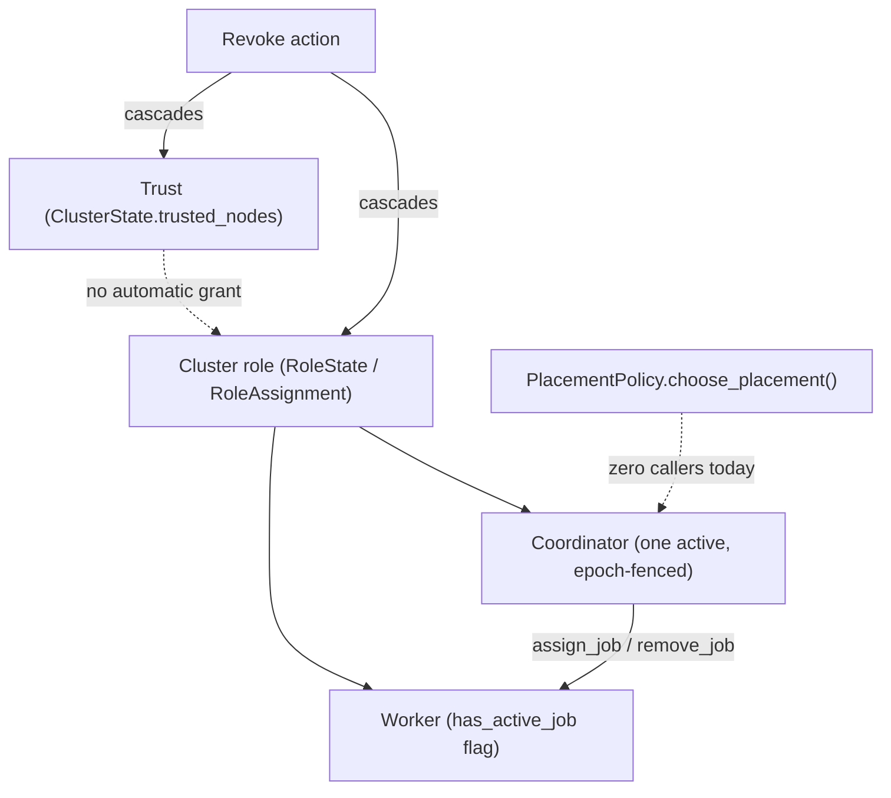

### Local vs. remote provider

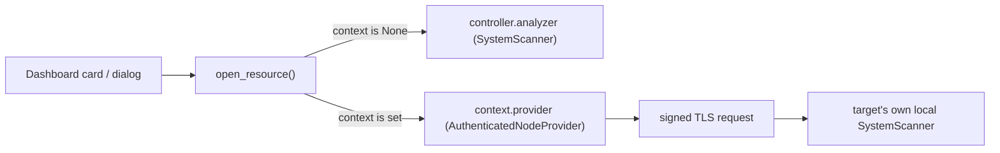

### Authenticated remote request

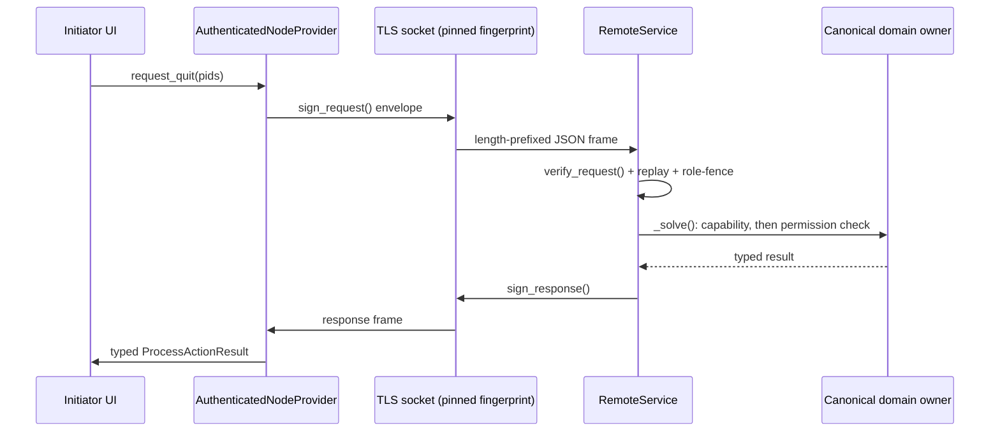

### State / persistence ownership

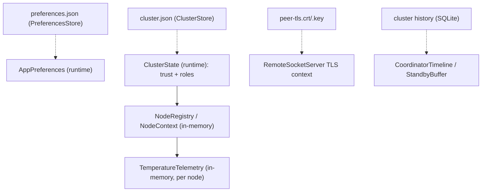

### Shutdown

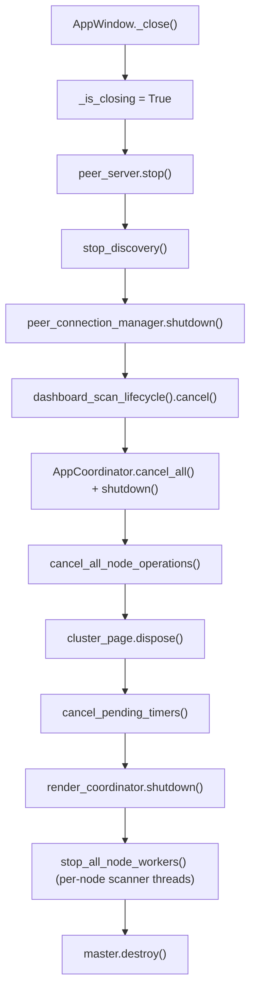

---

## Connection / Call-Path Index

**CPU card refresh**: `window_components.py:launch_component_scan` → `AppCoordinator.run` →
`Analyzer.component_summary("cpu")` → `SystemScanner.scan_component("cpu")` →
`scanner_support/dashboard.py:_cpu_resource` → `ResourceSummary` → `UICoordinator` →
`controller.cards["cpu"]`.

**Manual scan**: `window_scan.py:handle_analyze` → `DashboardScanLifecycle.start` →
`BackgroundOrchestrator.run_in_background` → `Analyzer.dashboard_snapshot` →
`SystemScanner.scan_dashboard` (loops `scan_component` per catalog key) → `queue_snapshot` →
`DashboardScanLifecycle.resolution_for_generation` → every card.

**Move to Trash**: `StorageDialog.move_selected` → `AppCoordinator.run` →
`FileManager.move_to_trash` → symlink/containment/identity checks → `send2trash`.

**Process force-quit (remote)**: `ProcessDialog` → `RemoteProcessActionBackend.force_quit` →
`AuthenticatedNodeProvider.terminate` → `SocketRemoteTransport.request` (pinned TLS) →
`RemoteService.handle` → `verify_request`/replay/role-fence → `RemoteService._solve` (capability +
permission) → target's `ProcessManager.terminate` (full local safety pipeline) → signed response →
`ProcessActionResult`.

**Pairing**: Nodes & Connections "Pair" → `pair_discovered_node` → local fingerprint-confirm dialog
→ `NodeRegistry.promote_to_trusted` (local, in-memory) → `request_target_grant` →
`AuthenticatedNodeProvider.request_pairing` → target's `handle_pairing_request` → target approval
dialog → `PeerGrantRecord` persisted on target → boolean success → initiator persists
`TrustedNodeRecord` → `reconcile_peer_connections`.

**Thermal render**: `apply_component` → `record_thermal_summary` →
`NodeContext.telemetry.record_summary` → `thermal_render_state` → `RenderIntent(THERMALS_PAGE)` →
`UICoordinator.request` (visibility-gated) → `ThermalsPage.render` → `thermal_graph.py`.

**Settings-category navigation**: `navigation_card` "Open" button → `ButtonCoordinator` dispatch →
`SettingsHomeCallbacks.on_select_category` → `window_pages.select_settings_category` → dict
dispatch → `_show_<category>_page()` → `PageRouter.show` + `sync_render_visibility`.

---

## Architecture Connection Matrix

Rows/columns are major subsystems; cells name the relationship (CALLS / OWNS / READS / WRITES /
SUBSCRIBES / DELIVERS / PERSISTS). Blank = no direct relationship found.

| | AppWindow | AppCoordinator | UICoordinator | ButtonCoordinator | NodeRegistry | Scanner | Remote | Cluster/Trust | Preferences |
|---|---|---|---|---|---|---|---|---|---|
| **AppWindow** | — | OWNS | OWNS | OWNS | OWNS | OWNS (`analyzer`) | OWNS (listener) | OWNS | OWNS (store) |
| **AppCoordinator** | DELIVERS (via `deliver` → UI thread) | — | CALLS (via controller's render-request wrapper) | | | CALLS (`task_factory`) | CALLS (per-node provider) | | |
| **UICoordinator** | | | — | | READS (node ownership check) | | | | |
| **ButtonCoordinator** | | | | — | | | | | |
| **NodeRegistry** | | | | | — | | | READS/WRITES (trust mirror) | |
| **Scanner** | | DELIVERS (results, via AppCoordinator) | | | | — | | | READS (interval bounds, indirectly via scheduler) |
| **Remote** | | CALLS (per-key coordinated activation) | | | READS/WRITES (via `activate_remote_node`) | CALLS (on target, via `RemoteService._solve` → local provider) | — | READS/WRITES (fencing, grants) | |
| **Cluster/Trust** | | | | | READS/WRITES (mirrored trust/role fields) | | READS (fencing fields) | — | |
| **Preferences** | SUBSCRIBES (applied via `apply_preferences`) | | | | | READS (interval defaults at construction) | | | — |

This exposes no unexpected coupling: every cross-subsystem edge above corresponds to a
specifically-audited relationship documented earlier in this review, and no subsystem reaches into
another's internals except through its designated interface (`AppCoordinator.run`, `NodeContext`
fields, `RemoteService._solve`'s dispatch to canonical local owners).

---

## Recommended Follow-up Work

In priority order, none implemented as part of this audit (documentation-only per its scope):

1. **[Finding A-1]** Fix or explicitly exempt `DiagnosticsPage`'s "Copy diagnostics" button, and
   extend `test_page_wiring_consistency.py` to cover it — smallest, most mechanical fix, directly
   continues this session's existing wiring-consistency work.
2. **[Finding G-1]** Decide on file-permission hardening for `cluster.json` given it holds
   plaintext pairing/grant secrets — a security-posture decision, not a code change requiring
   design work.
3. **[Finding E-1]** Document the always-on TLS listener behavior in user-facing docs (the Help &
   Guide "Permissions & Remote Access" topic is the natural home, since that page architecture
   already exists).
4. **[Finding F-1]** Add a capability/permission/operation-table drift test for the remote
   protocol, mirroring the existing `ScannerCatalogWiringTests` pattern — cheap, high-value,
   precedented.
5. **[Findings E-2, E-3]** Decide the product direction on automatic placement and cluster
   invites: either build the missing UI/wiring, or explicitly document both as implemented-but-not-
   yet-exposed future seams so they stop reading as ambiguous gaps.
6. **[Finding D-1]** Decide whether CPU/GPU/Storage should show an "unsupported" placeholder
   instead of disappearing, for consistency with battery's behavior.
7. **[Finding B-1]** Consider (not urgent) consolidating manual scan onto `AppCoordinator.run` in a
   future pass, or document why the split from the other four background-execution models is
   intentional.
8. **[Finding D-2]** One-line fix to `TemperatureTelemetry.record_scan`'s `empty_reads` reset, or
   remove the currently-dead method.
9. **[Finding A-2]** Confirm whether `cluster`'s asymmetric back-target (always → dashboard) is
   intentional; if not, the fix is a one-line callback change.
10. Update `docs/SYSTEM_ANALYZER_REVIEW.md`'s remote-path framing to match this review's corrected,
    evidence-based status (see [Corrections to the 2026-09-10 review](#corrections-to-the-2026-09-10-review)).

---

## Source Path Index

Files read in full or substantially during this audit (see individual sections for exact line
citations):

`main.py`, `window.py`, `algo.py`, `maintenance/scanner.py`, `maintenance/actions.py`,
`maintenance/nodes.py`, `maintenance/cluster.py`, `maintenance/preferences.py`,
`maintenance/persistence.py`, `maintenance/diagnostics.py`, `maintenance/health.py`,
`maintenance/remote.py`, `maintenance/remote_security.py`,
`maintenance/scanner_support/{dashboard,gpu,processes,storage,paths,temperature_platform,smc,_compat}.py`,
`maintenance/components/{coordinator,background,background_orchestration,catalog,dashboard_scan,
discovery_session,downloads,gpu,network_discovery,node_context,node_selection,peer_connection,
placement,process_safety,scan_support,cluster_roles,cluster_storage,temperature}.py`,
`maintenance/remote_support/{protocol,server,transport}.py`,
`maintenance/ui/{navigation,action_coordinator,render_coordinator,window_lifecycle,window_context,
window_presentation,window_components,window_discovery,window_node_actions,window_node_runtime,
window_page_data,window_pages,window_preferences,window_scan,settings_home,preferences_page,
nodes_connections,cluster_page,thermals_page,diagnostics_page,help_page,help_content,dashboard_page,
discovery_refresh,node_presentation,target_state,layout,styles,scan_status,transition,
telemetry_graph,thermal_graph}.py`,
`maintenance/ui/window_supports/{card_policy,node_specs,snapshot_state,timer_delivery}.py`,
`maintenance/dialogs.py`, `maintenance/models.py`, `pyproject.toml`, `AGENTS.md`,
`maintenance/README.md`, `maintenance/components/README.md`, plus targeted reads of
`tests/test_page_wiring_consistency.py`, `tests/test_remote_contract.py`,
`tests/test_deployment_validation.py`, `tests/test_packaging.py`, `tests/support/*.py`, and the
2026-09-12 patch/security review documents cited inline where their findings were independently
re-verified against current code.

Not independently re-read line-by-line in this pass (referenced by name/role only, or carried
forward from `maintenance/README.md`/`components/README.md` as high-confidence but not
line-verified): `maintenance/components/gpu.py`'s internal `GpuDetector` platform-dispatch logic;
`maintenance/ui/window_supports/snapshot_state.py`'s exact merge algorithm; the full 933-line
`maintenance/ui/help_content.py` content (existence and structure confirmed, not every topic's
prose); `maintenance/scanner_support/temperature_platform.py`'s Linux acquisition branch
specifically (Windows/macOS/permission-handling sections were read in full); exact caller-path
  verification for `CoordinatorTimeline`'s SQLite file path resolution.
